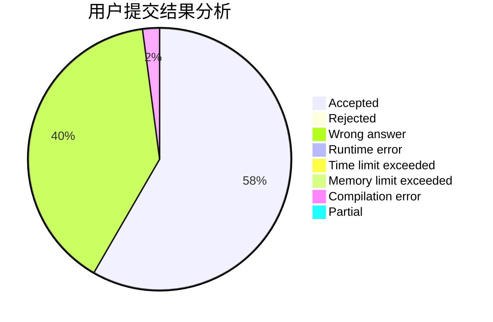
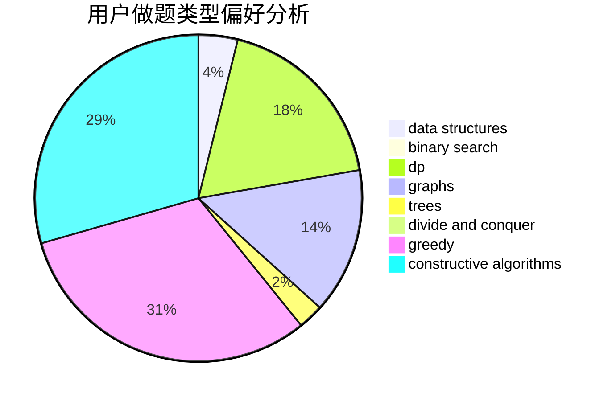

# NuoCarter
<!-- tabs:start -->
#### **用户提交结果分析**

#### **用户做题类型偏好分析**

#### **用户错题知识点分析**

<!-- tabs:end -->
# 推荐题目
[Holy Diver](http://codeforces.com/problemset/problem/1148/H)		data structures		  
[Recovering BST](http://codeforces.com/problemset/problem/1025/D)		brute force,
                        dp,
                        math,
                        number theory,
                        trees		  
[String and Operations](http://codeforces.com/problemset/problem/1455/F)		dp,
                        greedy		  
[Petr#](http://codeforces.com/problemset/problem/113/B)		brute force,
                        data structures,
                        hashing,
                        strings		  
[Bargaining Table](http://codeforces.com/problemset/problem/22/B)		brute force,
                        dp		  
[Tic-tac-toe](http://codeforces.com/problemset/problem/3/C)		brute force,
                        games,
                        implementation		  
[Strange Housing](https://codeforces.com/contest/1471/problem/F)		constructive algorithms,
                        dfs and similar,
                        graph matchings,
                        graphs,
                        greedy		  
[The Closest Pair](https://codeforces.com/contest/312/problem/C)		constructive algorithms,
                        implementation		  
[Runaway to a Shadow](http://codeforces.com/problemset/problem/681/E)		geometry,
                        sortings		  
[Wilbur and Swimming Pool](http://codeforces.com/problemset/problem/596/A)		geometry,
                        implementation		  
<!-- tabs:start -->
#### **data structures**
[Holy Diver](http://codeforces.com/problemset/problem/1148/H)		data structures		  
[Recovering BST](http://codeforces.com/problemset/problem/113/B)		brute force,
                        data structures,
                        hashing,
                        strings		  
[String and Operations](http://codeforces.com/problemset/problem/1098/D)		data structures		  
[Petr#](http://codeforces.com/problemset/problem/341/D)		data structures		  
[Bargaining Table](http://codeforces.com/problemset/problem/1401/F)		binary search,
                        bitmasks,
                        data structures		  
[Tic-tac-toe](http://codeforces.com/problemset/problem/766/E)		bitmasks,
                        constructive algorithms,
                        data structures,
                        dfs and similar,
                        dp,
                        math,
                        trees		  
[Strange Housing](http://codeforces.com/problemset/problem/1398/E)		binary search,
                        data structures,
                        greedy,
                        implementation,
                        math,
                        sortings		  
[The Closest Pair](https://codeforces.com/contest/528/problem/B)		data structures,
                        dp,
                        greedy,
                        implementation,
                        sortings		  
[Runaway to a Shadow](http://codeforces.com/problemset/problem/1498/B)		binary search,
                        bitmasks,
                        data structures,
                        greedy		  
[Wilbur and Swimming Pool](http://codeforces.com/problemset/problem/1398/C)		data structures,
                        dp,
                        math		  
#### **binary search**
[Holy Diver](http://codeforces.com/problemset/problem/1401/F)		binary search,
                        bitmasks,
                        data structures		  
[Recovering BST](http://codeforces.com/problemset/problem/484/B)		binary search,
                        math,
                        sortings,
                        two pointers		  
[String and Operations](http://codeforces.com/problemset/problem/1398/E)		binary search,
                        data structures,
                        greedy,
                        implementation,
                        math,
                        sortings		  
[Petr#](http://codeforces.com/problemset/problem/1498/B)		binary search,
                        bitmasks,
                        data structures,
                        greedy		  
[Bargaining Table](http://codeforces.com/problemset/problem/1492/C)		binary search,
                        data structures,
                        dp,
                        greedy,
                        two pointers		  
[Tic-tac-toe](http://codeforces.com/problemset/problem/1463/D)		binary search,
                        constructive algorithms,
                        greedy,
                        two pointers		  
[Strange Housing](http://codeforces.com/problemset/problem/1490/G)		binary search,
                        data structures,
                        math		  
[The Closest Pair](http://codeforces.com/problemset/problem/1479/D)		binary search,
                        bitmasks,
                        brute force,
                        data structures,
                        probabilities,
                        trees		  
[Runaway to a Shadow](http://codeforces.com/problemset/problem/1436/E)		binary search,
                        data structures,
                        two pointers		  
[Wilbur and Swimming Pool](http://codeforces.com/problemset/problem/1461/D)		binary search,
                        brute force,
                        data structures,
                        divide and conquer,
                        implementation,
                        sortings		  
#### **dp**
[Holy Diver](http://codeforces.com/problemset/problem/1025/D)		brute force,
                        dp,
                        math,
                        number theory,
                        trees		  
[Recovering BST](http://codeforces.com/problemset/problem/1455/F)		dp,
                        greedy		  
[String and Operations](http://codeforces.com/problemset/problem/22/B)		brute force,
                        dp		  
[Petr#](http://codeforces.com/problemset/problem/505/C)		dfs and similar,
                        dp,
                        two pointers		  
[Bargaining Table](http://codeforces.com/problemset/problem/459/E)		dp,
                        sortings		  
[Tic-tac-toe](http://codeforces.com/problemset/problem/468/E)		dp,
                        graph matchings,
                        math,
                        meet-in-the-middle		  
[Strange Housing](http://codeforces.com/problemset/problem/235/B)		dp,
                        math,
                        probabilities		  
[The Closest Pair](http://codeforces.com/problemset/problem/204/D)		dp		  
[Runaway to a Shadow](http://codeforces.com/problemset/problem/766/E)		bitmasks,
                        constructive algorithms,
                        data structures,
                        dfs and similar,
                        dp,
                        math,
                        trees		  
[Wilbur and Swimming Pool](http://codeforces.com/problemset/problem/1172/B)		combinatorics,
                        dfs and similar,
                        dp,
                        trees		  
#### **graph**
[Holy Diver](https://codeforces.com/contest/1471/problem/F)		constructive algorithms,
                        dfs and similar,
                        graph matchings,
                        graphs,
                        greedy		  
[Recovering BST](http://codeforces.com/problemset/problem/468/E)		dp,
                        graph matchings,
                        math,
                        meet-in-the-middle		  
[String and Operations](http://codeforces.com/problemset/problem/804/F)		combinatorics,
                        dfs and similar,
                        dp,
                        graphs,
                        number theory		  
[Petr#](http://codeforces.com/problemset/problem/1307/G)		flows,
                        graphs,
                        shortest paths		  
[Bargaining Table](http://codeforces.com/problemset/problem/1487/C)		brute force,
                        constructive algorithms,
                        dfs and similar,
                        graphs,
                        greedy,
                        implementation,
                        math		  
[Tic-tac-toe](http://codeforces.com/problemset/problem/1437/C)		dp,
                        flows,
                        graph matchings,
                        greedy,
                        math,
                        sortings		  
[Strange Housing](http://codeforces.com/problemset/problem/1470/D)		constructive algorithms,
                        dfs and similar,
                        graph matchings,
                        graphs,
                        greedy		  
[The Closest Pair](http://codeforces.com/problemset/problem/1476/C)		dp,
                        graphs,
                        greedy		  
[Runaway to a Shadow](http://codeforces.com/problemset/problem/1304/D)		constructive algorithms,
                        graphs,
                        greedy,
                        two pointers		  
[Wilbur and Swimming Pool](http://codeforces.com/problemset/problem/1475/C)		combinatorics,
                        graphs,
                        math		  
#### **trees**
[Holy Diver](http://codeforces.com/problemset/problem/1025/D)		brute force,
                        dp,
                        math,
                        number theory,
                        trees		  
[Recovering BST](https://codeforces.com/contest/1074/problem/B)		dfs and similar,
                        interactive,
                        trees		  
[String and Operations](http://codeforces.com/problemset/problem/766/E)		bitmasks,
                        constructive algorithms,
                        data structures,
                        dfs and similar,
                        dp,
                        math,
                        trees		  
[Petr#](http://codeforces.com/problemset/problem/1172/B)		combinatorics,
                        dfs and similar,
                        dp,
                        trees		  
[Bargaining Table](http://codeforces.com/problemset/problem/1225/F)		constructive algorithms,
                        greedy,
                        trees		  
[Tic-tac-toe](http://codeforces.com/problemset/problem/1479/D)		binary search,
                        bitmasks,
                        brute force,
                        data structures,
                        probabilities,
                        trees		  
[Strange Housing](http://codeforces.com/problemset/problem/1511/C)		brute force,
                        data structures,
                        implementation,
                        trees		  
[The Closest Pair](http://codeforces.com/problemset/problem/1499/F)		combinatorics,
                        dfs and similar,
                        dp,
                        trees		  
[Runaway to a Shadow](http://codeforces.com/problemset/problem/1491/E)		brute force,
                        dfs and similar,
                        divide and conquer,
                        number theory,
                        trees		  
[Wilbur and Swimming Pool](http://codeforces.com/problemset/problem/1466/D)		data structures,
                        greedy,
                        sortings,
                        trees		  
#### **divide and conquer**
[Holy Diver](http://codeforces.com/problemset/problem/1461/D)		binary search,
                        brute force,
                        data structures,
                        divide and conquer,
                        implementation,
                        sortings		  
[Recovering BST](http://codeforces.com/problemset/problem/1466/G)		combinatorics,
                        divide and conquer,
                        hashing,
                        math,
                        string suffix structures,
                        strings		  
[String and Operations](http://codeforces.com/problemset/problem/1490/D)		dfs and similar,
                        divide and conquer,
                        implementation		  
[Petr#](https://codeforces.com/contest/1483/problem/C)		data structures,
                        divide and conquer,
                        dp		  
[Bargaining Table](http://codeforces.com/problemset/problem/1491/E)		brute force,
                        dfs and similar,
                        divide and conquer,
                        number theory,
                        trees		  
[Tic-tac-toe](http://codeforces.com/problemset/problem/1303/G)		data structures,
                        divide and conquer,
                        geometry,
                        trees		  
[Strange Housing](http://codeforces.com/problemset/problem/1494/D)		constructive algorithms,
                        data structures,
                        dfs and similar,
                        divide and conquer,
                        dsu,
                        greedy,
                        sortings,
                        trees		  
[The Closest Pair](http://codeforces.com/problemset/problem/1482/E)		data structures,
                        divide and conquer,
                        dp		  
[Runaway to a Shadow](http://codeforces.com/problemset/problem/566/C)		dfs and similar,
                        divide and conquer,
                        trees		  
[Wilbur and Swimming Pool](http://codeforces.com/problemset/problem/1428/F)		binary search,
                        data structures,
                        divide and conquer,
                        dp,
                        two pointers		  
#### **greedy**
[Holy Diver](http://codeforces.com/problemset/problem/1455/F)		dp,
                        greedy		  
[Recovering BST](https://codeforces.com/contest/1471/problem/F)		constructive algorithms,
                        dfs and similar,
                        graph matchings,
                        graphs,
                        greedy		  
[String and Operations](http://codeforces.com/problemset/problem/1136/D)		greedy		  
[Petr#](http://codeforces.com/problemset/problem/1468/H)		constructive algorithms,
                        greedy,
                        math		  
[Bargaining Table](http://codeforces.com/problemset/problem/1272/A)		brute force,
                        greedy,
                        math,
                        sortings		  
[Tic-tac-toe](http://codeforces.com/problemset/problem/1398/E)		binary search,
                        data structures,
                        greedy,
                        implementation,
                        math,
                        sortings		  
[Strange Housing](https://codeforces.com/contest/528/problem/B)		data structures,
                        dp,
                        greedy,
                        implementation,
                        sortings		  
[The Closest Pair](http://codeforces.com/problemset/problem/1225/F)		constructive algorithms,
                        greedy,
                        trees		  
[Runaway to a Shadow](http://codeforces.com/problemset/problem/1445/A)		greedy,
                        sortings		  
[Wilbur and Swimming Pool](http://codeforces.com/problemset/problem/1498/B)		binary search,
                        bitmasks,
                        data structures,
                        greedy		  
#### **constructive algorithms**
[Holy Diver](https://codeforces.com/contest/1471/problem/F)		constructive algorithms,
                        dfs and similar,
                        graph matchings,
                        graphs,
                        greedy		  
[Recovering BST](https://codeforces.com/contest/312/problem/C)		constructive algorithms,
                        implementation		  
[String and Operations](http://codeforces.com/problemset/problem/814/B)		constructive algorithms		  
[Petr#](https://codeforces.com/contest/1478/problem/D)		constructive algorithms,
                        math,
                        number theory		  
[Bargaining Table](http://codeforces.com/problemset/problem/1174/C)		constructive algorithms,
                        number theory		  
[Tic-tac-toe](http://codeforces.com/problemset/problem/1468/H)		constructive algorithms,
                        greedy,
                        math		  
[Strange Housing](http://codeforces.com/problemset/problem/766/E)		bitmasks,
                        constructive algorithms,
                        data structures,
                        dfs and similar,
                        dp,
                        math,
                        trees		  
[The Closest Pair](http://codeforces.com/problemset/problem/1225/F)		constructive algorithms,
                        greedy,
                        trees		  
[Runaway to a Shadow](http://codeforces.com/problemset/problem/1512/C)		constructive algorithms,
                        implementation,
                        strings		  
[Wilbur and Swimming Pool](http://codeforces.com/problemset/problem/1455/B)		constructive algorithms,
                        math		  
#### **sortings**
[Holy Diver](http://codeforces.com/problemset/problem/681/E)		geometry,
                        sortings		  
[Recovering BST](http://codeforces.com/problemset/problem/652/C)		combinatorics,
                        sortings,
                        two pointers		  
[String and Operations](http://codeforces.com/problemset/problem/459/E)		dp,
                        sortings		  
[Petr#](http://codeforces.com/problemset/problem/484/B)		binary search,
                        math,
                        sortings,
                        two pointers		  
[Bargaining Table](http://codeforces.com/problemset/problem/1272/A)		brute force,
                        greedy,
                        math,
                        sortings		  
[Tic-tac-toe](http://codeforces.com/problemset/problem/1398/E)		binary search,
                        data structures,
                        greedy,
                        implementation,
                        math,
                        sortings		  
[Strange Housing](https://codeforces.com/contest/528/problem/B)		data structures,
                        dp,
                        greedy,
                        implementation,
                        sortings		  
[The Closest Pair](http://codeforces.com/problemset/problem/1445/A)		greedy,
                        sortings		  
[Runaway to a Shadow](https://codeforces.com/contest/1496/problem/C)		geometry,
                        greedy,
                        math,
                        sortings		  
[Wilbur and Swimming Pool](http://codeforces.com/problemset/problem/1495/A)		geometry,
                        greedy,
                        math,
                        sortings		  
<!-- tabs:end -->
