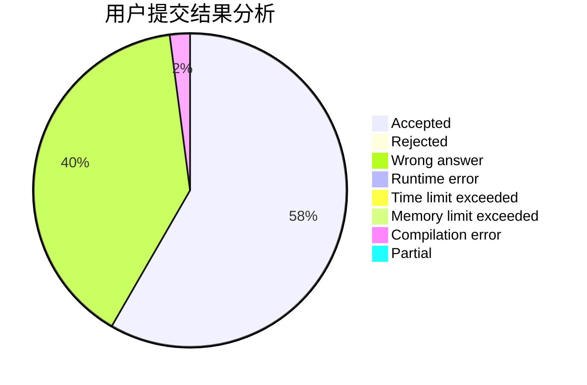
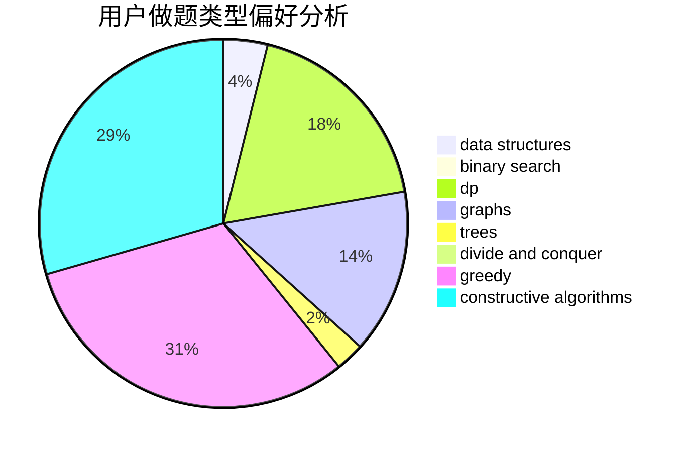

# NuoCarter

<!-- tabs:start -->

#### **用户提交结果分析**

#### **用户做题类型偏好分析**

#### **用户错题知识点分析**

<!-- tabs:end -->
# 推荐题目
[204D](https://codeforces.com/contest/204/problem/D)		dp		  
[814B](https://codeforces.com/contest/814/problem/B)		constructive algorithms		  
[1148H](https://codeforces.com/contest/1148/problem/H)		data structures		  
[113B](https://codeforces.com/contest/113/problem/B)		brute force,
                        data structures,
                        hashing,
                        strings		  
[1074B](https://codeforces.com/contest/1074/problem/B)		dsu,graphs,sortings,trees		  
[1136D](https://codeforces.com/contest/1136/problem/D)		greedy		  
[453A](https://codeforces.com/contest/453/problem/A)		probabilities		  
[1401F](https://codeforces.com/contest/1401/problem/F)		binary search,
                        bitmasks,
                        data structures		  
[312C](https://codeforces.com/contest/312/problem/C)		dsu,graphs,sortings,trees		  
[1174C](https://codeforces.com/contest/1174/problem/C)		constructive algorithms,
                        number theory		  
