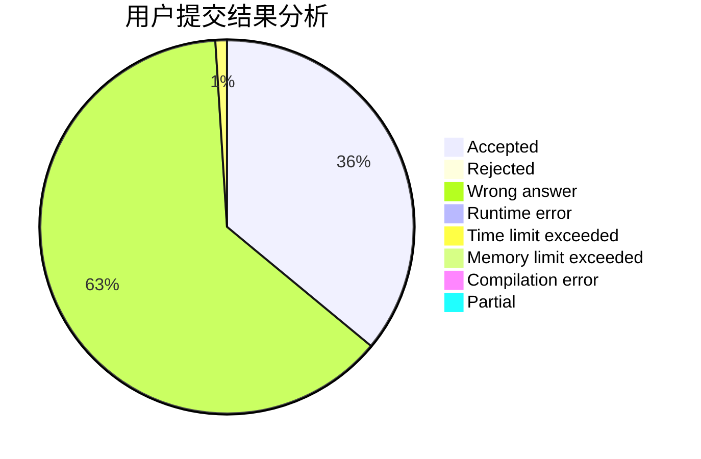
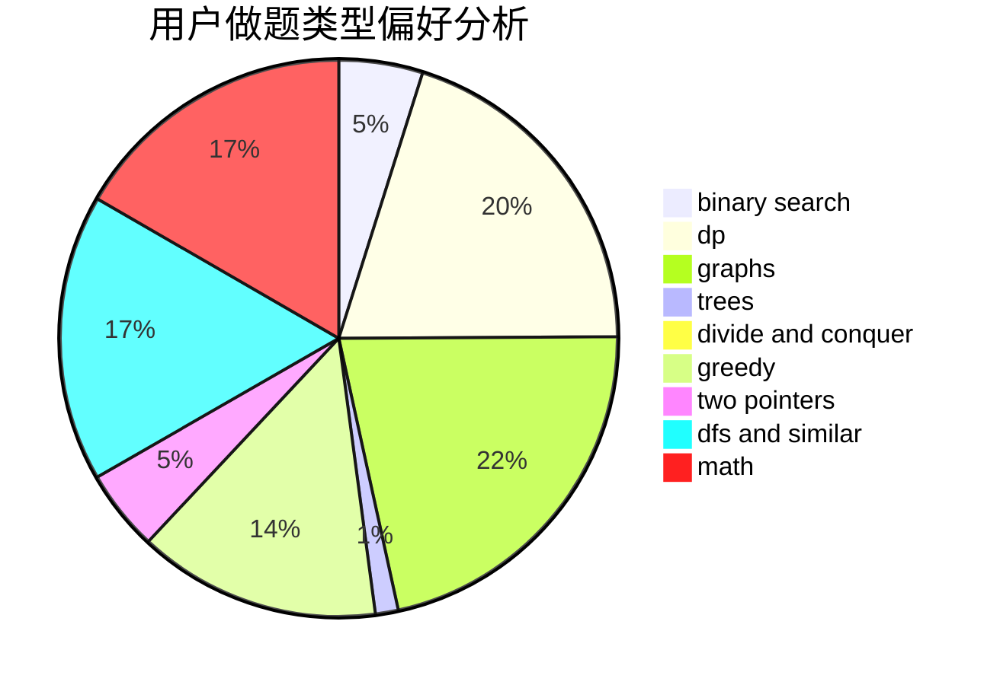

# O--O

<!-- tabs:start -->

#### **用户提交结果分析**

#### **用户做题类型偏好分析**

<!-- tabs:end -->
# 推荐题目
[891E](https://codeforces.com/contest/891/problem/E)
[1277B](https://codeforces.com/contest/1277/problem/B)
[1506E](https://codeforces.com/contest/1506/problem/E)
[421B](https://codeforces.com/contest/421/problem/B)
[838F](https://codeforces.com/contest/838/problem/F)
[12272](https://codeforces.com/contest/1227/problem/2)
[482E](https://codeforces.com/contest/482/problem/E)
[519B](https://codeforces.com/contest/519/problem/B)
[479C](https://codeforces.com/contest/479/problem/C)
[1781](https://codeforces.com/contest/178/problem/1)
