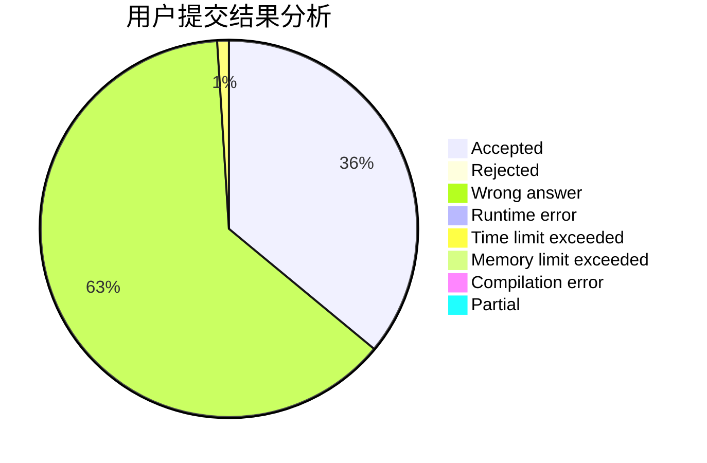
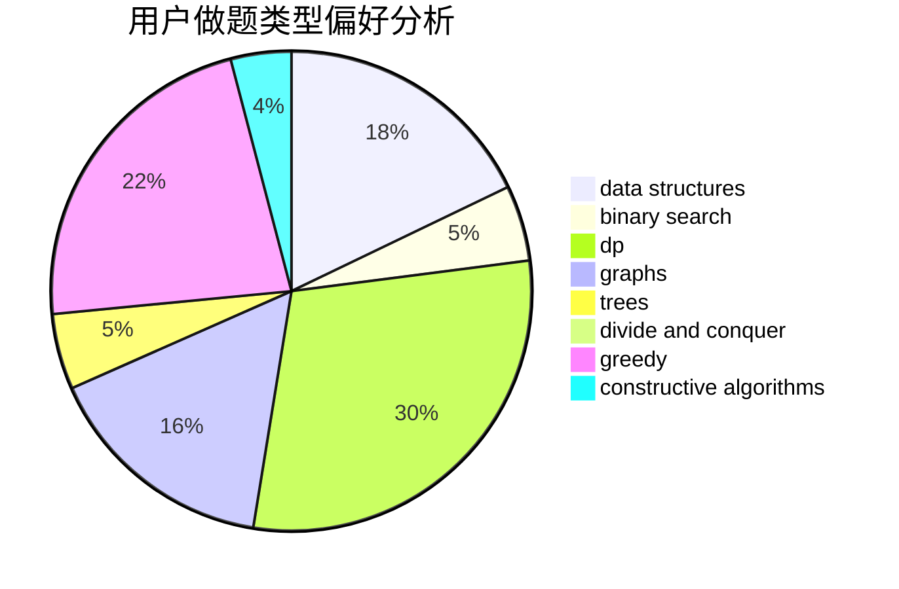
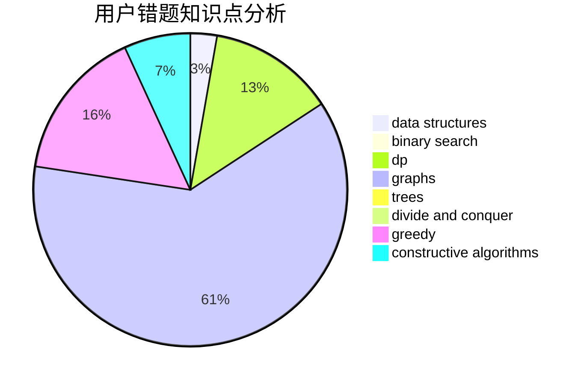

# O--O

<!-- tabs:start -->

#### **用户提交结果分析**

#### **用户做题类型偏好分析**

#### **用户错题知识点分析**

<!-- tabs:end -->
# 推荐题目
[891E](https://codeforces.com/contest/891/problem/E)		combinatorics,
                        math,
                        matrices		  
[1277B](https://codeforces.com/contest/1277/problem/B)		greedy,
                        number theory		  
[1506E](https://codeforces.com/contest/1506/problem/E)		constructive algorithms,
                        implementation		  
[421B](https://codeforces.com/contest/421/problem/B)		dsu,graphs,sortings,trees		  
[838F](https://codeforces.com/contest/838/problem/F)		nan		  
[12272](https://codeforces.com/contest/1227/problem/2)		dsu,graphs,sortings,trees		  
[482E](https://codeforces.com/contest/482/problem/E)		data structures,
                        trees		  
[519B](https://codeforces.com/contest/519/problem/B)		data structures,
                        implementation,
                        sortings		  
[479C](https://codeforces.com/contest/479/problem/C)		greedy,
                        sortings		  
[1781](https://codeforces.com/contest/178/problem/1)		dsu,graphs,sortings,trees		  
