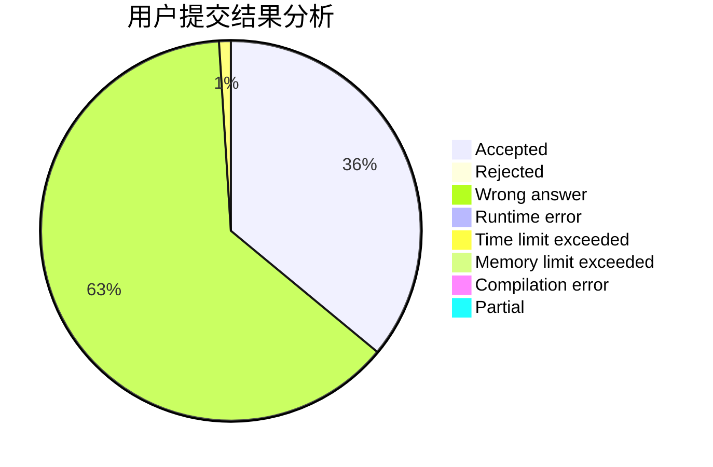
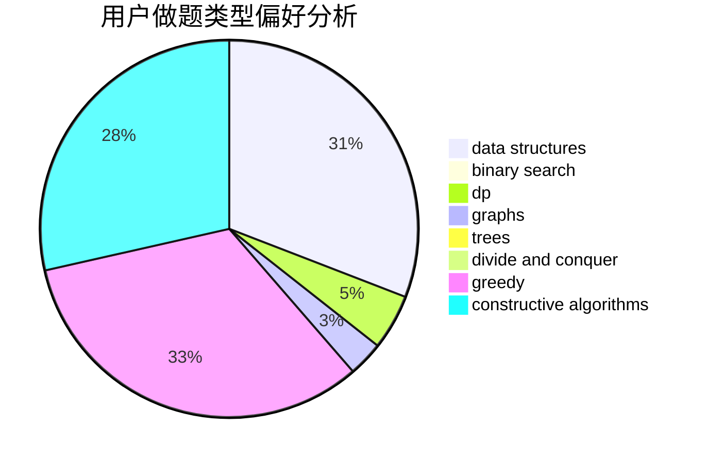
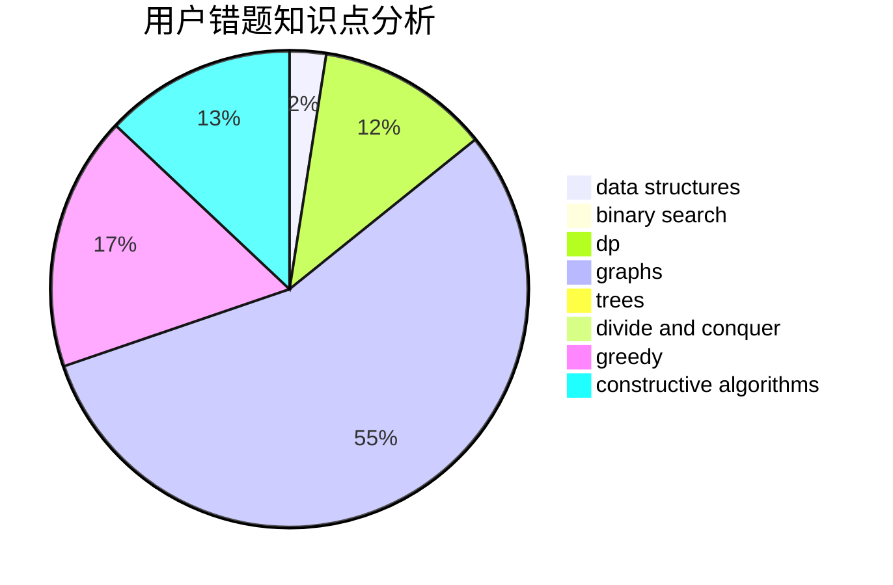

# O--O

<!-- tabs:start -->

#### **用户提交结果分析**

#### **用户做题类型偏好分析**

#### **用户错题知识点分析**

<!-- tabs:end -->
# 推荐题目
[871A](https://codeforces.com/contest/871/problem/A)		dsu,graphs,sortings,trees		  
[1268A](https://codeforces.com/contest/1268/problem/A)		constructive algorithms,
                        greedy,
                        implementation,
                        strings		  
[1498A](https://codeforces.com/contest/1498/problem/A)		brute force,
                        math		  
[393C](https://codeforces.com/contest/393/problem/C)		dsu,graphs,sortings,trees		  
[818G](https://codeforces.com/contest/818/problem/G)		flows,
                        graphs		  
[1219C](https://codeforces.com/contest/1219/problem/C)		implementation,
                        strings		  
[463A](https://codeforces.com/contest/463/problem/A)		brute force,
                        implementation		  
[498C](https://codeforces.com/contest/498/problem/C)		flows,
                        graph matchings,
                        number theory		  
[460A](https://codeforces.com/contest/460/problem/A)		brute force,
                        implementation,
                        math		  
[157B](https://codeforces.com/contest/157/problem/B)		geometry,
                        sortings		  
