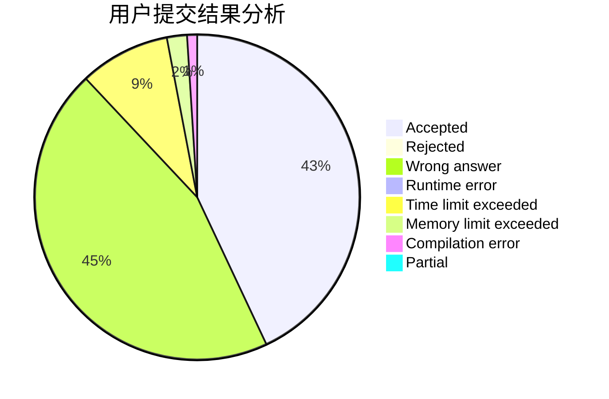
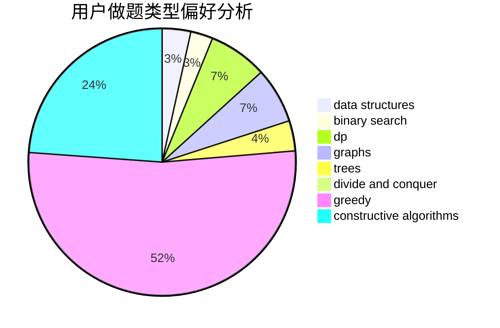

# OIerwanhong

<!-- tabs:start -->

#### **用户提交结果分析**

#### **用户做题类型偏好分析**

#### **用户错题知识点分析**

<!-- tabs:end -->
# 推荐题目
[1007A](https://codeforces.com/contest/1007/problem/A)		combinatorics,
                        data structures,
                        math,
                        sortings,
                        two pointers		  
[212E](https://codeforces.com/contest/212/problem/E)		dfs and similar,
                        dp,
                        trees		  
[13573](https://codeforces.com/contest/1357/problem/3)		dsu,graphs,sortings,trees		  
[526A](https://codeforces.com/contest/526/problem/A)		brute force,
                        implementation		  
[677C](https://codeforces.com/contest/677/problem/C)		bitmasks,
                        combinatorics,
                        implementation,
                        strings		  
[254A](https://codeforces.com/contest/254/problem/A)		constructive algorithms,
                        sortings		  
[228B](https://codeforces.com/contest/228/problem/B)		brute force,
                        implementation		  
[1083F](https://codeforces.com/contest/1083/problem/F)		data structures		  
[689B](https://codeforces.com/contest/689/problem/B)		dfs and similar,
                        graphs,
                        greedy,
                        shortest paths		  
[908A](https://codeforces.com/contest/908/problem/A)		brute force,
                        implementation		  
