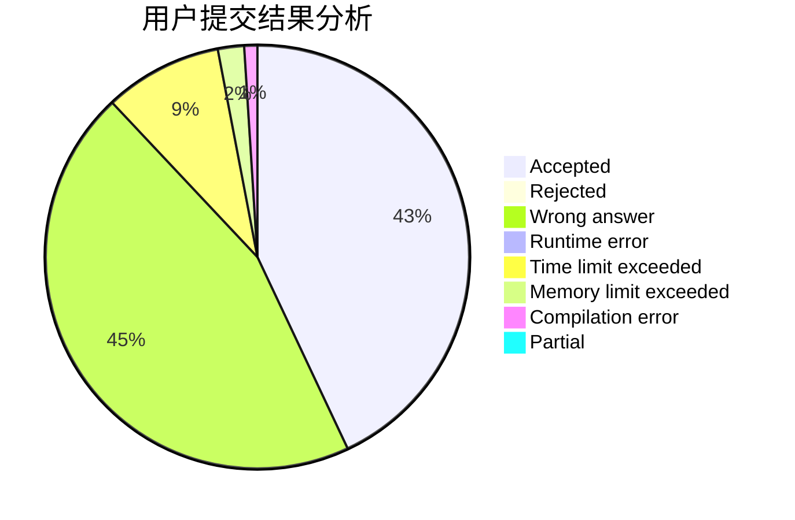
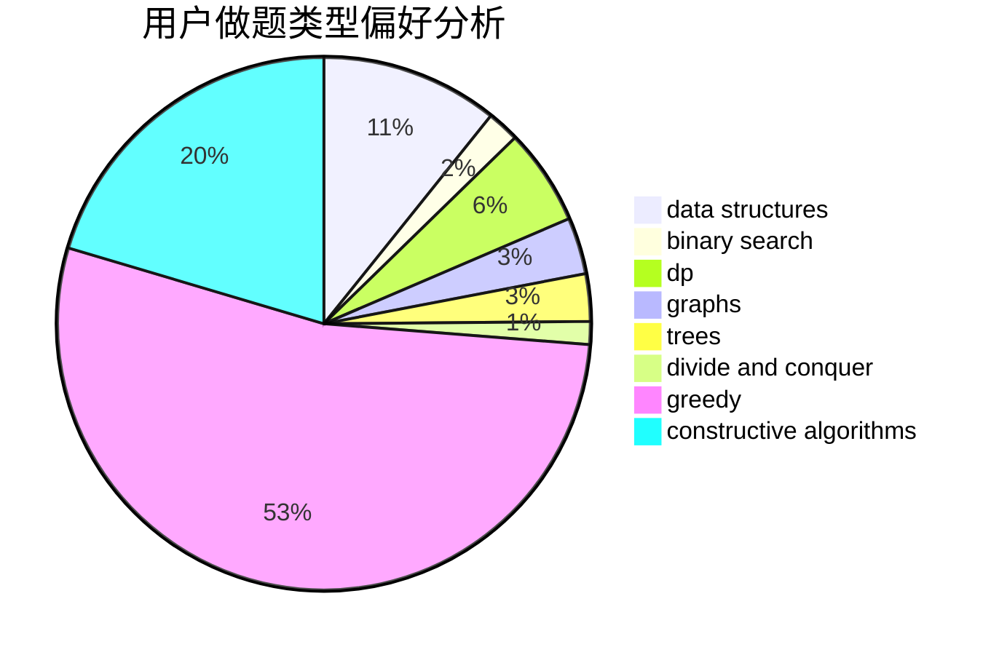
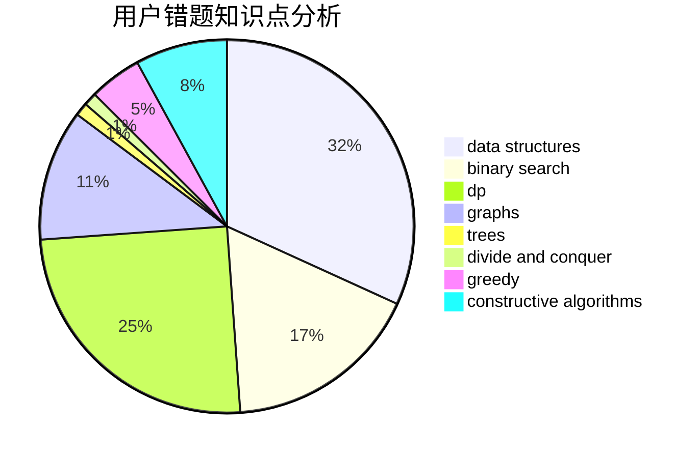

# OIerwanhong

<!-- tabs:start -->

#### **用户提交结果分析**

#### **用户做题类型偏好分析**

#### **用户错题知识点分析**

<!-- tabs:end -->
# 推荐题目
[1006D](https://codeforces.com/contest/1006/problem/D)		implementation		  
[189A](https://codeforces.com/contest/189/problem/A)		brute force,
                        dp		  
[134B](https://codeforces.com/contest/134/problem/B)		brute force,
                        dfs and similar,
                        math,
                        number theory		  
[505D](https://codeforces.com/contest/505/problem/D)		dfs and similar		  
[653C](https://codeforces.com/contest/653/problem/C)		brute force,
                        implementation		  
[232B](https://codeforces.com/contest/232/problem/B)		bitmasks,
                        combinatorics,
                        dp,
                        math		  
[204C](https://codeforces.com/contest/204/problem/C)		math,
                        probabilities		  
[1083C](https://codeforces.com/contest/1083/problem/C)		data structures,
                        trees		  
[667B](https://codeforces.com/contest/667/problem/B)		constructive algorithms,
                        geometry		  
[888C](https://codeforces.com/contest/888/problem/C)		binary search,
                        implementation,
                        two pointers		  
