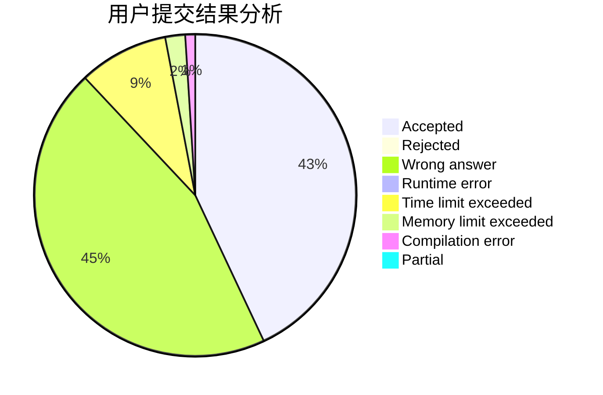
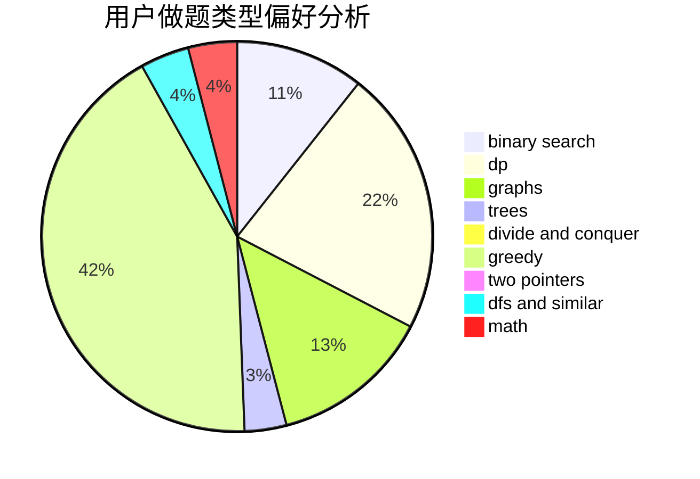

# OIerwanhong

<!-- tabs:start -->

#### **用户提交结果分析**

#### **用户做题类型偏好分析**

<!-- tabs:end -->
# 推荐题目
[1007A](https://codeforces.com/contest/1007/problem/A)
[212E](https://codeforces.com/contest/212/problem/E)
[13573](https://codeforces.com/contest/1357/problem/3)
[526A](https://codeforces.com/contest/526/problem/A)
[677C](https://codeforces.com/contest/677/problem/C)
[254A](https://codeforces.com/contest/254/problem/A)
[228B](https://codeforces.com/contest/228/problem/B)
[1083F](https://codeforces.com/contest/1083/problem/F)
[689B](https://codeforces.com/contest/689/problem/B)
[908A](https://codeforces.com/contest/908/problem/A)
