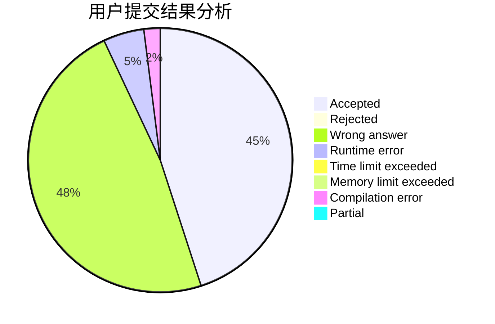
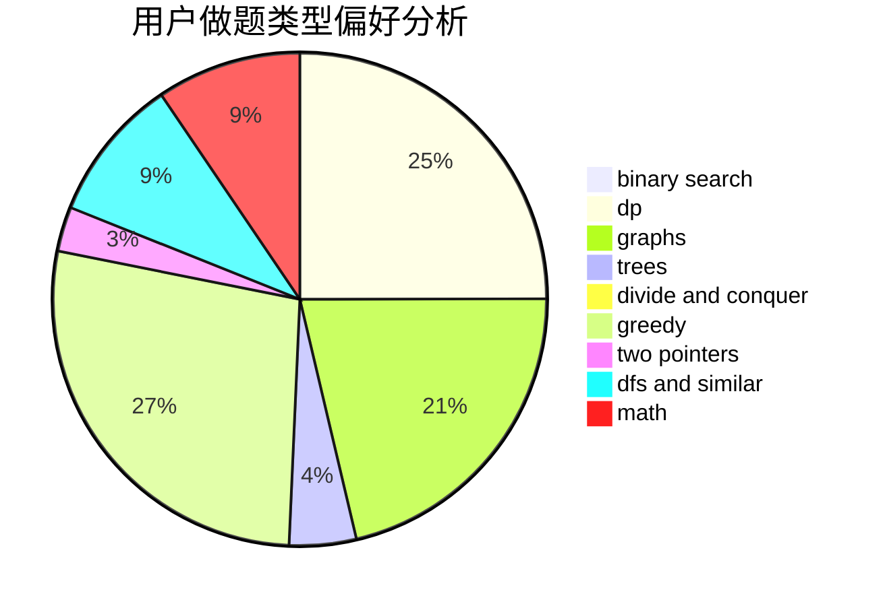

# OInfly

<!-- tabs:start -->

#### **用户提交结果分析**

#### **用户做题类型偏好分析**

<!-- tabs:end -->
# 推荐题目
[278B](https://codeforces.com/contest/278/problem/B)
[1051E](https://codeforces.com/contest/1051/problem/E)
[13681](https://codeforces.com/contest/1368/problem/1)
[52A](https://codeforces.com/contest/52/problem/A)
[276C](https://codeforces.com/contest/276/problem/C)
[901C](https://codeforces.com/contest/901/problem/C)
[1191C](https://codeforces.com/contest/1191/problem/C)
[1345F](https://codeforces.com/contest/1345/problem/F)
[780G](https://codeforces.com/contest/780/problem/G)
[119D](https://codeforces.com/contest/119/problem/D)
