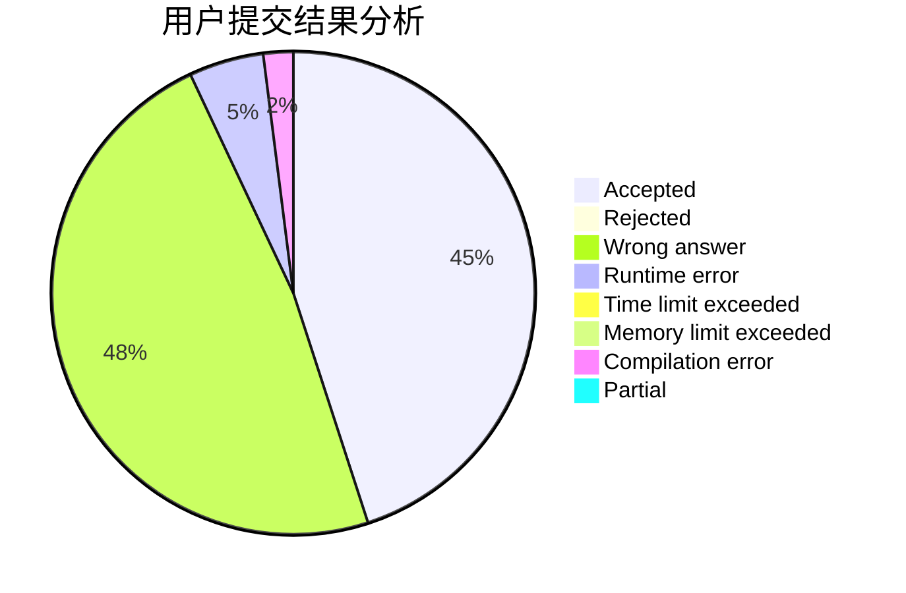
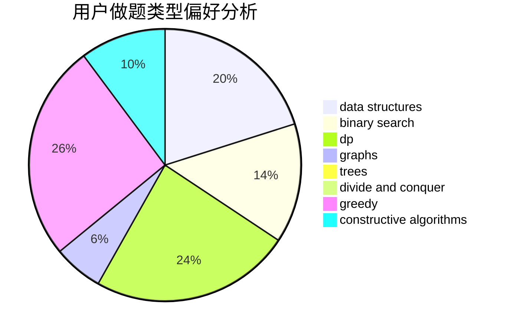
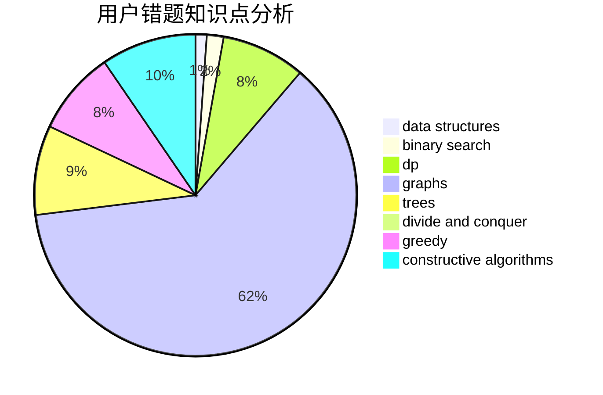

# OInfly

<!-- tabs:start -->

#### **用户提交结果分析**

#### **用户做题类型偏好分析**

#### **用户错题知识点分析**

<!-- tabs:end -->
# 推荐题目
[260A](https://codeforces.com/contest/260/problem/A)		implementation,
                        math		  
[1051B](https://codeforces.com/contest/1051/problem/B)		greedy,
                        math,
                        number theory		  
[135B](https://codeforces.com/contest/135/problem/B)		brute force,
                        geometry,
                        math		  
[509A](https://codeforces.com/contest/509/problem/A)		brute force,
                        implementation		  
[258D](https://codeforces.com/contest/258/problem/D)		dp,
                        math,
                        probabilities		  
[883I](https://codeforces.com/contest/883/problem/I)		binary search,
                        dp		  
[1187F](https://codeforces.com/contest/1187/problem/F)		dp,
                        math,
                        probabilities		  
[1338E](https://codeforces.com/contest/1338/problem/E)		graphs		  
[762C](https://codeforces.com/contest/762/problem/C)		binary search,
                        hashing,
                        strings,
                        two pointers		  
[1195E](https://codeforces.com/contest/1195/problem/E)		data structures,
                        two pointers		  
