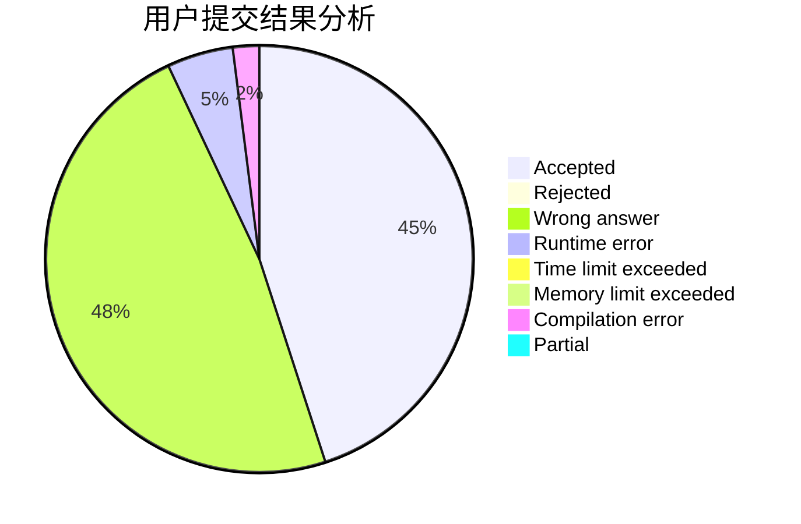
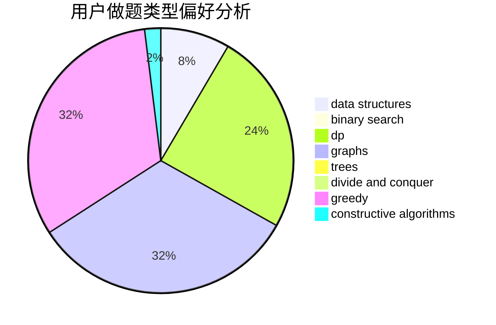
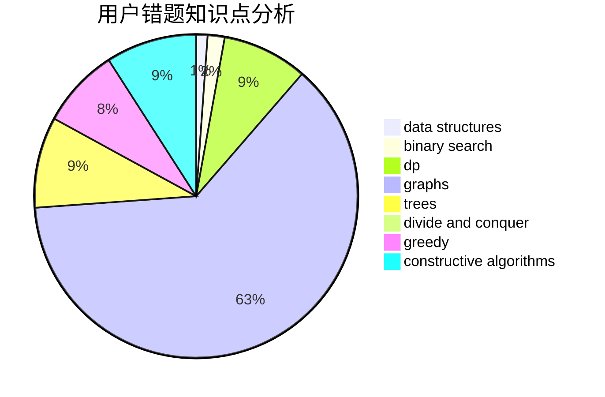

# OInfly

<!-- tabs:start -->

#### **用户提交结果分析**

#### **用户做题类型偏好分析**

#### **用户错题知识点分析**

<!-- tabs:end -->
# 推荐题目
[278B](https://codeforces.com/contest/278/problem/B)		brute force,
                        strings		  
[1051E](https://codeforces.com/contest/1051/problem/E)		binary search,
                        data structures,
                        dp,
                        hashing,
                        strings		  
[13681](https://codeforces.com/contest/1368/problem/1)		dsu,graphs,sortings,trees		  
[52A](https://codeforces.com/contest/52/problem/A)		implementation		  
[276C](https://codeforces.com/contest/276/problem/C)		data structures,
                        greedy,
                        implementation,
                        sortings		  
[901C](https://codeforces.com/contest/901/problem/C)		binary search,
                        data structures,
                        dfs and similar,
                        dsu,
                        graphs,
                        two pointers		  
[1191C](https://codeforces.com/contest/1191/problem/C)		dsu,graphs,sortings,trees		  
[1345F](https://codeforces.com/contest/1345/problem/F)		dsu,graphs,sortings,trees		  
[780G](https://codeforces.com/contest/780/problem/G)		data structures,
                        dp		  
[119D](https://codeforces.com/contest/119/problem/D)		hashing,
                        strings		  
