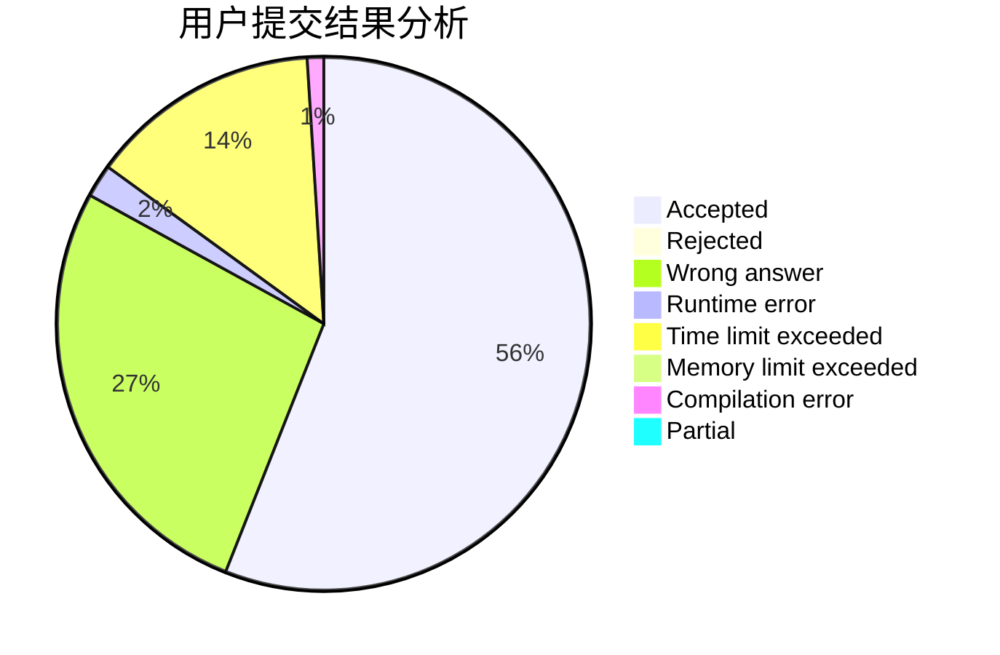
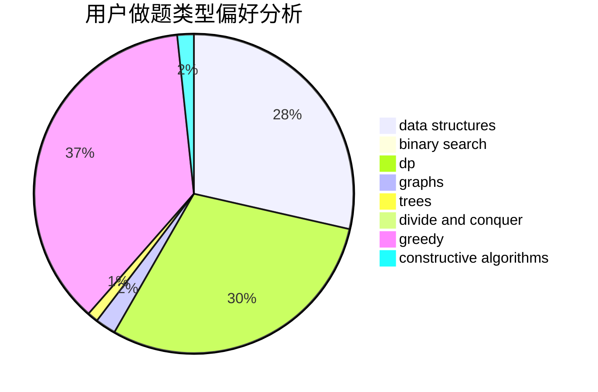
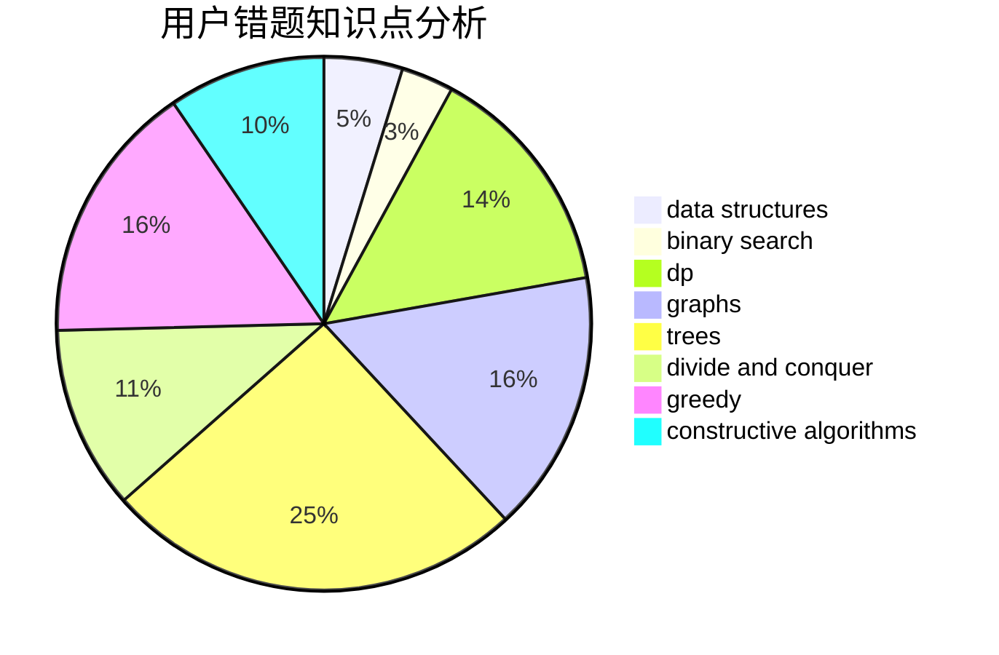

# OMG_link

<!-- tabs:start -->

#### **用户提交结果分析**

#### **用户做题类型偏好分析**

#### **用户错题知识点分析**

<!-- tabs:end -->
# 推荐题目
[1391A](https://codeforces.com/contest/1391/problem/A)		constructive algorithms,
                        math		  
[1220E](https://codeforces.com/contest/1220/problem/E)		dfs and similar,
                        dp,
                        dsu,
                        graphs,
                        greedy,
                        trees		  
[1358F](https://codeforces.com/contest/1358/problem/F)		binary search,
                        constructive algorithms,
                        greedy,
                        implementation		  
[876A](https://codeforces.com/contest/876/problem/A)		math		  
[415A](https://codeforces.com/contest/415/problem/A)		implementation		  
[1297A](https://codeforces.com/contest/1297/problem/A)		*special problem,
                        implementation		  
[591B](https://codeforces.com/contest/591/problem/B)		implementation,
                        strings		  
[1164G](https://codeforces.com/contest/1164/problem/G)		dsu,graphs,sortings,trees		  
[1180D](https://codeforces.com/contest/1180/problem/D)		dsu,graphs,sortings,trees		  
[796D](https://codeforces.com/contest/796/problem/D)		constructive algorithms,
                        dfs and similar,
                        dp,
                        graphs,
                        shortest paths,
                        trees		  
