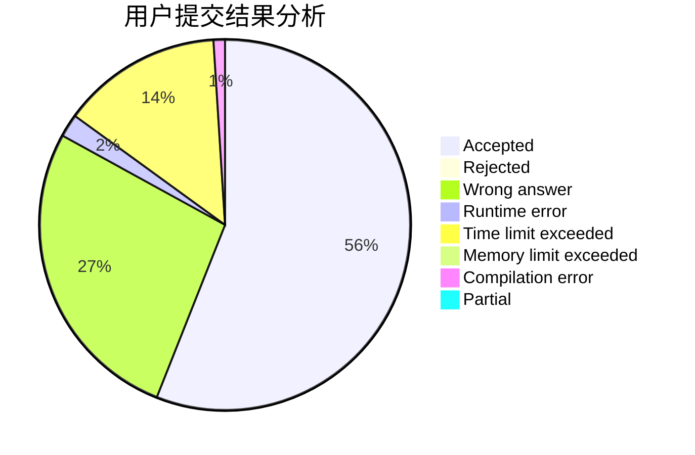
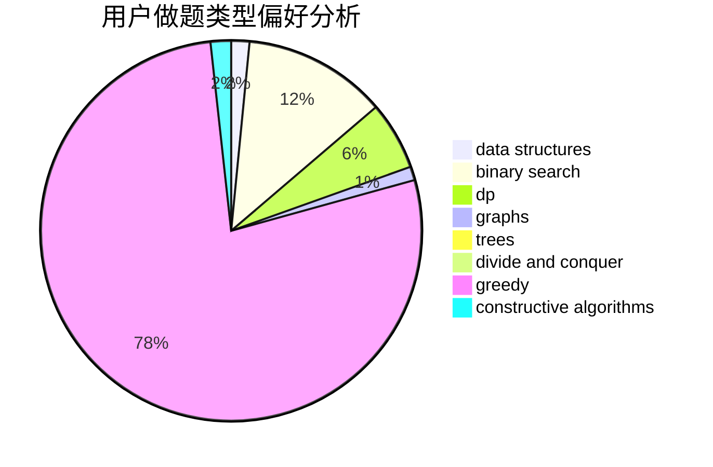
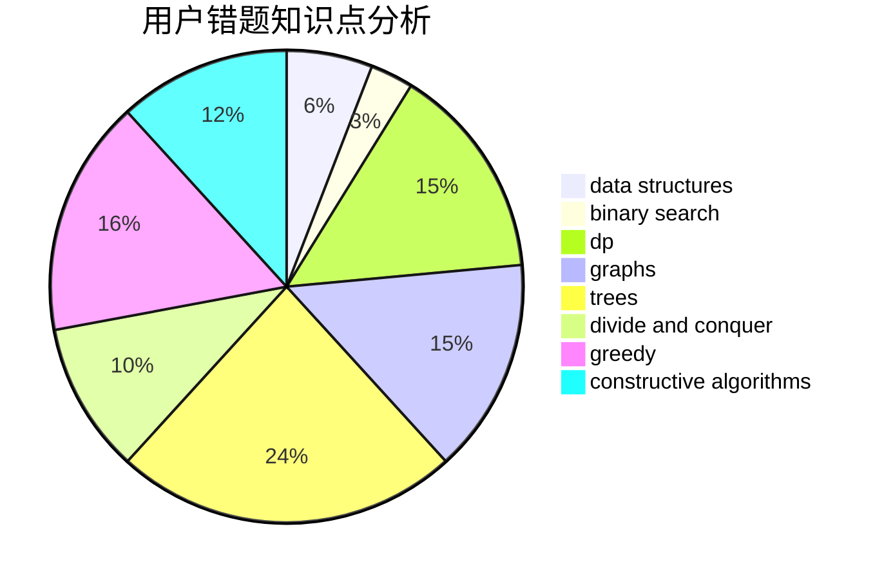

# OMG_link

<!-- tabs:start -->

#### **用户提交结果分析**

#### **用户做题类型偏好分析**

#### **用户错题知识点分析**

<!-- tabs:end -->
# 推荐题目
[1380G](https://codeforces.com/contest/1380/problem/G)		greedy,
                        math,
                        probabilities		  
[1215A](https://codeforces.com/contest/1215/problem/A)		greedy,
                        implementation,
                        math		  
[1352B](https://codeforces.com/contest/1352/problem/B)		constructive algorithms,
                        math		  
[858A](https://codeforces.com/contest/858/problem/A)		brute force,
                        math,
                        number theory		  
[385E](https://codeforces.com/contest/385/problem/E)		math,
                        matrices		  
[1290D](https://codeforces.com/contest/1290/problem/D)		constructive algorithms,
                        graphs,
                        interactive		  
[570E](https://codeforces.com/contest/570/problem/E)		combinatorics,
                        dp		  
[1161E](https://codeforces.com/contest/1161/problem/E)		dsu,graphs,sortings,trees		  
[1178E](https://codeforces.com/contest/1178/problem/E)		brute force,
                        constructive algorithms,
                        greedy,
                        strings		  
[778C](https://codeforces.com/contest/778/problem/C)		brute force,
                        dfs and similar,
                        dsu,
                        hashing,
                        strings,
                        trees		  
