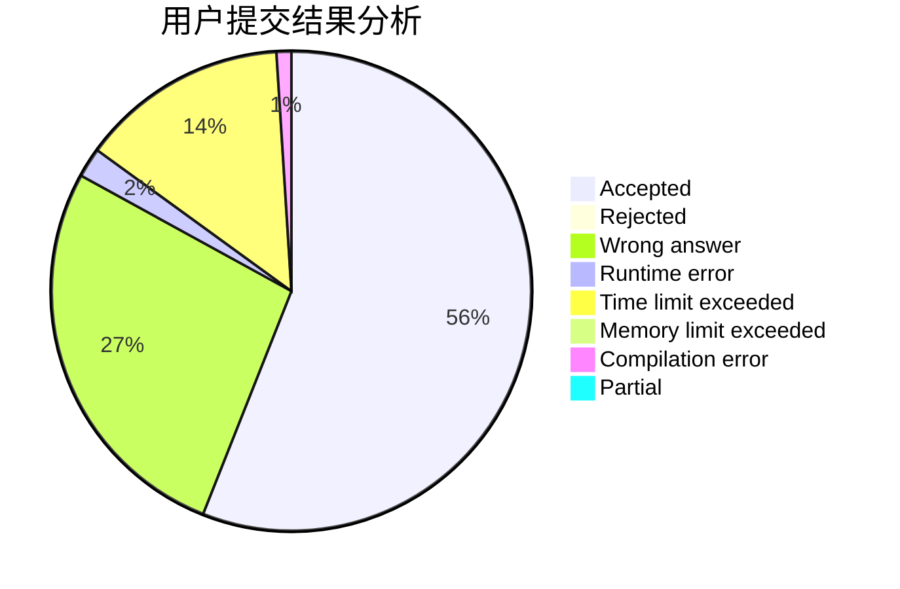
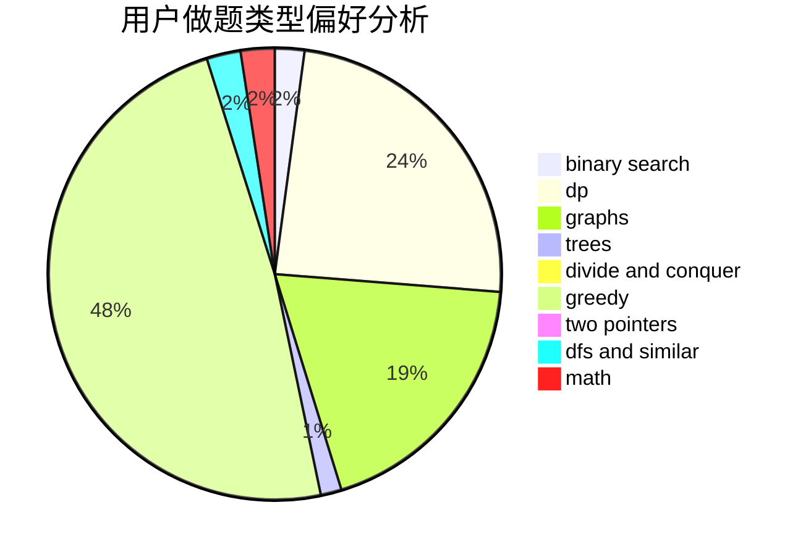

# OMG_link

<!-- tabs:start -->

#### **用户提交结果分析**

#### **用户做题类型偏好分析**

<!-- tabs:end -->
# 推荐题目
[1391A](https://codeforces.com/contest/1391/problem/A)
[1220E](https://codeforces.com/contest/1220/problem/E)
[1358F](https://codeforces.com/contest/1358/problem/F)
[876A](https://codeforces.com/contest/876/problem/A)
[415A](https://codeforces.com/contest/415/problem/A)
[1297A](https://codeforces.com/contest/1297/problem/A)
[591B](https://codeforces.com/contest/591/problem/B)
[1164G](https://codeforces.com/contest/1164/problem/G)
[1180D](https://codeforces.com/contest/1180/problem/D)
[796D](https://codeforces.com/contest/796/problem/D)
