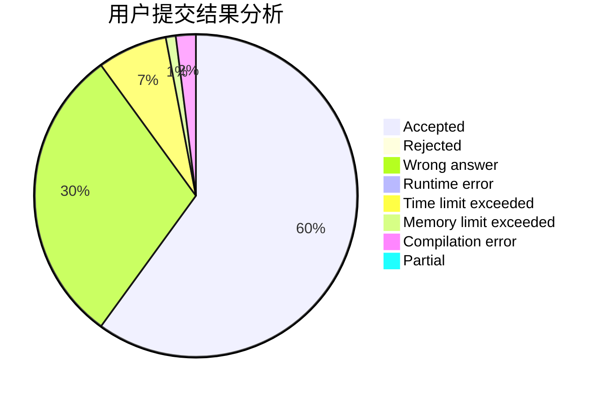
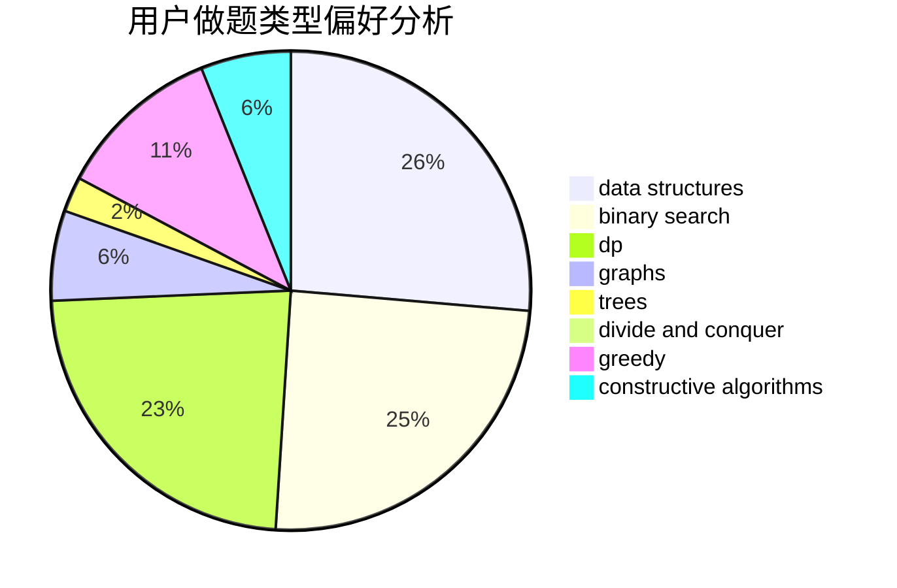
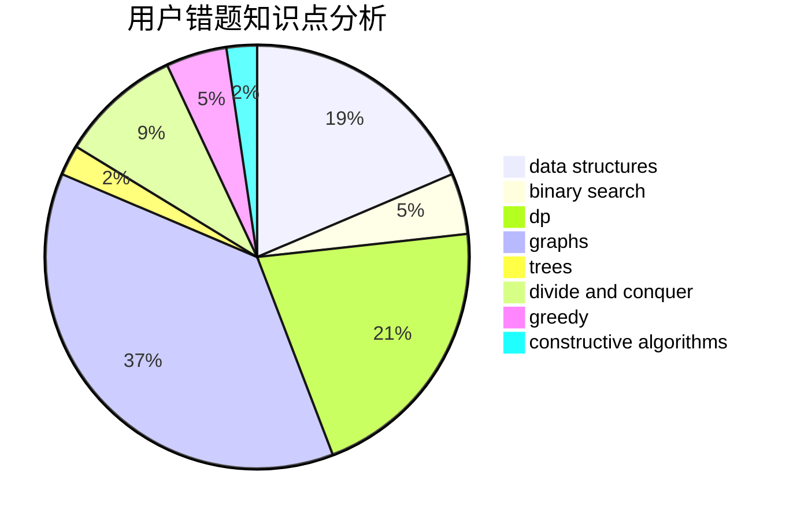

# OMG_wc

<!-- tabs:start -->

#### **用户提交结果分析**

#### **用户做题类型偏好分析**

#### **用户错题知识点分析**

<!-- tabs:end -->
# 推荐题目
[1487D](https://codeforces.com/contest/1487/problem/D)		binary search,
                        brute force,
                        math,
                        number theory		  
[985E](https://codeforces.com/contest/985/problem/E)		binary search,
                        data structures,
                        dp,
                        greedy,
                        two pointers		  
[1007A](https://codeforces.com/contest/1007/problem/A)		combinatorics,
                        data structures,
                        math,
                        sortings,
                        two pointers		  
[743E](https://codeforces.com/contest/743/problem/E)		binary search,
                        bitmasks,
                        brute force,
                        dp		  
[1119B](https://codeforces.com/contest/1119/problem/B)		binary search,
                        flows,
                        greedy,
                        sortings		  
[762B](https://codeforces.com/contest/762/problem/B)		greedy,
                        implementation,
                        sortings,
                        two pointers		  
[492E](https://codeforces.com/contest/492/problem/E)		math		  
[301D](https://codeforces.com/contest/301/problem/D)		data structures		  
[1056E](https://codeforces.com/contest/1056/problem/E)		brute force,
                        data structures,
                        hashing,
                        strings		  
[1322F](https://codeforces.com/contest/1322/problem/F)		dp,
                        trees		  
