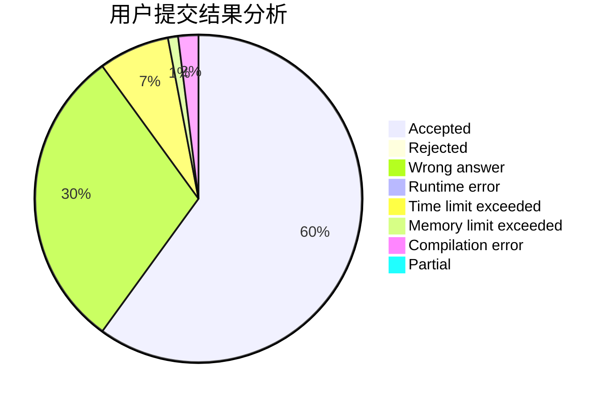
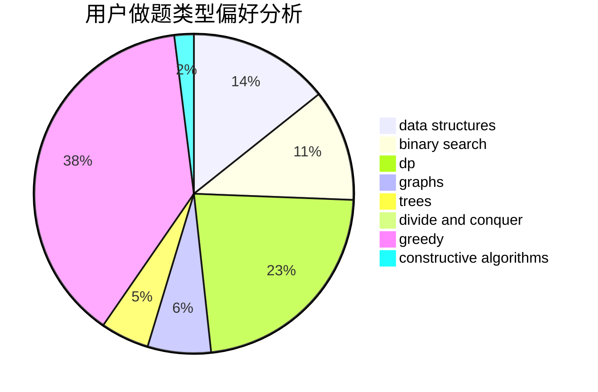
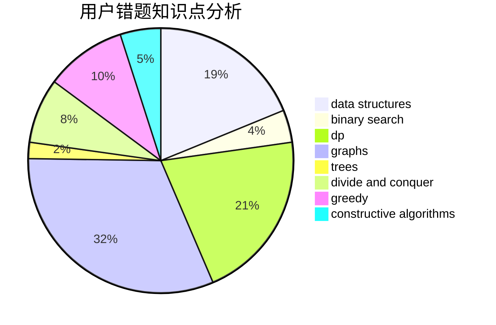

# OMG_wc

<!-- tabs:start -->

#### **用户提交结果分析**

#### **用户做题类型偏好分析**

#### **用户错题知识点分析**

<!-- tabs:end -->
# 推荐题目
[1478F](https://codeforces.com/contest/1478/problem/F)		dsu,graphs,sortings,trees		  
[962G](https://codeforces.com/contest/962/problem/G)		data structures,
                        dsu,
                        geometry,
                        trees		  
[1006D](https://codeforces.com/contest/1006/problem/D)		implementation		  
[725E](https://codeforces.com/contest/725/problem/E)		brute force,
                        greedy		  
[1117C](https://codeforces.com/contest/1117/problem/C)		binary search		  
[741B](https://codeforces.com/contest/741/problem/B)		dfs and similar,
                        dp,
                        dsu		  
[474D](https://codeforces.com/contest/474/problem/D)		dp		  
[288C](https://codeforces.com/contest/288/problem/C)		implementation,
                        math		  
[1056B](https://codeforces.com/contest/1056/problem/B)		math,
                        number theory		  
[1313C1](https://codeforces.com/contest/1313C/problem/1)		brute force,
                        data structures,
                        dp,
                        greedy		  
