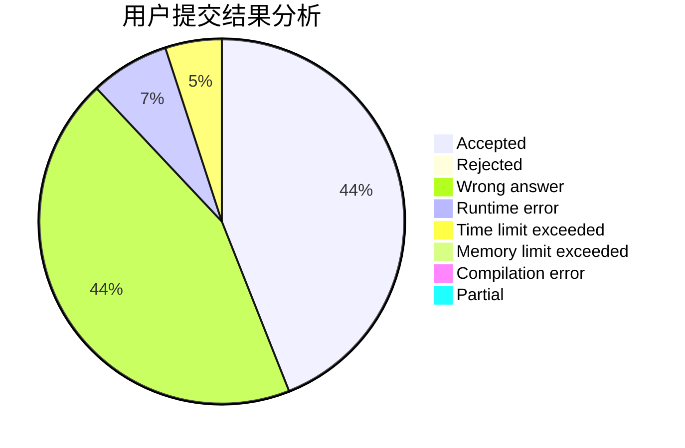
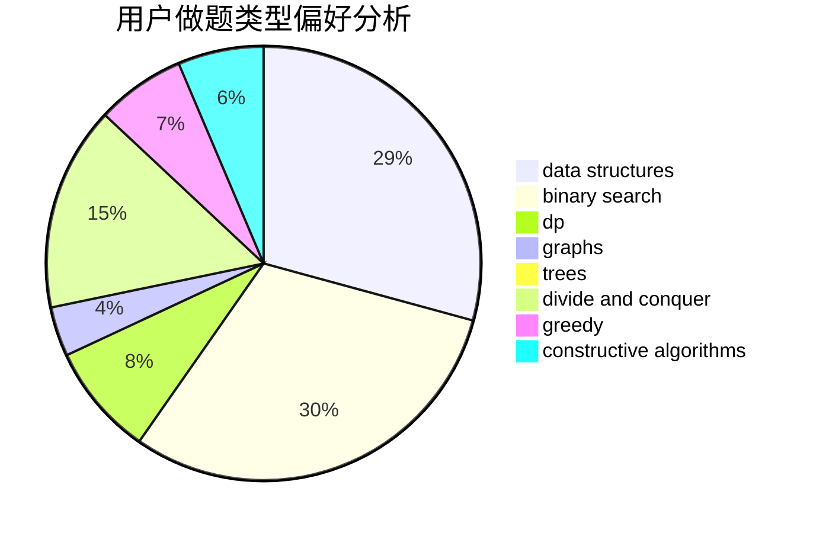
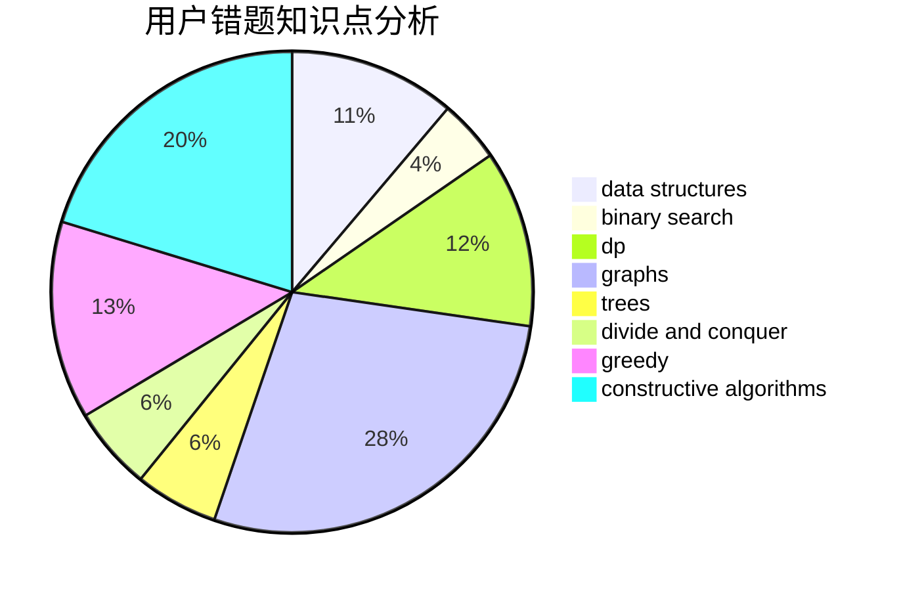

# OOmega

<!-- tabs:start -->

#### **用户提交结果分析**

#### **用户做题类型偏好分析**

#### **用户错题知识点分析**

<!-- tabs:end -->
# 推荐题目
[1220B](https://codeforces.com/contest/1220/problem/B)		math,
                        number theory		  
[1109A](https://codeforces.com/contest/1109/problem/A)		dp,
                        implementation		  
[94C](https://codeforces.com/contest/94/problem/C)		dsu,graphs,sortings,trees		  
[1480D1](https://codeforces.com/contest/1480D/problem/1)		dsu,graphs,sortings,trees		  
[733B](https://codeforces.com/contest/733/problem/B)		math		  
[958B2](https://codeforces.com/contest/958B/problem/2)		data structures,
                        dfs and similar,
                        graphs,
                        greedy,
                        trees		  
[475A](https://codeforces.com/contest/475/problem/A)		implementation		  
[1101E](https://codeforces.com/contest/1101/problem/E)		implementation		  
[822E](https://codeforces.com/contest/822/problem/E)		binary search,
                        dp,
                        hashing,
                        string suffix structures		  
[1156C](https://codeforces.com/contest/1156/problem/C)		binary search,
                        greedy,
                        sortings,
                        ternary search,
                        two pointers		  
