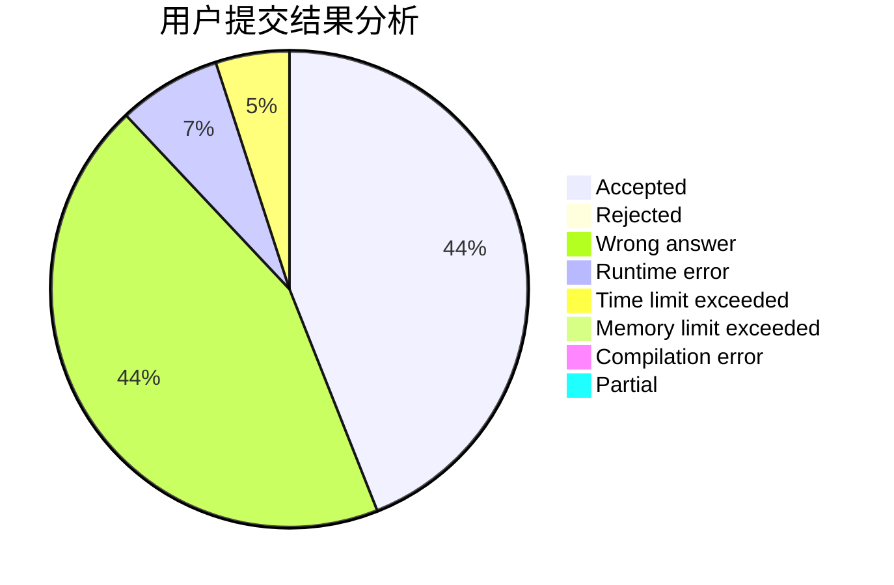
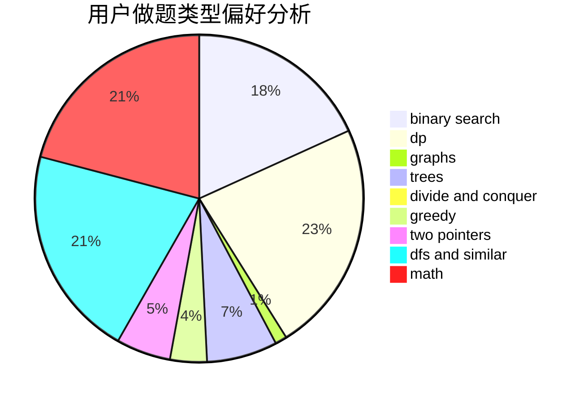

# OOmega

<!-- tabs:start -->

#### **用户提交结果分析**

#### **用户做题类型偏好分析**

<!-- tabs:end -->
# 推荐题目
[1228B](https://codeforces.com/contest/1228/problem/B)
[1109E](https://codeforces.com/contest/1109/problem/E)
[967B](https://codeforces.com/contest/967/problem/B)
[1488H](https://codeforces.com/contest/1488/problem/H)
[750G](https://codeforces.com/contest/750/problem/G)
[979E](https://codeforces.com/contest/979/problem/E)
[494A](https://codeforces.com/contest/494/problem/A)
[1102A](https://codeforces.com/contest/1102/problem/A)
[842D](https://codeforces.com/contest/842/problem/D)
[1158A](https://codeforces.com/contest/1158/problem/A)
