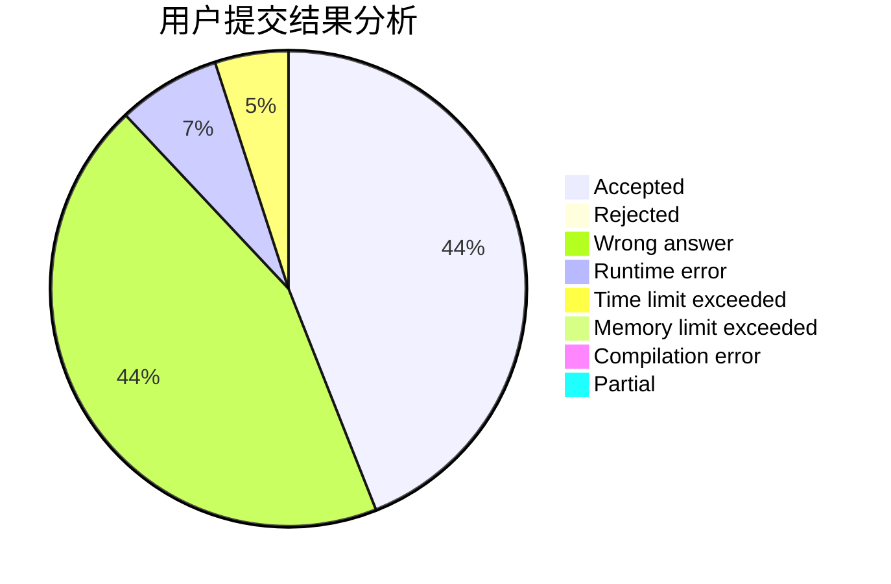
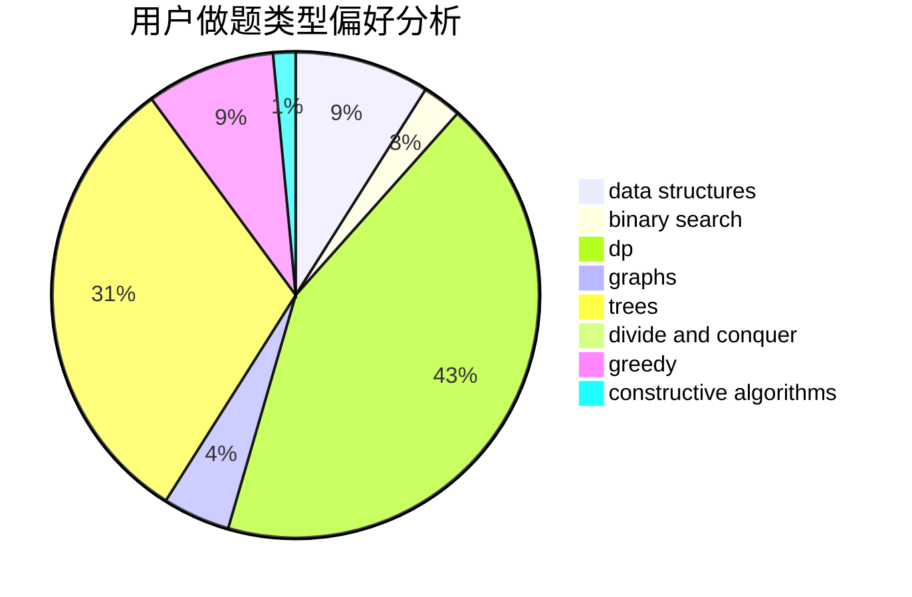
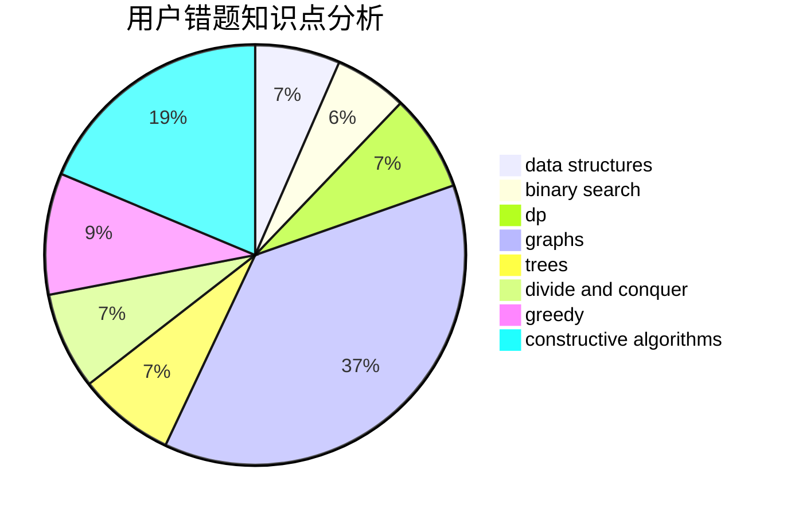

# OOmega

<!-- tabs:start -->

#### **用户提交结果分析**

#### **用户做题类型偏好分析**

#### **用户错题知识点分析**

<!-- tabs:end -->
# 推荐题目
[1228B](https://codeforces.com/contest/1228/problem/B)		implementation,
                        math		  
[1109E](https://codeforces.com/contest/1109/problem/E)		data structures,
                        number theory		  
[967B](https://codeforces.com/contest/967/problem/B)		math,
                        sortings		  
[1488H](https://codeforces.com/contest/1488/problem/H)		*special problem,
                        combinatorics,
                        data structures		  
[750G](https://codeforces.com/contest/750/problem/G)		bitmasks,
                        brute force,
                        combinatorics,
                        dp		  
[979E](https://codeforces.com/contest/979/problem/E)		dp		  
[494A](https://codeforces.com/contest/494/problem/A)		greedy		  
[1102A](https://codeforces.com/contest/1102/problem/A)		math		  
[842D](https://codeforces.com/contest/842/problem/D)		binary search,
                        data structures		  
[1158A](https://codeforces.com/contest/1158/problem/A)		binary search,
                        constructive algorithms,
                        greedy,
                        implementation,
                        math,
                        sortings,
                        two pointers		  
