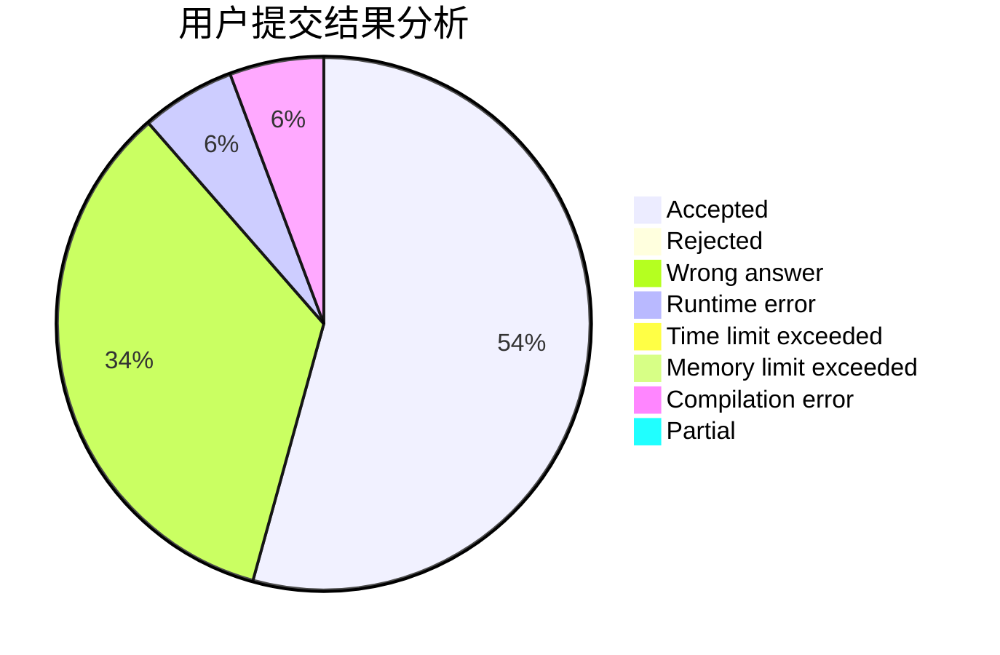
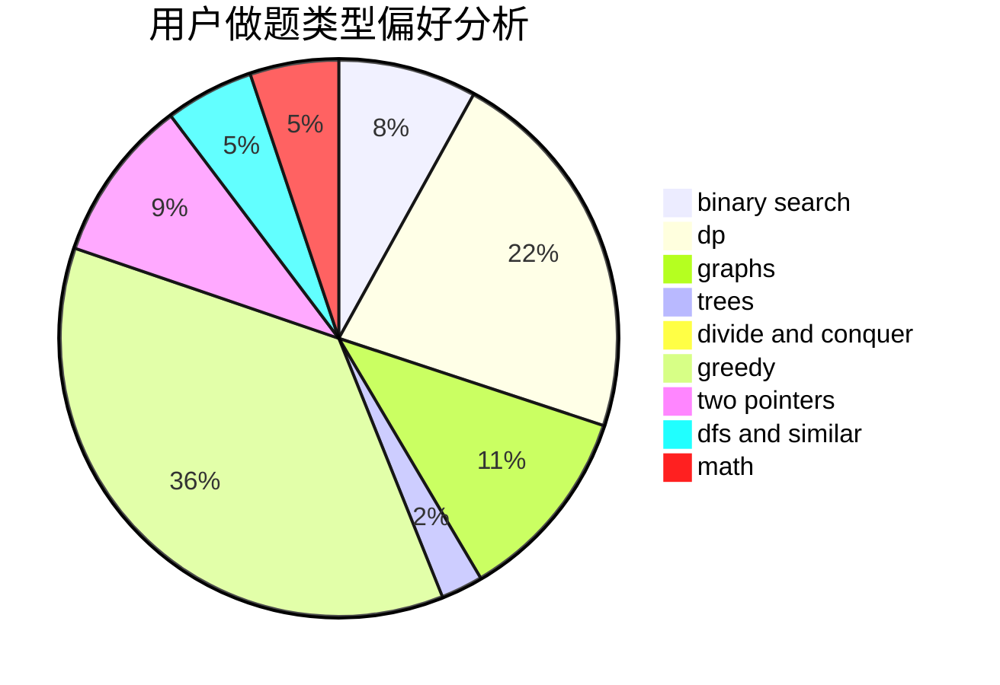

# 9Omega

<!-- tabs:start -->

#### **用户提交结果分析**

#### **用户做题类型偏好分析**

<!-- tabs:end -->
# 推荐题目
[1468N](https://codeforces.com/contest/1468/problem/N)
[1470E](https://codeforces.com/contest/1470/problem/E)
[1374B](https://codeforces.com/contest/1374/problem/B)
[1471E](https://codeforces.com/contest/1471/problem/E)
[1470D](https://codeforces.com/contest/1470/problem/D)
[1468L](https://codeforces.com/contest/1468/problem/L)
[1470F](https://codeforces.com/contest/1470/problem/F)
[1033E](https://codeforces.com/contest/1033/problem/E)
[11961](https://codeforces.com/contest/1196/problem/1)
[146C](https://codeforces.com/contest/146/problem/C)
