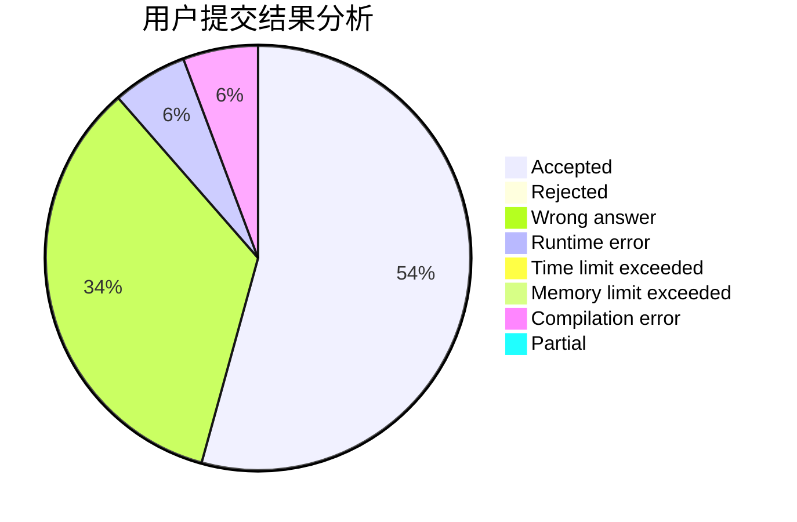
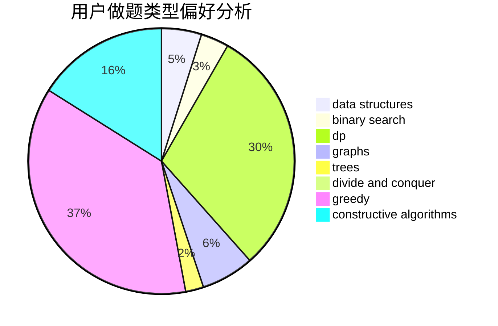
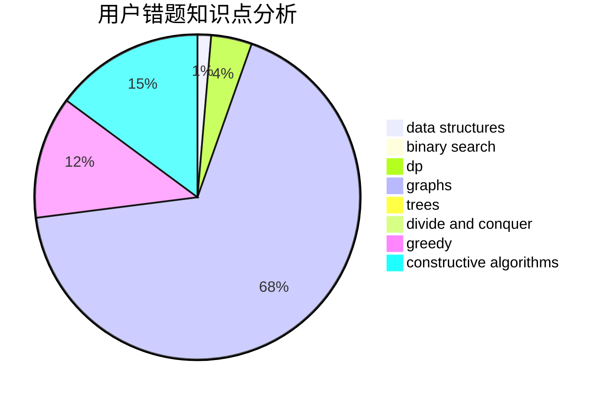

# 9Omega

<!-- tabs:start -->

#### **用户提交结果分析**

#### **用户做题类型偏好分析**

#### **用户错题知识点分析**

<!-- tabs:end -->
# 推荐题目
[1468N](https://codeforces.com/contest/1468/problem/N)		greedy,
                        implementation		  
[1470E](https://codeforces.com/contest/1470/problem/E)		binary search,
                        combinatorics,
                        data structures,
                        dp,
                        graphs,
                        implementation,
                        two pointers		  
[1374B](https://codeforces.com/contest/1374/problem/B)		math		  
[1471E](https://codeforces.com/contest/1471/problem/E)		dsu,graphs,sortings,trees		  
[1470D](https://codeforces.com/contest/1470/problem/D)		constructive algorithms,
                        dfs and similar,
                        graph matchings,
                        graphs,
                        greedy		  
[1468L](https://codeforces.com/contest/1468/problem/L)		binary search,
                        greedy,
                        math,
                        number theory		  
[1470F](https://codeforces.com/contest/1470/problem/F)		divide and conquer		  
[1033E](https://codeforces.com/contest/1033/problem/E)		binary search,
                        constructive algorithms,
                        dfs and similar,
                        graphs,
                        interactive		  
[11961](https://codeforces.com/contest/1196/problem/1)		dsu,graphs,sortings,trees		  
[146C](https://codeforces.com/contest/146/problem/C)		dsu,graphs,sortings,trees		  
