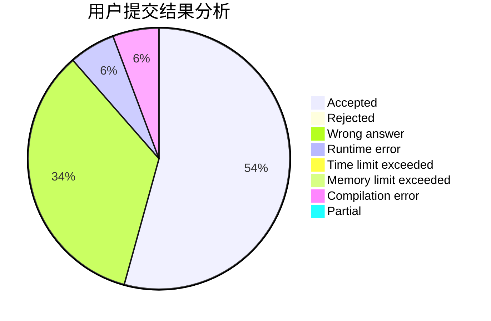
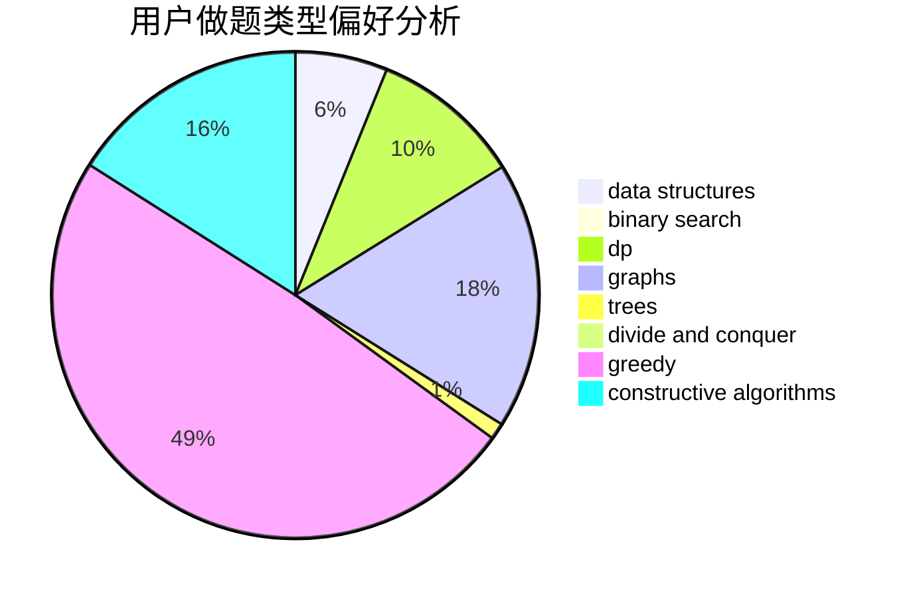
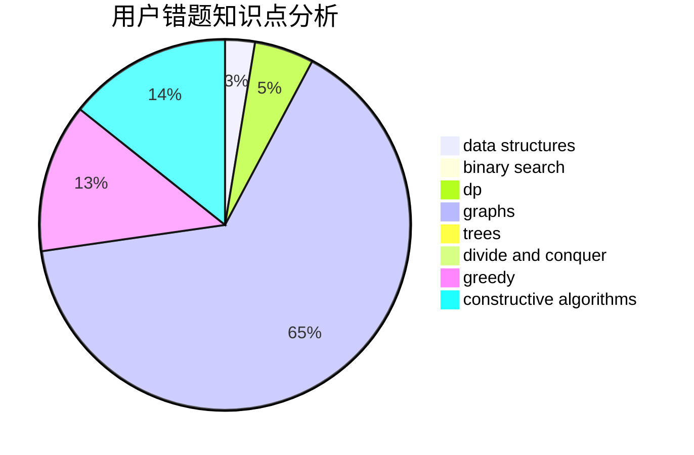

# 9Omega
<!-- tabs:start -->
#### **用户提交结果分析**

#### **用户做题类型偏好分析**

#### **用户错题知识点分析**

<!-- tabs:end -->
# 推荐题目
[Divide and Summarize](http://codeforces.com/problemset/problem/1461/D)		binary search,
                        brute force,
                        data structures,
                        divide and conquer,
                        implementation,
                        sortings		  
[Minimum Integer](http://codeforces.com/problemset/problem/1101/A)		math		  
[Max Correct Set](http://codeforces.com/problemset/problem/1463/F)		bitmasks,
                        dp,
                        math		  
[Necklace Assembly](http://codeforces.com/problemset/problem/1367/E)		brute force,
                        dfs and similar,
                        dp,
                        graphs,
                        greedy,
                        number theory		  
[Pairs](http://codeforces.com/problemset/problem/1463/D)		binary search,
                        constructive algorithms,
                        greedy,
                        two pointers		  
[The Thorny Path](https://codeforces.com/contest/1464/problem/D)		greedy,
                        math		  
[Fixing the Cloud](https://codeforces.com/contest/1460/problem/A)		nan		  
[The Fair Nut and the Best Path](http://codeforces.com/problemset/problem/1083/A)		data structures,
                        dp,
                        trees		  
[Lucky Conversion](http://codeforces.com/problemset/problem/145/A)		greedy,
                        implementation		  
[Square Difference](http://codeforces.com/problemset/problem/1033/B)		math,
                        number theory		  
<!-- tabs:start -->
#### **data structures**
[Divide and Summarize](http://codeforces.com/problemset/problem/1461/D)		binary search,
                        brute force,
                        data structures,
                        divide and conquer,
                        implementation,
                        sortings		  
[Minimum Integer](http://codeforces.com/problemset/problem/1083/A)		data structures,
                        dp,
                        trees		  
[Max Correct Set](http://codeforces.com/problemset/problem/1458/F)		data structures,
                        trees		  
[Necklace Assembly](https://codeforces.com/contest/1459/problem/F)		data structures,
                        graphs,
                        greedy		  
[Pairs](http://codeforces.com/problemset/problem/1200/A)		brute force,
                        data structures,
                        implementation		  
[The Thorny Path](http://codeforces.com/problemset/problem/1458/E)		data structures,
                        games		  
[Fixing the Cloud](http://codeforces.com/problemset/problem/1462/F)		binary search,
                        data structures,
                        greedy		  
[The Fair Nut and the Best Path](http://codeforces.com/problemset/problem/1492/C)		binary search,
                        data structures,
                        dp,
                        greedy,
                        two pointers		  
[Lucky Conversion](http://codeforces.com/problemset/problem/1490/G)		binary search,
                        data structures,
                        math		  
[Square Difference](http://codeforces.com/problemset/problem/1479/D)		binary search,
                        bitmasks,
                        brute force,
                        data structures,
                        probabilities,
                        trees		  
#### **binary search**
[Divide and Summarize](http://codeforces.com/problemset/problem/1461/D)		binary search,
                        brute force,
                        data structures,
                        divide and conquer,
                        implementation,
                        sortings		  
[Minimum Integer](http://codeforces.com/problemset/problem/1463/D)		binary search,
                        constructive algorithms,
                        greedy,
                        two pointers		  
[Max Correct Set](http://codeforces.com/problemset/problem/1007/C)		binary search,
                        interactive		  
[Necklace Assembly](http://codeforces.com/problemset/problem/1462/E2)		binary search,
                        combinatorics,
                        implementation,
                        math,
                        sortings,
                        two pointers		  
[Pairs](http://codeforces.com/problemset/problem/1462/E1)		binary search,
                        combinatorics,
                        math,
                        sortings,
                        two pointers		  
[The Thorny Path](http://codeforces.com/problemset/problem/1463/A)		binary search,
                        math		  
[Fixing the Cloud](http://codeforces.com/problemset/problem/1462/F)		binary search,
                        data structures,
                        greedy		  
[The Fair Nut and the Best Path](http://codeforces.com/problemset/problem/1492/C)		binary search,
                        data structures,
                        dp,
                        greedy,
                        two pointers		  
[Lucky Conversion](http://codeforces.com/problemset/problem/1463/D)		binary search,
                        constructive algorithms,
                        greedy,
                        two pointers		  
[Square Difference](http://codeforces.com/problemset/problem/1490/G)		binary search,
                        data structures,
                        math		  
#### **dp**
[Divide and Summarize](http://codeforces.com/problemset/problem/1463/F)		bitmasks,
                        dp,
                        math		  
[Minimum Integer](http://codeforces.com/problemset/problem/1367/E)		brute force,
                        dfs and similar,
                        dp,
                        graphs,
                        greedy,
                        number theory		  
[Max Correct Set](http://codeforces.com/problemset/problem/1083/A)		data structures,
                        dp,
                        trees		  
[Necklace Assembly](http://codeforces.com/problemset/problem/1081/C)		combinatorics,
                        dp,
                        math		  
[Pairs](http://codeforces.com/problemset/problem/145/C)		combinatorics,
                        dp,
                        math		  
[The Thorny Path](https://codeforces.com/contest/1459/problem/D)		dp		  
[Fixing the Cloud](http://codeforces.com/problemset/problem/1070/G)		brute force,
                        dp,
                        greedy,
                        implementation		  
[The Fair Nut and the Best Path](http://codeforces.com/problemset/problem/1373/E)		brute force,
                        constructive algorithms,
                        dp,
                        greedy		  
[Lucky Conversion](http://codeforces.com/problemset/problem/1461/B)		brute force,
                        dp,
                        implementation		  
[Square Difference](http://codeforces.com/problemset/problem/1459/B)		dp,
                        math		  
#### **graph**
[Divide and Summarize](http://codeforces.com/problemset/problem/1367/E)		brute force,
                        dfs and similar,
                        dp,
                        graphs,
                        greedy,
                        number theory		  
[Minimum Integer](https://codeforces.com/contest/1459/problem/F)		data structures,
                        graphs,
                        greedy		  
[Max Correct Set](http://codeforces.com/problemset/problem/1394/B)		brute force,
                        dfs and similar,
                        graphs,
                        hashing		  
[Necklace Assembly](https://codeforces.com/contest/1464/problem/A)		dfs and similar,
                        dsu,
                        graphs		  
[Pairs](http://codeforces.com/problemset/problem/1463/E)		constructive algorithms,
                        dfs and similar,
                        dsu,
                        graphs,
                        implementation,
                        sortings,
                        trees		  
[The Thorny Path](http://codeforces.com/problemset/problem/1461/E)		brute force,
                        graphs,
                        greedy,
                        implementation,
                        math		  
[Fixing the Cloud](http://codeforces.com/problemset/problem/1487/C)		brute force,
                        constructive algorithms,
                        dfs and similar,
                        graphs,
                        greedy,
                        implementation,
                        math		  
[The Fair Nut and the Best Path](http://codeforces.com/problemset/problem/1437/C)		dp,
                        flows,
                        graph matchings,
                        greedy,
                        math,
                        sortings		  
[Lucky Conversion](http://codeforces.com/problemset/problem/1470/D)		constructive algorithms,
                        dfs and similar,
                        graph matchings,
                        graphs,
                        greedy		  
[Square Difference](http://codeforces.com/problemset/problem/1476/C)		dp,
                        graphs,
                        greedy		  
#### **trees**
[Divide and Summarize](http://codeforces.com/problemset/problem/1083/A)		data structures,
                        dp,
                        trees		  
[Minimum Integer](http://codeforces.com/problemset/problem/1458/F)		data structures,
                        trees		  
[Max Correct Set](http://codeforces.com/problemset/problem/1463/E)		constructive algorithms,
                        dfs and similar,
                        dsu,
                        graphs,
                        implementation,
                        sortings,
                        trees		  
[Necklace Assembly](http://codeforces.com/problemset/problem/1479/D)		binary search,
                        bitmasks,
                        brute force,
                        data structures,
                        probabilities,
                        trees		  
[Pairs](http://codeforces.com/problemset/problem/1511/C)		brute force,
                        data structures,
                        implementation,
                        trees		  
[The Thorny Path](http://codeforces.com/problemset/problem/1499/F)		combinatorics,
                        dfs and similar,
                        dp,
                        trees		  
[Fixing the Cloud](http://codeforces.com/problemset/problem/1491/E)		brute force,
                        dfs and similar,
                        divide and conquer,
                        number theory,
                        trees		  
[The Fair Nut and the Best Path](http://codeforces.com/problemset/problem/1466/D)		data structures,
                        greedy,
                        sortings,
                        trees		  
[Lucky Conversion](http://codeforces.com/problemset/problem/1495/D)		combinatorics,
                        dfs and similar,
                        graphs,
                        math,
                        shortest paths,
                        trees		  
[Square Difference](http://codeforces.com/problemset/problem/1303/G)		data structures,
                        divide and conquer,
                        geometry,
                        trees		  
#### **divide and conquer**
[Divide and Summarize](http://codeforces.com/problemset/problem/1461/D)		binary search,
                        brute force,
                        data structures,
                        divide and conquer,
                        implementation,
                        sortings		  
[Minimum Integer](http://codeforces.com/problemset/problem/1461/D)		binary search,
                        brute force,
                        data structures,
                        divide and conquer,
                        implementation,
                        sortings		  
[Max Correct Set](http://codeforces.com/problemset/problem/1466/G)		combinatorics,
                        divide and conquer,
                        hashing,
                        math,
                        string suffix structures,
                        strings		  
[Necklace Assembly](http://codeforces.com/problemset/problem/1490/D)		dfs and similar,
                        divide and conquer,
                        implementation		  
[Pairs](https://codeforces.com/contest/1483/problem/C)		data structures,
                        divide and conquer,
                        dp		  
[The Thorny Path](http://codeforces.com/problemset/problem/1491/E)		brute force,
                        dfs and similar,
                        divide and conquer,
                        number theory,
                        trees		  
[Fixing the Cloud](http://codeforces.com/problemset/problem/1303/G)		data structures,
                        divide and conquer,
                        geometry,
                        trees		  
[The Fair Nut and the Best Path](http://codeforces.com/problemset/problem/1494/D)		constructive algorithms,
                        data structures,
                        dfs and similar,
                        divide and conquer,
                        dsu,
                        greedy,
                        sortings,
                        trees		  
[Lucky Conversion](http://codeforces.com/problemset/problem/1482/E)		data structures,
                        divide and conquer,
                        dp		  
[Square Difference](http://codeforces.com/problemset/problem/566/C)		dfs and similar,
                        divide and conquer,
                        trees		  
#### **greedy**
[Divide and Summarize](http://codeforces.com/problemset/problem/1367/E)		brute force,
                        dfs and similar,
                        dp,
                        graphs,
                        greedy,
                        number theory		  
[Minimum Integer](http://codeforces.com/problemset/problem/1463/D)		binary search,
                        constructive algorithms,
                        greedy,
                        two pointers		  
[Max Correct Set](https://codeforces.com/contest/1464/problem/D)		greedy,
                        math		  
[Necklace Assembly](http://codeforces.com/problemset/problem/145/A)		greedy,
                        implementation		  
[Pairs](https://codeforces.com/contest/1464/problem/C)		bitmasks,
                        greedy,
                        math,
                        strings		  
[The Thorny Path](http://codeforces.com/problemset/problem/1462/C)		brute force,
                        greedy,
                        math		  
[Fixing the Cloud](http://codeforces.com/problemset/problem/1070/G)		brute force,
                        dp,
                        greedy,
                        implementation		  
[The Fair Nut and the Best Path](http://codeforces.com/problemset/problem/1373/E)		brute force,
                        constructive algorithms,
                        dp,
                        greedy		  
[Lucky Conversion](http://codeforces.com/problemset/problem/1455/E)		brute force,
                        constructive algorithms,
                        flows,
                        geometry,
                        greedy,
                        implementation,
                        math,
                        ternary search		  
[Square Difference](https://codeforces.com/contest/1459/problem/F)		data structures,
                        graphs,
                        greedy		  
#### **constructive algorithms**
[Divide and Summarize](http://codeforces.com/problemset/problem/1463/D)		binary search,
                        constructive algorithms,
                        greedy,
                        two pointers		  
[Minimum Integer](https://codeforces.com/contest/1180/problem/D)		constructive algorithms		  
[Max Correct Set](http://codeforces.com/problemset/problem/1080/D)		constructive algorithms,
                        implementation,
                        math		  
[Necklace Assembly](http://codeforces.com/problemset/problem/145/B)		constructive algorithms		  
[Pairs](http://codeforces.com/problemset/problem/1373/E)		brute force,
                        constructive algorithms,
                        dp,
                        greedy		  
[The Thorny Path](http://codeforces.com/problemset/problem/1455/E)		brute force,
                        constructive algorithms,
                        flows,
                        geometry,
                        greedy,
                        implementation,
                        math,
                        ternary search		  
[Fixing the Cloud](http://codeforces.com/problemset/problem/1463/E)		constructive algorithms,
                        dfs and similar,
                        dsu,
                        graphs,
                        implementation,
                        sortings,
                        trees		  
[The Fair Nut and the Best Path](http://codeforces.com/problemset/problem/1461/A)		constructive algorithms,
                        greedy		  
[Lucky Conversion](http://codeforces.com/problemset/problem/1103/A)		constructive algorithms,
                        implementation		  
[Square Difference](http://codeforces.com/problemset/problem/1416/B)		constructive algorithms,
                        greedy,
                        math		  
#### **sortings**
[Divide and Summarize](http://codeforces.com/problemset/problem/1461/D)		binary search,
                        brute force,
                        data structures,
                        divide and conquer,
                        implementation,
                        sortings		  
[Minimum Integer](http://codeforces.com/problemset/problem/1462/E2)		binary search,
                        combinatorics,
                        implementation,
                        math,
                        sortings,
                        two pointers		  
[Max Correct Set](http://codeforces.com/problemset/problem/1463/E)		constructive algorithms,
                        dfs and similar,
                        dsu,
                        graphs,
                        implementation,
                        sortings,
                        trees		  
[Necklace Assembly](http://codeforces.com/problemset/problem/1462/E1)		binary search,
                        combinatorics,
                        math,
                        sortings,
                        two pointers		  
[Pairs](https://codeforces.com/contest/1496/problem/C)		geometry,
                        greedy,
                        math,
                        sortings		  
[The Thorny Path](http://codeforces.com/problemset/problem/1495/A)		geometry,
                        greedy,
                        math,
                        sortings		  
[Fixing the Cloud](http://codeforces.com/problemset/problem/1497/A)		brute force,
                        data structures,
                        greedy,
                        sortings		  
[The Fair Nut and the Best Path](http://codeforces.com/problemset/problem/1427/A)		math,
                        sortings		  
[Lucky Conversion](http://codeforces.com/problemset/problem/1461/D)		binary search,
                        brute force,
                        data structures,
                        divide and conquer,
                        implementation,
                        sortings		  
[Square Difference](http://codeforces.com/problemset/problem/1437/C)		dp,
                        flows,
                        graph matchings,
                        greedy,
                        math,
                        sortings		  
<!-- tabs:end -->
