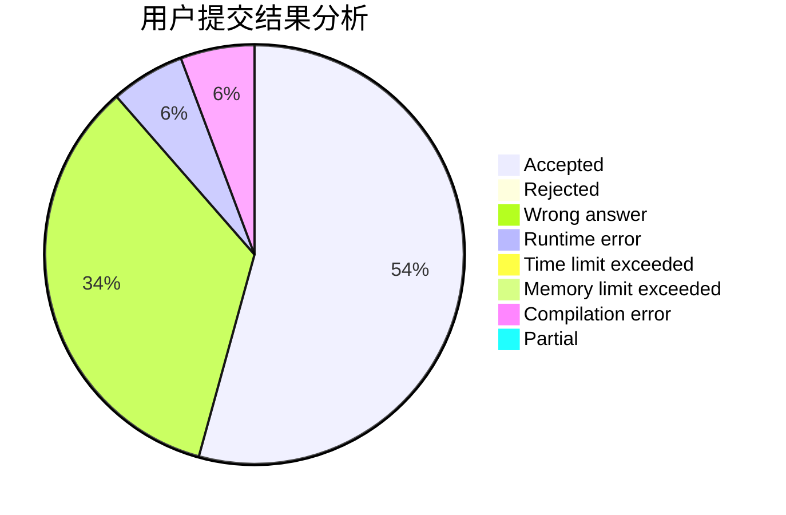
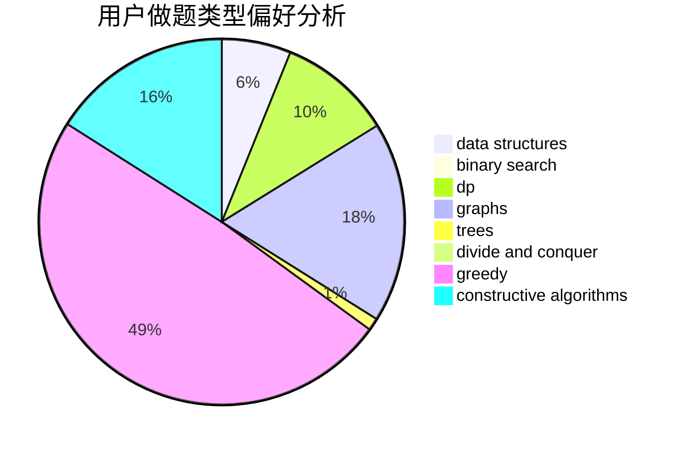
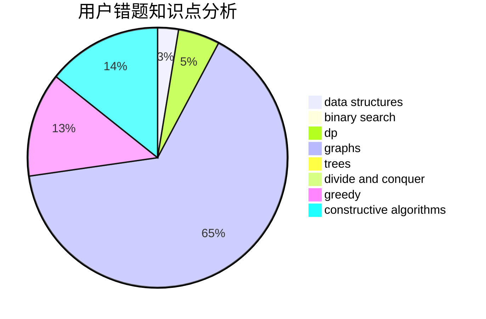

# 9Omega

<!-- tabs:start -->

#### **用户提交结果分析**

#### **用户做题类型偏好分析**

#### **用户错题知识点分析**

<!-- tabs:end -->
# 推荐题目
[1461D](https://codeforces.com/contest/1461/problem/D)		binary search,
                        brute force,
                        data structures,
                        divide and conquer,
                        implementation,
                        sortings		  
[1463D](https://codeforces.com/contest/1463/problem/D)		binary search,
                        constructive algorithms,
                        greedy,
                        two pointers		  
[1367E](https://codeforces.com/contest/1367/problem/E)		brute force,
                        dfs and similar,
                        dp,
                        graphs,
                        greedy,
                        number theory		  
[1464D](https://codeforces.com/contest/1464/problem/D)		dsu,graphs,sortings,trees		  
[1463C](https://codeforces.com/contest/1463/problem/C)		implementation		  
[1461B](https://codeforces.com/contest/1461/problem/B)		brute force,
                        dp,
                        implementation		  
[1463E](https://codeforces.com/contest/1463/problem/E)		constructive algorithms,
                        dfs and similar,
                        dsu,
                        graphs,
                        implementation,
                        sortings,
                        trees		  
[1033B](https://codeforces.com/contest/1033/problem/B)		math,
                        number theory		  
[1190A](https://codeforces.com/contest/1190/problem/A)		implementation,
                        two pointers		  
[1462E2](https://codeforces.com/contest/1462E/problem/2)		binary search,
                        combinatorics,
                        implementation,
                        math,
                        sortings,
                        two pointers		  
