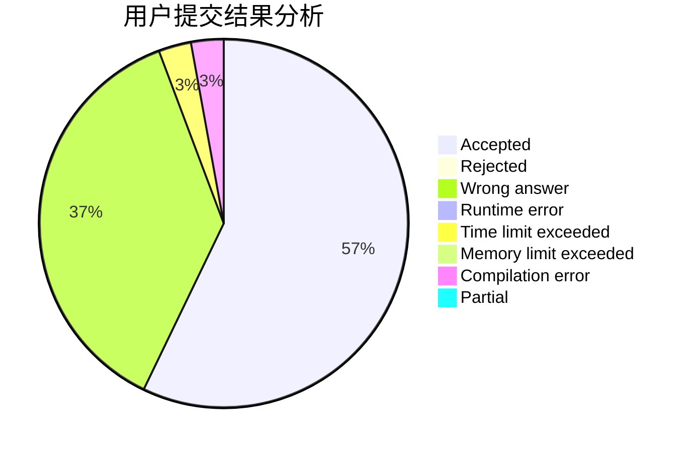
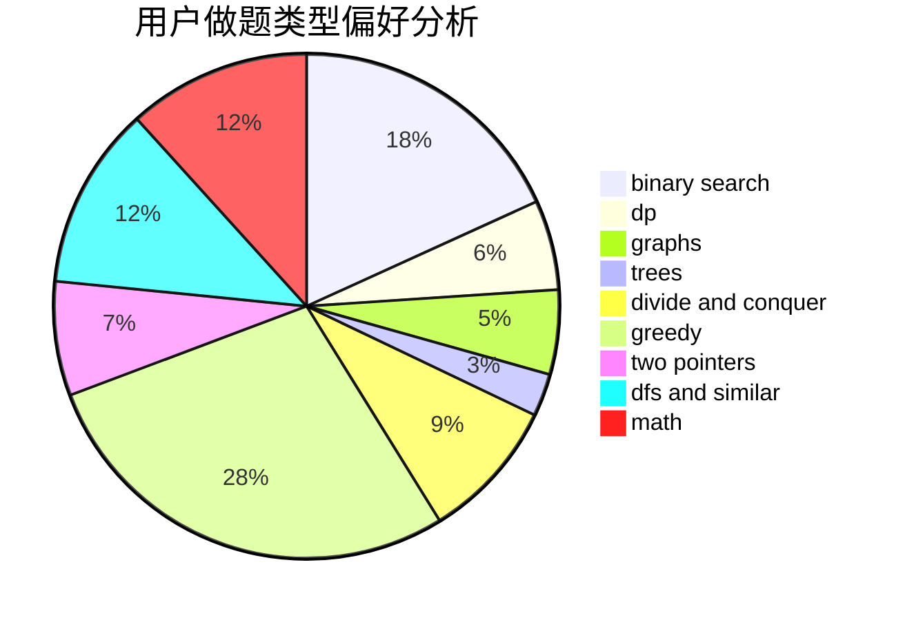

# OZY123

<!-- tabs:start -->

#### **用户提交结果分析**

#### **用户做题类型偏好分析**

<!-- tabs:end -->
# 推荐题目
[962B](https://codeforces.com/contest/962/problem/B)
[766C](https://codeforces.com/contest/766/problem/C)
[721C](https://codeforces.com/contest/721/problem/C)
[329B](https://codeforces.com/contest/329/problem/B)
[957E](https://codeforces.com/contest/957/problem/E)
[183A](https://codeforces.com/contest/183/problem/A)
[898B](https://codeforces.com/contest/898/problem/B)
[113C](https://codeforces.com/contest/113/problem/C)
[275B](https://codeforces.com/contest/275/problem/B)
[568A](https://codeforces.com/contest/568/problem/A)
