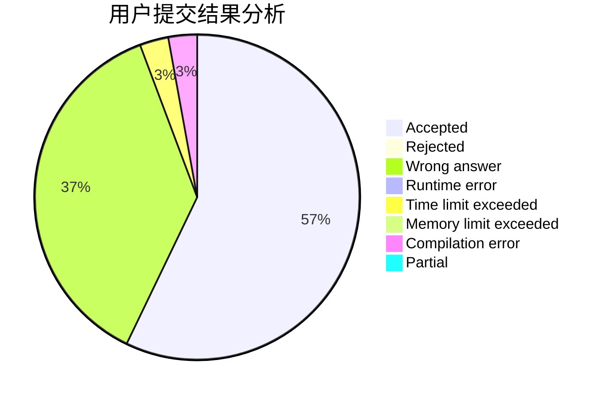
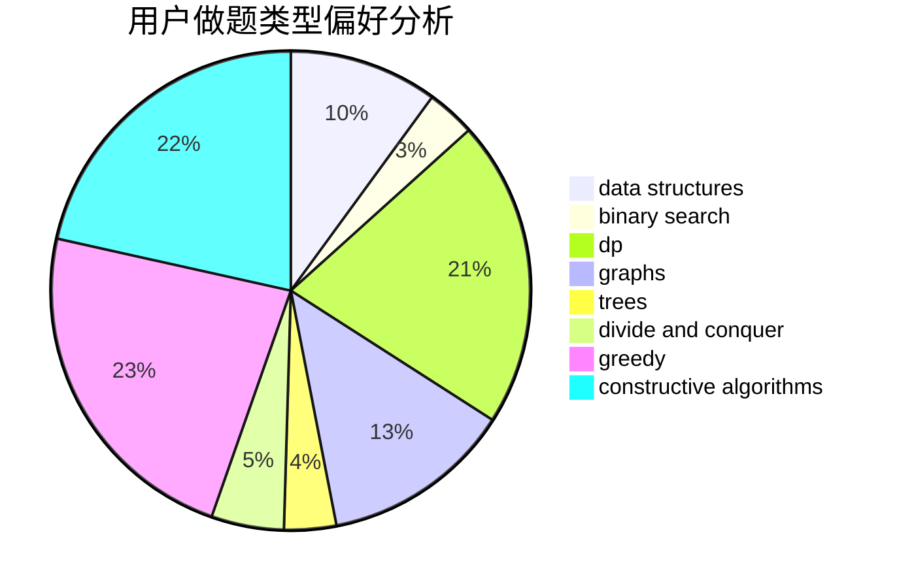
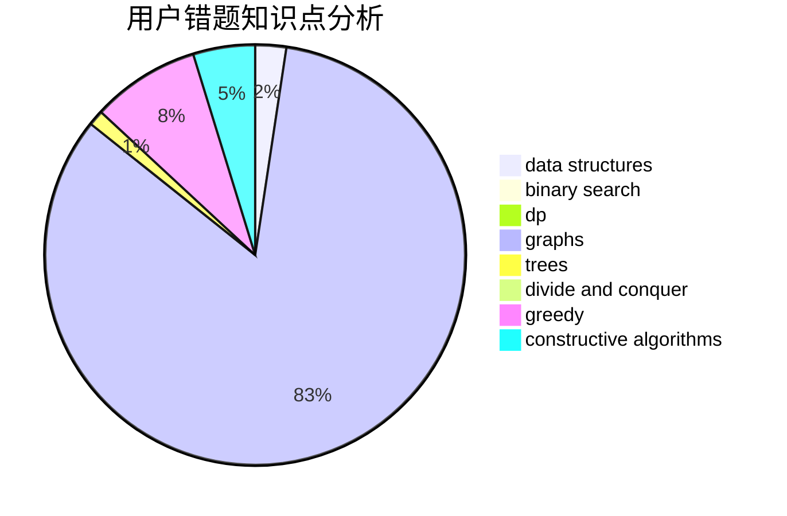

# OZY123

<!-- tabs:start -->

#### **用户提交结果分析**

#### **用户做题类型偏好分析**

#### **用户错题知识点分析**

<!-- tabs:end -->
# 推荐题目
[940E](https://codeforces.com/contest/940/problem/E)		data structures,
                        dp,
                        greedy,
                        math		  
[746G](https://codeforces.com/contest/746/problem/G)		constructive algorithms,
                        graphs,
                        trees		  
[702E](https://codeforces.com/contest/702/problem/E)		data structures,
                        graphs		  
[306D](https://codeforces.com/contest/306/problem/D)		constructive algorithms,
                        geometry		  
[935F](https://codeforces.com/contest/935/problem/F)		data structures,
                        greedy		  
[15D](https://codeforces.com/contest/15/problem/D)		data structures,
                        implementation,
                        sortings		  
[877C](https://codeforces.com/contest/877/problem/C)		constructive algorithms		  
[1138A](https://codeforces.com/contest/1138/problem/A)		binary search,
                        greedy,
                        implementation		  
[258C](https://codeforces.com/contest/258/problem/C)		binary search,
                        combinatorics,
                        dp,
                        math		  
[543E](https://codeforces.com/contest/543/problem/E)		constructive algorithms,
                        data structures		  
