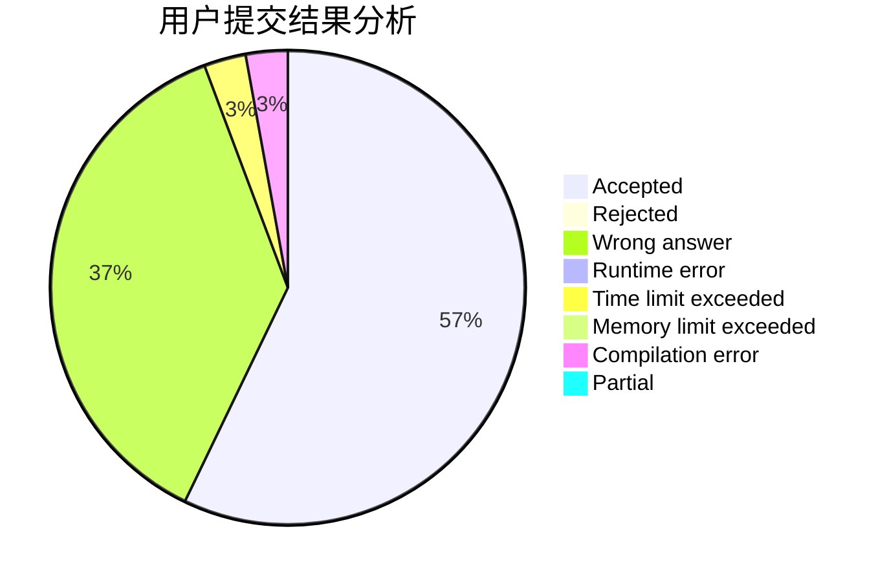
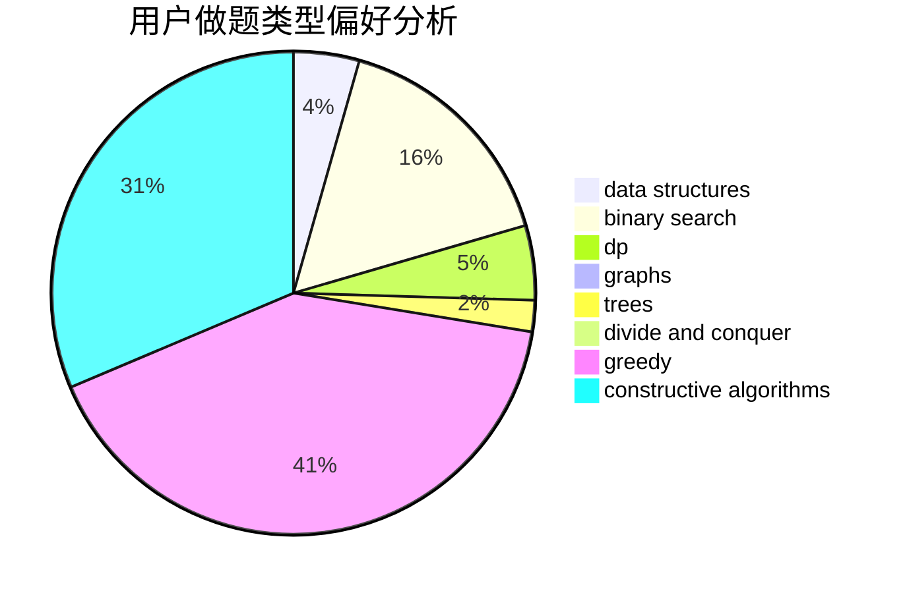
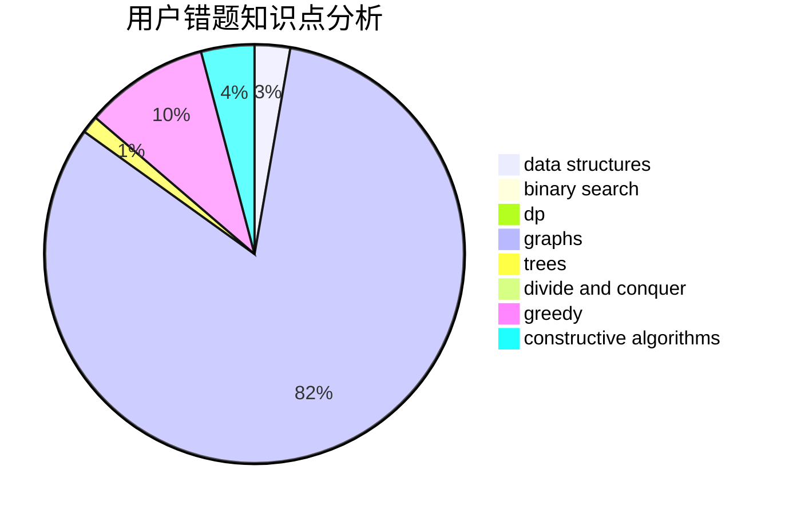

# OZY123

<!-- tabs:start -->

#### **用户提交结果分析**

#### **用户做题类型偏好分析**

#### **用户错题知识点分析**

<!-- tabs:end -->
# 推荐题目
[962B](https://codeforces.com/contest/962/problem/B)		constructive algorithms,
                        greedy,
                        implementation		  
[766C](https://codeforces.com/contest/766/problem/C)		brute force,
                        dp,
                        greedy,
                        strings		  
[721C](https://codeforces.com/contest/721/problem/C)		dp,
                        graphs		  
[329B](https://codeforces.com/contest/329/problem/B)		dfs and similar,
                        shortest paths		  
[957E](https://codeforces.com/contest/957/problem/E)		dsu,graphs,sortings,trees		  
[183A](https://codeforces.com/contest/183/problem/A)		constructive algorithms,
                        math		  
[898B](https://codeforces.com/contest/898/problem/B)		brute force,
                        implementation,
                        number theory		  
[113C](https://codeforces.com/contest/113/problem/C)		brute force,
                        math,
                        number theory		  
[275B](https://codeforces.com/contest/275/problem/B)		constructive algorithms,
                        implementation		  
[568A](https://codeforces.com/contest/568/problem/A)		brute force,
                        implementation,
                        math,
                        number theory		  
