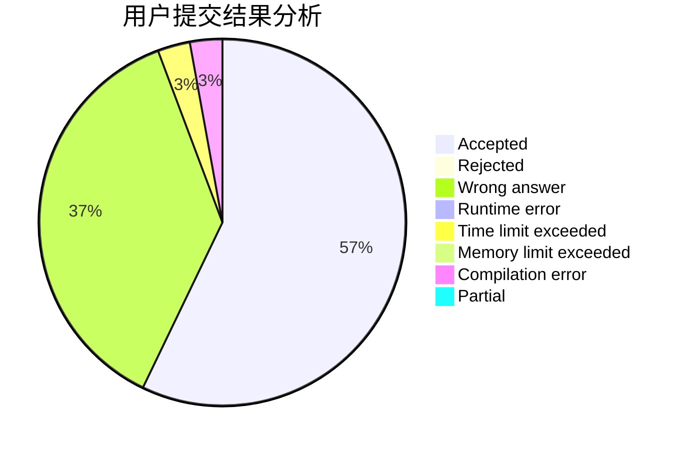
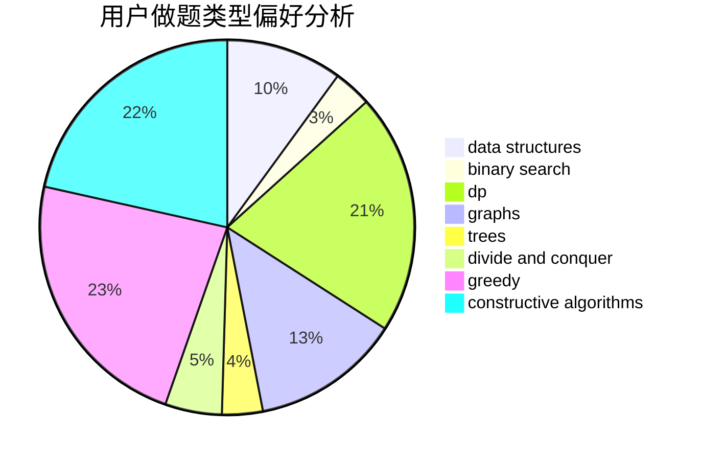
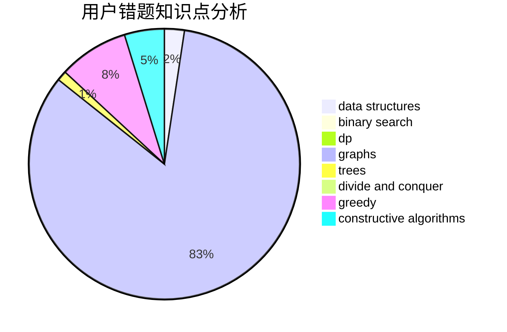

# OZY123
<!-- tabs:start -->
#### **用户提交结果分析**

#### **用户做题类型偏好分析**

#### **用户错题知识点分析**

<!-- tabs:end -->
# 推荐题目
[Sasha and Array](http://codeforces.com/problemset/problem/718/C)		data structures,
                        math,
                        matrices		  
[Kuroni and the Punishment](http://codeforces.com/problemset/problem/1305/F)		math,
                        number theory,
                        probabilities		  
[New Roads](http://codeforces.com/problemset/problem/746/G)		constructive algorithms,
                        graphs,
                        trees		  
[Cashback](http://codeforces.com/problemset/problem/940/E)		data structures,
                        dp,
                        greedy,
                        math		  
[Fafa and Array](http://codeforces.com/problemset/problem/935/F)		data structures,
                        greedy		  
[Sushi for Two](http://codeforces.com/problemset/problem/1138/A)		binary search,
                        greedy,
                        implementation		  
[Polygon](http://codeforces.com/problemset/problem/306/D)		constructive algorithms,
                        geometry		  
[Map](http://codeforces.com/problemset/problem/15/D)		data structures,
                        implementation,
                        sortings		  
[Ember and Storm's Tree Game](http://codeforces.com/problemset/problem/914/H)		combinatorics,
                        dp,
                        games,
                        trees		  
[A Problem about Polyline](http://codeforces.com/problemset/problem/578/A)		geometry,
                        math		  
<!-- tabs:start -->
#### **data structures**
[Sasha and Array](http://codeforces.com/problemset/problem/718/C)		data structures,
                        math,
                        matrices		  
[Kuroni and the Punishment](http://codeforces.com/problemset/problem/940/E)		data structures,
                        dp,
                        greedy,
                        math		  
[New Roads](http://codeforces.com/problemset/problem/935/F)		data structures,
                        greedy		  
[Cashback](http://codeforces.com/problemset/problem/15/D)		data structures,
                        implementation,
                        sortings		  
[Fafa and Array](http://codeforces.com/problemset/problem/702/E)		data structures,
                        graphs		  
[Sushi for Two](http://codeforces.com/problemset/problem/834/B)		data structures,
                        implementation		  
[Polygon](http://codeforces.com/problemset/problem/543/E)		constructive algorithms,
                        data structures		  
[Map](http://codeforces.com/problemset/problem/552/D)		brute force,
                        combinatorics,
                        data structures,
                        geometry,
                        math,
                        sortings		  
[Ember and Storm's Tree Game](https://codeforces.com/contest/841/problem/D)		constructive algorithms,
                        data structures,
                        dfs and similar,
                        dp,
                        graphs		  
[A Problem about Polyline](http://codeforces.com/problemset/problem/958/C3)		data structures,
                        dp		  
#### **binary search**
[Sasha and Array](http://codeforces.com/problemset/problem/1138/A)		binary search,
                        greedy,
                        implementation		  
[Kuroni and the Punishment](http://codeforces.com/problemset/problem/258/C)		binary search,
                        combinatorics,
                        dp,
                        math		  
[New Roads](http://codeforces.com/problemset/problem/567/D)		binary search,
                        data structures,
                        greedy,
                        sortings		  
[Cashback](http://codeforces.com/problemset/problem/1488/F)		*special problem,
                        *special problem,
                        binary search,
                        data structures		  
[Fafa and Array](http://codeforces.com/problemset/problem/1463/A)		binary search,
                        math		  
[Sushi for Two](https://codeforces.com/contest/1440/problem/E)		binary search,
                        data structures,
                        divide and conquer,
                        greedy,
                        implementation		  
[Polygon](http://codeforces.com/problemset/problem/1492/C)		binary search,
                        data structures,
                        dp,
                        greedy,
                        two pointers		  
[Map](http://codeforces.com/problemset/problem/1463/D)		binary search,
                        constructive algorithms,
                        greedy,
                        two pointers		  
[Ember and Storm's Tree Game](http://codeforces.com/problemset/problem/1490/G)		binary search,
                        data structures,
                        math		  
[A Problem about Polyline](http://codeforces.com/problemset/problem/1479/D)		binary search,
                        bitmasks,
                        brute force,
                        data structures,
                        probabilities,
                        trees		  
#### **dp**
[Sasha and Array](http://codeforces.com/problemset/problem/940/E)		data structures,
                        dp,
                        greedy,
                        math		  
[Kuroni and the Punishment](http://codeforces.com/problemset/problem/914/H)		combinatorics,
                        dp,
                        games,
                        trees		  
[New Roads](http://codeforces.com/problemset/problem/258/C)		binary search,
                        combinatorics,
                        dp,
                        math		  
[Cashback](https://codeforces.com/contest/841/problem/D)		constructive algorithms,
                        data structures,
                        dfs and similar,
                        dp,
                        graphs		  
[Fafa and Array](http://codeforces.com/problemset/problem/294/E)		dp,
                        trees		  
[Sushi for Two](http://codeforces.com/problemset/problem/1096/E)		combinatorics,
                        dp,
                        math,
                        probabilities		  
[Polygon](http://codeforces.com/problemset/problem/958/C3)		data structures,
                        dp		  
[Map](http://codeforces.com/problemset/problem/1196/D2)		data structures,
                        dp,
                        implementation,
                        two pointers		  
[Ember and Storm's Tree Game](http://codeforces.com/problemset/problem/1407/E)		constructive algorithms,
                        dfs and similar,
                        dp,
                        graphs,
                        greedy,
                        shortest paths		  
[A Problem about Polyline](http://codeforces.com/problemset/problem/1067/A)		dp		  
#### **graph**
[Sasha and Array](http://codeforces.com/problemset/problem/746/G)		constructive algorithms,
                        graphs,
                        trees		  
[Kuroni and the Punishment](http://codeforces.com/problemset/problem/702/E)		data structures,
                        graphs		  
[New Roads](http://codeforces.com/problemset/problem/402/C)		brute force,
                        constructive algorithms,
                        graphs		  
[Cashback](http://codeforces.com/problemset/problem/1482/F)		graphs,
                        shortest paths		  
[Fafa and Array](https://codeforces.com/contest/841/problem/D)		constructive algorithms,
                        data structures,
                        dfs and similar,
                        dp,
                        graphs		  
[Sushi for Two](http://codeforces.com/problemset/problem/1407/E)		constructive algorithms,
                        dfs and similar,
                        dp,
                        graphs,
                        greedy,
                        shortest paths		  
[Polygon](http://codeforces.com/problemset/problem/1005/F)		brute force,
                        dfs and similar,
                        graphs,
                        shortest paths		  
[Map](http://codeforces.com/problemset/problem/1487/C)		brute force,
                        constructive algorithms,
                        dfs and similar,
                        graphs,
                        greedy,
                        implementation,
                        math		  
[Ember and Storm's Tree Game](http://codeforces.com/problemset/problem/1437/C)		dp,
                        flows,
                        graph matchings,
                        greedy,
                        math,
                        sortings		  
[A Problem about Polyline](http://codeforces.com/problemset/problem/1470/D)		constructive algorithms,
                        dfs and similar,
                        graph matchings,
                        graphs,
                        greedy		  
#### **trees**
[Sasha and Array](http://codeforces.com/problemset/problem/746/G)		constructive algorithms,
                        graphs,
                        trees		  
[Kuroni and the Punishment](http://codeforces.com/problemset/problem/914/H)		combinatorics,
                        dp,
                        games,
                        trees		  
[New Roads](http://codeforces.com/problemset/problem/294/E)		dp,
                        trees		  
[Cashback](http://codeforces.com/problemset/problem/1404/B)		dfs and similar,
                        dp,
                        games,
                        trees		  
[Fafa and Array](http://codeforces.com/problemset/problem/1479/D)		binary search,
                        bitmasks,
                        brute force,
                        data structures,
                        probabilities,
                        trees		  
[Sushi for Two](http://codeforces.com/problemset/problem/1511/C)		brute force,
                        data structures,
                        implementation,
                        trees		  
[Polygon](http://codeforces.com/problemset/problem/1499/F)		combinatorics,
                        dfs and similar,
                        dp,
                        trees		  
[Map](http://codeforces.com/problemset/problem/1491/E)		brute force,
                        dfs and similar,
                        divide and conquer,
                        number theory,
                        trees		  
[Ember and Storm's Tree Game](http://codeforces.com/problemset/problem/1466/D)		data structures,
                        greedy,
                        sortings,
                        trees		  
[A Problem about Polyline](http://codeforces.com/problemset/problem/1495/D)		combinatorics,
                        dfs and similar,
                        graphs,
                        math,
                        shortest paths,
                        trees		  
#### **divide and conquer**
[Sasha and Array](https://codeforces.com/contest/1440/problem/E)		binary search,
                        data structures,
                        divide and conquer,
                        greedy,
                        implementation		  
[Kuroni and the Punishment](http://codeforces.com/problemset/problem/1461/D)		binary search,
                        brute force,
                        data structures,
                        divide and conquer,
                        implementation,
                        sortings		  
[New Roads](http://codeforces.com/problemset/problem/1466/G)		combinatorics,
                        divide and conquer,
                        hashing,
                        math,
                        string suffix structures,
                        strings		  
[Cashback](http://codeforces.com/problemset/problem/1490/D)		dfs and similar,
                        divide and conquer,
                        implementation		  
[Fafa and Array](https://codeforces.com/contest/1483/problem/C)		data structures,
                        divide and conquer,
                        dp		  
[Sushi for Two](http://codeforces.com/problemset/problem/1491/E)		brute force,
                        dfs and similar,
                        divide and conquer,
                        number theory,
                        trees		  
[Polygon](http://codeforces.com/problemset/problem/1303/G)		data structures,
                        divide and conquer,
                        geometry,
                        trees		  
[Map](http://codeforces.com/problemset/problem/1494/D)		constructive algorithms,
                        data structures,
                        dfs and similar,
                        divide and conquer,
                        dsu,
                        greedy,
                        sortings,
                        trees		  
[Ember and Storm's Tree Game](http://codeforces.com/problemset/problem/1482/E)		data structures,
                        divide and conquer,
                        dp		  
[A Problem about Polyline](http://codeforces.com/problemset/problem/566/C)		dfs and similar,
                        divide and conquer,
                        trees		  
#### **greedy**
[Sasha and Array](http://codeforces.com/problemset/problem/940/E)		data structures,
                        dp,
                        greedy,
                        math		  
[Kuroni and the Punishment](http://codeforces.com/problemset/problem/935/F)		data structures,
                        greedy		  
[New Roads](http://codeforces.com/problemset/problem/1138/A)		binary search,
                        greedy,
                        implementation		  
[Cashback](http://codeforces.com/problemset/problem/779/B)		brute force,
                        greedy		  
[Fafa and Array](http://codeforces.com/problemset/problem/1431/D)		*special problem,
                        greedy		  
[Sushi for Two](http://codeforces.com/problemset/problem/802/A)		greedy		  
[Polygon](http://codeforces.com/problemset/problem/1039/A)		constructive algorithms,
                        data structures,
                        greedy,
                        math		  
[Map](http://codeforces.com/problemset/problem/815/A)		brute force,
                        greedy,
                        implementation		  
[Ember and Storm's Tree Game](http://codeforces.com/problemset/problem/567/D)		binary search,
                        data structures,
                        greedy,
                        sortings		  
[A Problem about Polyline](http://codeforces.com/problemset/problem/1407/E)		constructive algorithms,
                        dfs and similar,
                        dp,
                        graphs,
                        greedy,
                        shortest paths		  
#### **constructive algorithms**
[Sasha and Array](http://codeforces.com/problemset/problem/746/G)		constructive algorithms,
                        graphs,
                        trees		  
[Kuroni and the Punishment](http://codeforces.com/problemset/problem/306/D)		constructive algorithms,
                        geometry		  
[New Roads](http://codeforces.com/problemset/problem/402/C)		brute force,
                        constructive algorithms,
                        graphs		  
[Cashback](http://codeforces.com/problemset/problem/877/C)		constructive algorithms		  
[Fafa and Array](http://codeforces.com/problemset/problem/543/E)		constructive algorithms,
                        data structures		  
[Sushi for Two](https://codeforces.com/contest/841/problem/D)		constructive algorithms,
                        data structures,
                        dfs and similar,
                        dp,
                        graphs		  
[Polygon](http://codeforces.com/problemset/problem/1039/A)		constructive algorithms,
                        data structures,
                        greedy,
                        math		  
[Map](http://codeforces.com/problemset/problem/11/A)		constructive algorithms,
                        implementation,
                        math		  
[Ember and Storm's Tree Game](http://codeforces.com/problemset/problem/1407/E)		constructive algorithms,
                        dfs and similar,
                        dp,
                        graphs,
                        greedy,
                        shortest paths		  
[A Problem about Polyline](http://codeforces.com/problemset/problem/1493/A)		constructive algorithms,
                        greedy		  
#### **sortings**
[Sasha and Array](http://codeforces.com/problemset/problem/15/D)		data structures,
                        implementation,
                        sortings		  
[Kuroni and the Punishment](http://codeforces.com/problemset/problem/552/D)		brute force,
                        combinatorics,
                        data structures,
                        geometry,
                        math,
                        sortings		  
[New Roads](http://codeforces.com/problemset/problem/769/A)		*special problem,
                        implementation,
                        sortings		  
[Cashback](http://codeforces.com/problemset/problem/567/D)		binary search,
                        data structures,
                        greedy,
                        sortings		  
[Fafa and Array](https://codeforces.com/contest/1496/problem/C)		geometry,
                        greedy,
                        math,
                        sortings		  
[Sushi for Two](http://codeforces.com/problemset/problem/1495/A)		geometry,
                        greedy,
                        math,
                        sortings		  
[Polygon](http://codeforces.com/problemset/problem/1497/A)		brute force,
                        data structures,
                        greedy,
                        sortings		  
[Map](http://codeforces.com/problemset/problem/1427/A)		math,
                        sortings		  
[Ember and Storm's Tree Game](http://codeforces.com/problemset/problem/1461/D)		binary search,
                        brute force,
                        data structures,
                        divide and conquer,
                        implementation,
                        sortings		  
[A Problem about Polyline](http://codeforces.com/problemset/problem/1437/C)		dp,
                        flows,
                        graph matchings,
                        greedy,
                        math,
                        sortings		  
<!-- tabs:end -->
