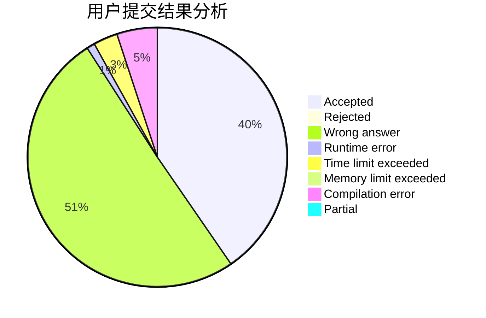
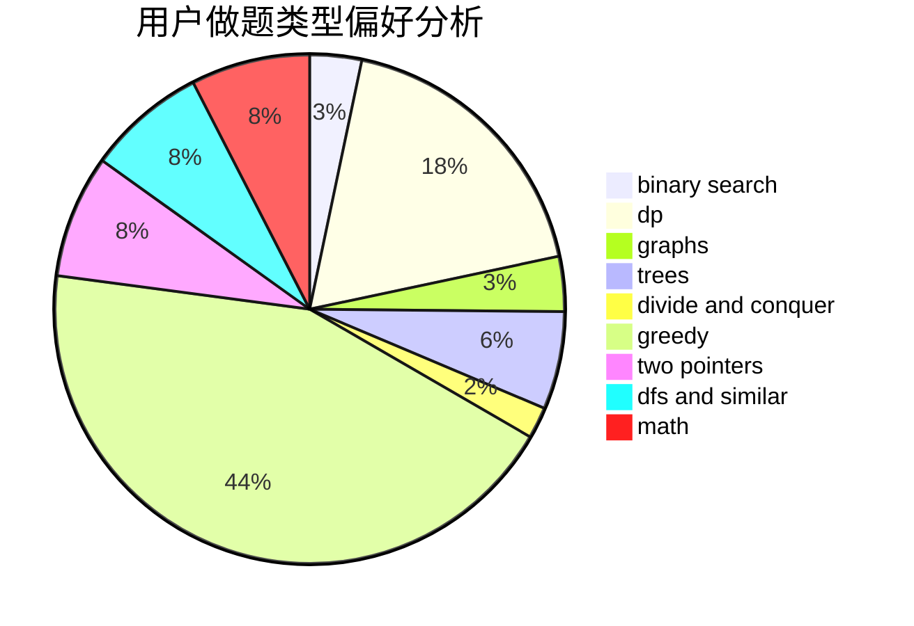

# Oak_limy

<!-- tabs:start -->

#### **用户提交结果分析**

#### **用户做题类型偏好分析**

<!-- tabs:end -->
# 推荐题目
[10772](https://codeforces.com/contest/1077/problem/2)
[1483E](https://codeforces.com/contest/1483/problem/E)
[1416A](https://codeforces.com/contest/1416/problem/A)
[1195E](https://codeforces.com/contest/1195/problem/E)
[1107C](https://codeforces.com/contest/1107/problem/C)
[1307A](https://codeforces.com/contest/1307/problem/A)
[879B](https://codeforces.com/contest/879/problem/B)
[990B](https://codeforces.com/contest/990/problem/B)
[477B](https://codeforces.com/contest/477/problem/B)
[68A](https://codeforces.com/contest/68/problem/A)
