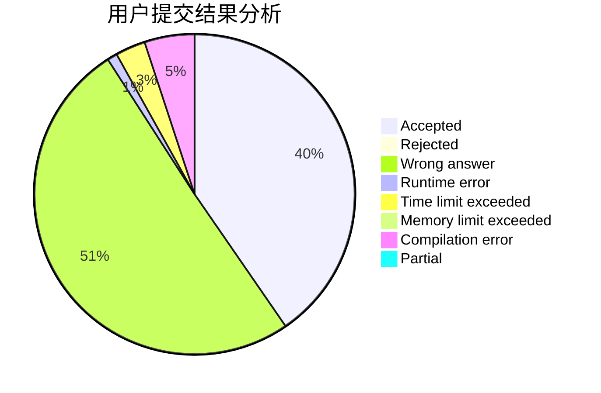
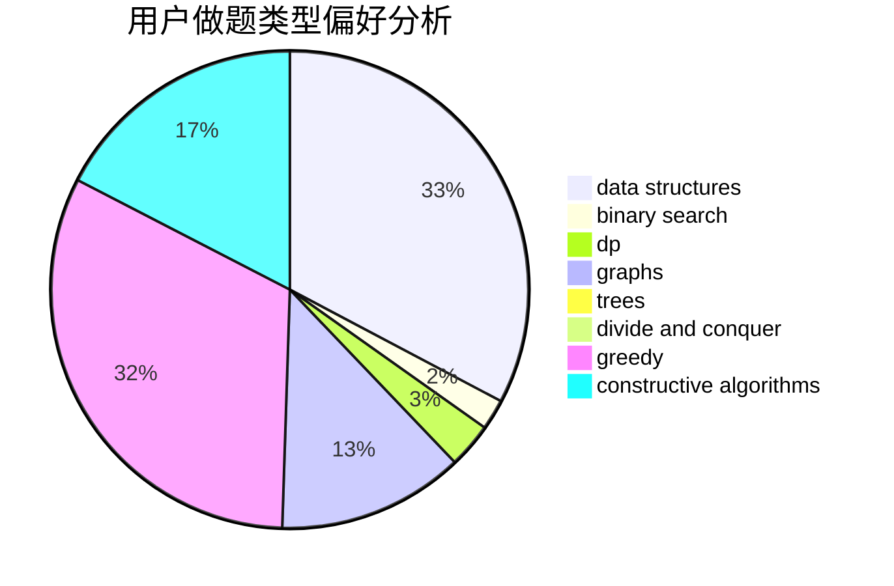
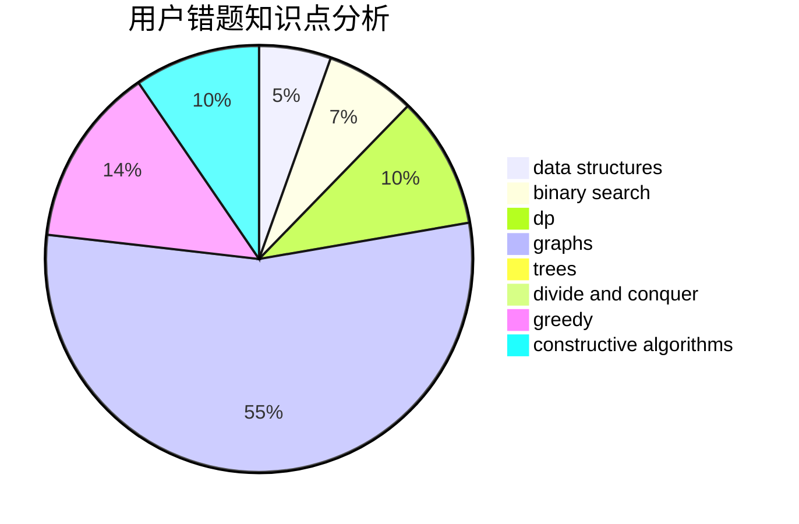

# Oak_limy

<!-- tabs:start -->

#### **用户提交结果分析**

#### **用户做题类型偏好分析**

#### **用户错题知识点分析**

<!-- tabs:end -->
# 推荐题目
[1076E](https://codeforces.com/contest/1076/problem/E)		data structures,
                        trees		  
[1475B](https://codeforces.com/contest/1475/problem/B)		brute force,
                        dp,
                        math		  
[1404E](https://codeforces.com/contest/1404/problem/E)		flows,
                        graph matchings,
                        graphs		  
[118D](https://codeforces.com/contest/118/problem/D)		dp		  
[1106F](https://codeforces.com/contest/1106/problem/F)		math,
                        matrices,
                        number theory		  
[1299E](https://codeforces.com/contest/1299/problem/E)		interactive,
                        math		  
[861B](https://codeforces.com/contest/861/problem/B)		dsu,graphs,sortings,trees		  
[976C](https://codeforces.com/contest/976/problem/C)		greedy,
                        implementation,
                        sortings		  
[456B](https://codeforces.com/contest/456/problem/B)		math,
                        number theory		  
[668A](https://codeforces.com/contest/668/problem/A)		dsu,graphs,sortings,trees		  
