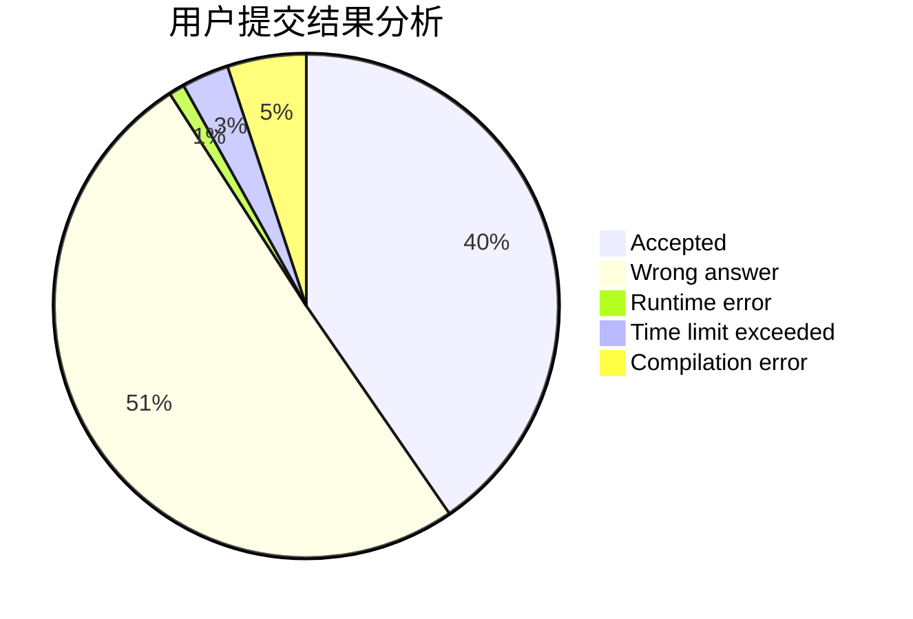
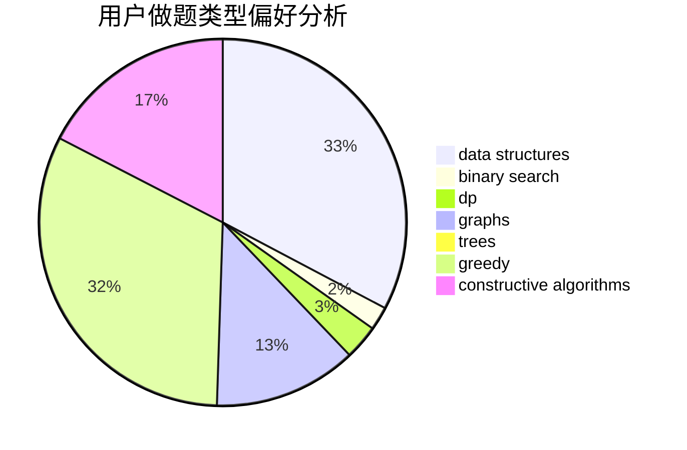
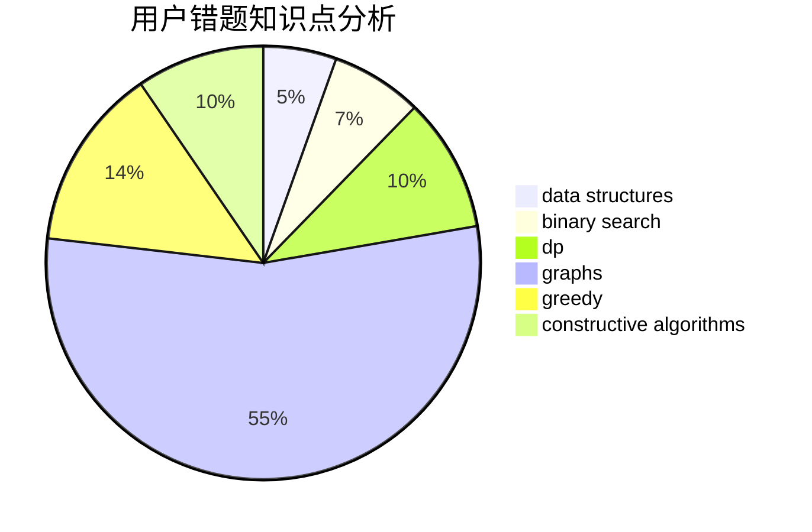

# Oak_limy
<!-- tabs:start -->
#### **用户提交结果分析**

#### **用户做题类型偏好分析**

#### **用户错题知识点分析**

<!-- tabs:end -->
# 推荐题目
[New Year's Number](http://codeforces.com/problemset/problem/1475/B)		brute force,
                        dp,
                        math		  
[Nested Segments](http://codeforces.com/problemset/problem/976/C)		greedy,
                        implementation,
                        sortings		  
[Vasya and a Tree](http://codeforces.com/problemset/problem/1076/E)		data structures,
                        trees		  
[Electrification](http://codeforces.com/problemset/problem/1175/C)		binary search,
                        brute force,
                        greedy		  
[Birthday](http://codeforces.com/problemset/problem/590/E)		graph matchings,
                        strings		  
[Lunar New Year and a Recursive Sequence](http://codeforces.com/problemset/problem/1106/F)		math,
                        matrices,
                        number theory		  
[Degree Set](http://codeforces.com/problemset/problem/976/D)		constructive algorithms,
                        graphs,
                        implementation		  
[Plus and Square Root](http://codeforces.com/problemset/problem/715/A)		constructive algorithms,
                        math		  
[ZgukistringZ](http://codeforces.com/problemset/problem/551/B)		brute force,
                        constructive algorithms,
                        implementation,
                        strings		  
[Numbers](http://codeforces.com/problemset/problem/13/A)		implementation,
                        math		  
<!-- tabs:start -->
#### **data structures**
[Vasya and a Tree](http://codeforces.com/problemset/problem/1076/E)		data structures,
                        trees		  
[Maxim and Array](http://codeforces.com/problemset/problem/721/D)		constructive algorithms,
                        data structures,
                        greedy,
                        math		  
[Riverside Curio](http://codeforces.com/problemset/problem/924/C)		data structures,
                        dp,
                        greedy		  
[Teodor is not a liar!](http://codeforces.com/problemset/problem/930/C)		data structures,
                        dp		  
[Chips on a Board](http://codeforces.com/problemset/problem/1511/G)		bitmasks,
                        brute force,
                        data structures,
                        games,
                        two pointers		  
[SUM and REPLACE](http://codeforces.com/problemset/problem/920/F)		brute force,
                        data structures,
                        dsu,
                        number theory		  
[Maximum width](http://codeforces.com/problemset/problem/1492/C)		binary search,
                        data structures,
                        dp,
                        greedy,
                        two pointers		  
[Old Floppy Drive](http://codeforces.com/problemset/problem/1490/G)		binary search,
                        data structures,
                        math		  
[Odd Mineral Resource](http://codeforces.com/problemset/problem/1479/D)		binary search,
                        bitmasks,
                        brute force,
                        data structures,
                        probabilities,
                        trees		  
[Meximization](http://codeforces.com/problemset/problem/1497/A)		brute force,
                        data structures,
                        greedy,
                        sortings		  
#### **binary search**
[Electrification](http://codeforces.com/problemset/problem/1175/C)		binary search,
                        brute force,
                        greedy		  
[Restoring Increasing Sequence](http://codeforces.com/problemset/problem/490/E)		binary search,
                        brute force,
                        greedy,
                        implementation		  
[Maximum width](http://codeforces.com/problemset/problem/1492/C)		binary search,
                        data structures,
                        dp,
                        greedy,
                        two pointers		  
[Pairs](http://codeforces.com/problemset/problem/1463/D)		binary search,
                        constructive algorithms,
                        greedy,
                        two pointers		  
[Old Floppy Drive](http://codeforces.com/problemset/problem/1490/G)		binary search,
                        data structures,
                        math		  
[Odd Mineral Resource](http://codeforces.com/problemset/problem/1479/D)		binary search,
                        bitmasks,
                        brute force,
                        data structures,
                        probabilities,
                        trees		  
[Complicated Computations](http://codeforces.com/problemset/problem/1436/E)		binary search,
                        data structures,
                        two pointers		  
[Divide and Summarize](http://codeforces.com/problemset/problem/1461/D)		binary search,
                        brute force,
                        data structures,
                        divide and conquer,
                        implementation,
                        sortings		  
[K-beautiful Strings](http://codeforces.com/problemset/problem/1493/C)		binary search,
                        brute force,
                        constructive algorithms,
                        greedy,
                        strings		  
[Pythagorean Triples](http://codeforces.com/problemset/problem/1487/D)		binary search,
                        brute force,
                        math,
                        number theory		  
#### **dp**
[New Year's Number](http://codeforces.com/problemset/problem/1475/B)		brute force,
                        dp,
                        math		  
[Beads](http://codeforces.com/problemset/problem/8/E)		dp,
                        graphs		  
[Sasha and Interesting Fact from Graph Theory](https://codeforces.com/contest/1113/problem/F)		brute force,
                        combinatorics,
                        dp,
                        math,
                        trees		  
[Riverside Curio](http://codeforces.com/problemset/problem/924/C)		data structures,
                        dp,
                        greedy		  
[Caesar's Legions](http://codeforces.com/problemset/problem/118/D)		dp		  
[Teodor is not a liar!](http://codeforces.com/problemset/problem/930/C)		data structures,
                        dp		  
[Balanced Substring](http://codeforces.com/problemset/problem/873/B)		dp,
                        implementation		  
[Alyona and the Tree](http://codeforces.com/problemset/problem/682/C)		dfs and similar,
                        dp,
                        graphs,
                        trees		  
[Nezzar and Lucky Number](http://codeforces.com/problemset/problem/1478/B)		brute force,
                        dp,
                        greedy,
                        math		  
[Maximum width](http://codeforces.com/problemset/problem/1492/C)		binary search,
                        data structures,
                        dp,
                        greedy,
                        two pointers		  
#### **graph**
[Birthday](http://codeforces.com/problemset/problem/590/E)		graph matchings,
                        strings		  
[Degree Set](http://codeforces.com/problemset/problem/976/D)		constructive algorithms,
                        graphs,
                        implementation		  
[Bricks](http://codeforces.com/problemset/problem/1404/E)		flows,
                        graph matchings,
                        graphs		  
[Beads](http://codeforces.com/problemset/problem/8/E)		dp,
                        graphs		  
[Directing Edges](http://codeforces.com/problemset/problem/1385/E)		constructive algorithms,
                        dfs and similar,
                        graphs		  
[Peaceful Rooks](https://codeforces.com/contest/1464/problem/A)		dfs and similar,
                        dsu,
                        graphs		  
[Alyona and the Tree](http://codeforces.com/problemset/problem/682/C)		dfs and similar,
                        dp,
                        graphs,
                        trees		  
[Ehab and the Big Finale](http://codeforces.com/problemset/problem/1174/F)		constructive algorithms,
                        divide and conquer,
                        graphs,
                        implementation,
                        interactive,
                        trees		  
[Minimum Ties](http://codeforces.com/problemset/problem/1487/C)		brute force,
                        constructive algorithms,
                        dfs and similar,
                        graphs,
                        greedy,
                        implementation,
                        math		  
[Chef Monocarp](http://codeforces.com/problemset/problem/1437/C)		dp,
                        flows,
                        graph matchings,
                        greedy,
                        math,
                        sortings		  
#### **trees**
[Vasya and a Tree](http://codeforces.com/problemset/problem/1076/E)		data structures,
                        trees		  
[Sasha and Interesting Fact from Graph Theory](https://codeforces.com/contest/1113/problem/F)		brute force,
                        combinatorics,
                        dp,
                        math,
                        trees		  
[Alyona and the Tree](http://codeforces.com/problemset/problem/682/C)		dfs and similar,
                        dp,
                        graphs,
                        trees		  
[Ehab and the Big Finale](http://codeforces.com/problemset/problem/1174/F)		constructive algorithms,
                        divide and conquer,
                        graphs,
                        implementation,
                        interactive,
                        trees		  
[Odd Mineral Resource](http://codeforces.com/problemset/problem/1479/D)		binary search,
                        bitmasks,
                        brute force,
                        data structures,
                        probabilities,
                        trees		  
[Yet Another Card Deck](http://codeforces.com/problemset/problem/1511/C)		brute force,
                        data structures,
                        implementation,
                        trees		  
[Diameter Cuts](http://codeforces.com/problemset/problem/1499/F)		combinatorics,
                        dfs and similar,
                        dp,
                        trees		  
[Fib-tree](http://codeforces.com/problemset/problem/1491/E)		brute force,
                        dfs and similar,
                        divide and conquer,
                        number theory,
                        trees		  
[13th Labour of Heracles](http://codeforces.com/problemset/problem/1466/D)		data structures,
                        greedy,
                        sortings,
                        trees		  
[BFS Trees](http://codeforces.com/problemset/problem/1495/D)		combinatorics,
                        dfs and similar,
                        graphs,
                        math,
                        shortest paths,
                        trees		  
#### **divide and conquer**
[Set Merging](http://codeforces.com/problemset/problem/1375/H)		constructive algorithms,
                        divide and conquer		  
[Ehab and the Big Finale](http://codeforces.com/problemset/problem/1174/F)		constructive algorithms,
                        divide and conquer,
                        graphs,
                        implementation,
                        interactive,
                        trees		  
[Divide and Summarize](http://codeforces.com/problemset/problem/1461/D)		binary search,
                        brute force,
                        data structures,
                        divide and conquer,
                        implementation,
                        sortings		  
[Song of the Sirens](http://codeforces.com/problemset/problem/1466/G)		combinatorics,
                        divide and conquer,
                        hashing,
                        math,
                        string suffix structures,
                        strings		  
[Permutation Transformation](http://codeforces.com/problemset/problem/1490/D)		dfs and similar,
                        divide and conquer,
                        implementation		  
[Skyline Photo](https://codeforces.com/contest/1483/problem/C)		data structures,
                        divide and conquer,
                        dp		  
[Fib-tree](http://codeforces.com/problemset/problem/1491/E)		brute force,
                        dfs and similar,
                        divide and conquer,
                        number theory,
                        trees		  
[Sum of Prefix Sums](http://codeforces.com/problemset/problem/1303/G)		data structures,
                        divide and conquer,
                        geometry,
                        trees		  
[Dogeforces](http://codeforces.com/problemset/problem/1494/D)		constructive algorithms,
                        data structures,
                        dfs and similar,
                        divide and conquer,
                        dsu,
                        greedy,
                        sortings,
                        trees		  
[Logistical Questions](http://codeforces.com/problemset/problem/566/C)		dfs and similar,
                        divide and conquer,
                        trees		  
#### **greedy**
[Nested Segments](http://codeforces.com/problemset/problem/976/C)		greedy,
                        implementation,
                        sortings		  
[Electrification](http://codeforces.com/problemset/problem/1175/C)		binary search,
                        brute force,
                        greedy		  
[Restoring Increasing Sequence](http://codeforces.com/problemset/problem/490/E)		binary search,
                        brute force,
                        greedy,
                        implementation		  
[Maxim and Array](http://codeforces.com/problemset/problem/721/D)		constructive algorithms,
                        data structures,
                        greedy,
                        math		  
[Ray Tracing](http://codeforces.com/problemset/problem/724/C)		greedy,
                        hashing,
                        implementation,
                        math,
                        number theory,
                        sortings		  
[Riverside Curio](http://codeforces.com/problemset/problem/924/C)		data structures,
                        dp,
                        greedy		  
[Nauuo and Chess](http://codeforces.com/problemset/problem/1173/B)		constructive algorithms,
                        greedy		  
[Maximal Intersection](http://codeforces.com/problemset/problem/1029/C)		greedy,
                        math,
                        sortings		  
[Common Prefixes](http://codeforces.com/problemset/problem/1384/A)		constructive algorithms,
                        greedy,
                        strings		  
[Nezzar and Lucky Number](http://codeforces.com/problemset/problem/1478/B)		brute force,
                        dp,
                        greedy,
                        math		  
#### **constructive algorithms**
[Degree Set](http://codeforces.com/problemset/problem/976/D)		constructive algorithms,
                        graphs,
                        implementation		  
[Plus and Square Root](http://codeforces.com/problemset/problem/715/A)		constructive algorithms,
                        math		  
[ZgukistringZ](http://codeforces.com/problemset/problem/551/B)		brute force,
                        constructive algorithms,
                        implementation,
                        strings		  
[Maxim and Array](http://codeforces.com/problemset/problem/721/D)		constructive algorithms,
                        data structures,
                        greedy,
                        math		  
[Nauuo and Chess](http://codeforces.com/problemset/problem/1173/B)		constructive algorithms,
                        greedy		  
[Directing Edges](http://codeforces.com/problemset/problem/1385/E)		constructive algorithms,
                        dfs and similar,
                        graphs		  
[Set Merging](http://codeforces.com/problemset/problem/1375/H)		constructive algorithms,
                        divide and conquer		  
[Common Prefixes](http://codeforces.com/problemset/problem/1384/A)		constructive algorithms,
                        greedy,
                        strings		  
[Ehab and the Big Finale](http://codeforces.com/problemset/problem/1174/F)		constructive algorithms,
                        divide and conquer,
                        graphs,
                        implementation,
                        interactive,
                        trees		  
[Huge Boxes of Animal Toys](http://codeforces.com/problemset/problem/1425/H)		constructive algorithms		  
#### **sortings**
[Nested Segments](http://codeforces.com/problemset/problem/976/C)		greedy,
                        implementation,
                        sortings		  
[Ray Tracing](http://codeforces.com/problemset/problem/724/C)		greedy,
                        hashing,
                        implementation,
                        math,
                        number theory,
                        sortings		  
[Maximal Intersection](http://codeforces.com/problemset/problem/1029/C)		greedy,
                        math,
                        sortings		  
[Diamond Miner](https://codeforces.com/contest/1496/problem/C)		geometry,
                        greedy,
                        math,
                        sortings		  
[Meximization](http://codeforces.com/problemset/problem/1497/A)		brute force,
                        data structures,
                        greedy,
                        sortings		  
[Avoiding Zero](http://codeforces.com/problemset/problem/1427/A)		math,
                        sortings		  
[Divide and Summarize](http://codeforces.com/problemset/problem/1461/D)		binary search,
                        brute force,
                        data structures,
                        divide and conquer,
                        implementation,
                        sortings		  
[Chef Monocarp](http://codeforces.com/problemset/problem/1437/C)		dp,
                        flows,
                        graph matchings,
                        greedy,
                        math,
                        sortings		  
[Replacing Elements](http://codeforces.com/problemset/problem/1473/A)		greedy,
                        implementation,
                        math,
                        sortings		  
[Eastern Exhibition](http://codeforces.com/problemset/problem/1486/B)		binary search,
                        geometry,
                        shortest paths,
                        sortings		  
<!-- tabs:end -->
