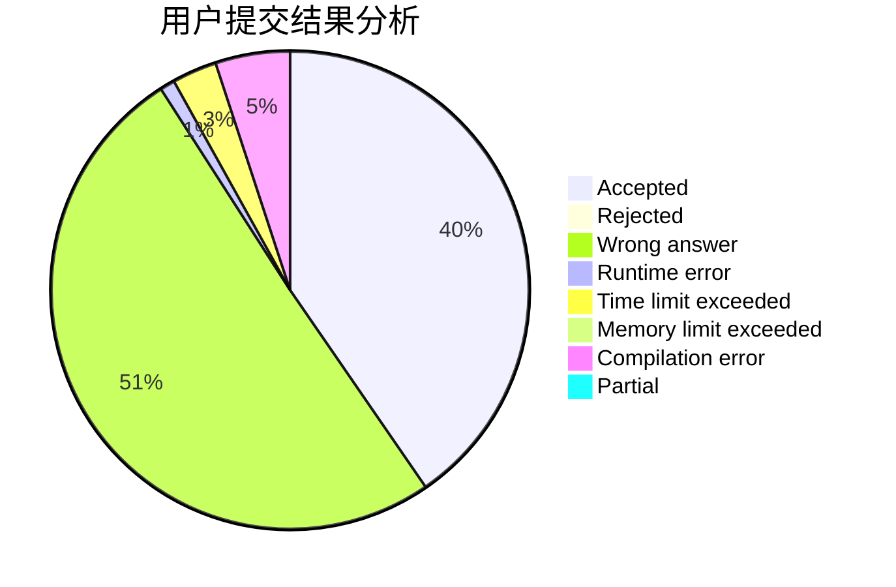
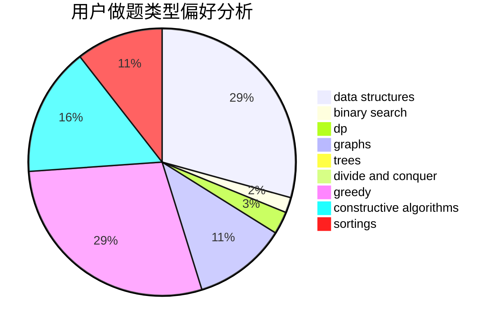
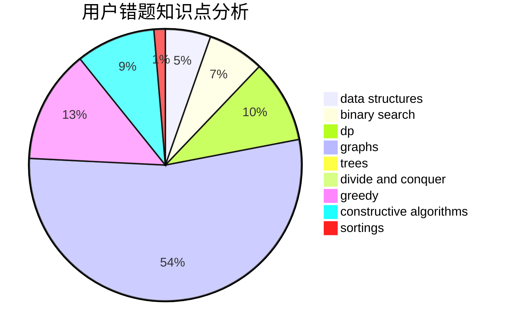

# Oak_limy
<!-- tabs:start -->
#### **用户提交结果分析**

#### **用户做题类型偏好分析**

#### **用户错题知识点分析**

<!-- tabs:end -->
# 推荐题目
[1475B](http://codeforces.com/problemset/problem/1475/B)		brute force,
                        dp,
                        math		  
[976C](http://codeforces.com/problemset/problem/976/C)		greedy,
                        implementation,
                        sortings		  
[1076E](http://codeforces.com/problemset/problem/1076/E)		data structures,
                        trees		  
[1175C](http://codeforces.com/problemset/problem/1175/C)		binary search,
                        brute force,
                        greedy		  
[590E](http://codeforces.com/problemset/problem/590/E)		graph matchings,
                        strings		  
[1106F](http://codeforces.com/problemset/problem/1106/F)		math,
                        matrices,
                        number theory		  
[976D](http://codeforces.com/problemset/problem/976/D)		constructive algorithms,
                        graphs,
                        implementation		  
[715A](http://codeforces.com/problemset/problem/715/A)		constructive algorithms,
                        math		  
[551B](http://codeforces.com/problemset/problem/551/B)		brute force,
                        constructive algorithms,
                        implementation,
                        strings		  
[13A](http://codeforces.com/problemset/problem/13/A)		implementation,
                        math		  
<!-- tabs:start -->
#### **data structures**
[1076E](http://codeforces.com/problemset/problem/1076/E)		data structures,
                        trees		  
[721D](http://codeforces.com/problemset/problem/721/D)		constructive algorithms,
                        data structures,
                        greedy,
                        math		  
[924C](http://codeforces.com/problemset/problem/924/C)		data structures,
                        dp,
                        greedy		  
[930C](http://codeforces.com/problemset/problem/930/C)		data structures,
                        dp		  
[1511G](http://codeforces.com/problemset/problem/1511/G)		bitmasks,
                        brute force,
                        data structures,
                        games,
                        two pointers		  
[920F](http://codeforces.com/problemset/problem/920/F)		brute force,
                        data structures,
                        dsu,
                        number theory		  
[1492C](http://codeforces.com/problemset/problem/1492/C)		binary search,
                        data structures,
                        dp,
                        greedy,
                        two pointers		  
[1490G](http://codeforces.com/problemset/problem/1490/G)		binary search,
                        data structures,
                        math		  
[1479D](http://codeforces.com/problemset/problem/1479/D)		binary search,
                        bitmasks,
                        brute force,
                        data structures,
                        probabilities,
                        trees		  
[1497A](http://codeforces.com/problemset/problem/1497/A)		brute force,
                        data structures,
                        greedy,
                        sortings		  
#### **binary search**
[1175C](http://codeforces.com/problemset/problem/1175/C)		binary search,
                        brute force,
                        greedy		  
[490E](http://codeforces.com/problemset/problem/490/E)		binary search,
                        brute force,
                        greedy,
                        implementation		  
[1492C](http://codeforces.com/problemset/problem/1492/C)		binary search,
                        data structures,
                        dp,
                        greedy,
                        two pointers		  
[1463D](http://codeforces.com/problemset/problem/1463/D)		binary search,
                        constructive algorithms,
                        greedy,
                        two pointers		  
[1490G](http://codeforces.com/problemset/problem/1490/G)		binary search,
                        data structures,
                        math		  
[1479D](http://codeforces.com/problemset/problem/1479/D)		binary search,
                        bitmasks,
                        brute force,
                        data structures,
                        probabilities,
                        trees		  
[1436E](http://codeforces.com/problemset/problem/1436/E)		binary search,
                        data structures,
                        two pointers		  
[1461D](http://codeforces.com/problemset/problem/1461/D)		binary search,
                        brute force,
                        data structures,
                        divide and conquer,
                        implementation,
                        sortings		  
[1493C](http://codeforces.com/problemset/problem/1493/C)		binary search,
                        brute force,
                        constructive algorithms,
                        greedy,
                        strings		  
[1487D](http://codeforces.com/problemset/problem/1487/D)		binary search,
                        brute force,
                        math,
                        number theory		  
#### **dp**
[1475B](http://codeforces.com/problemset/problem/1475/B)		brute force,
                        dp,
                        math		  
[8E](http://codeforces.com/problemset/problem/8/E)		dp,
                        graphs		  
[1113F](https://codeforces.com/contest/1113/problem/F)		brute force,
                        combinatorics,
                        dp,
                        math,
                        trees		  
[924C](http://codeforces.com/problemset/problem/924/C)		data structures,
                        dp,
                        greedy		  
[118D](http://codeforces.com/problemset/problem/118/D)		dp		  
[930C](http://codeforces.com/problemset/problem/930/C)		data structures,
                        dp		  
[873B](http://codeforces.com/problemset/problem/873/B)		dp,
                        implementation		  
[682C](http://codeforces.com/problemset/problem/682/C)		dfs and similar,
                        dp,
                        graphs,
                        trees		  
[1478B](http://codeforces.com/problemset/problem/1478/B)		brute force,
                        dp,
                        greedy,
                        math		  
[1492C](http://codeforces.com/problemset/problem/1492/C)		binary search,
                        data structures,
                        dp,
                        greedy,
                        two pointers		  
#### **graph**
[590E](http://codeforces.com/problemset/problem/590/E)		graph matchings,
                        strings		  
[976D](http://codeforces.com/problemset/problem/976/D)		constructive algorithms,
                        graphs,
                        implementation		  
[1404E](http://codeforces.com/problemset/problem/1404/E)		flows,
                        graph matchings,
                        graphs		  
[8E](http://codeforces.com/problemset/problem/8/E)		dp,
                        graphs		  
[1385E](http://codeforces.com/problemset/problem/1385/E)		constructive algorithms,
                        dfs and similar,
                        graphs		  
[1464A](https://codeforces.com/contest/1464/problem/A)		dfs and similar,
                        dsu,
                        graphs		  
[682C](http://codeforces.com/problemset/problem/682/C)		dfs and similar,
                        dp,
                        graphs,
                        trees		  
[1174F](http://codeforces.com/problemset/problem/1174/F)		constructive algorithms,
                        divide and conquer,
                        graphs,
                        implementation,
                        interactive,
                        trees		  
[1487C](http://codeforces.com/problemset/problem/1487/C)		brute force,
                        constructive algorithms,
                        dfs and similar,
                        graphs,
                        greedy,
                        implementation,
                        math		  
[1437C](http://codeforces.com/problemset/problem/1437/C)		dp,
                        flows,
                        graph matchings,
                        greedy,
                        math,
                        sortings		  
#### **trees**
[1076E](http://codeforces.com/problemset/problem/1076/E)		data structures,
                        trees		  
[1113F](https://codeforces.com/contest/1113/problem/F)		brute force,
                        combinatorics,
                        dp,
                        math,
                        trees		  
[682C](http://codeforces.com/problemset/problem/682/C)		dfs and similar,
                        dp,
                        graphs,
                        trees		  
[1174F](http://codeforces.com/problemset/problem/1174/F)		constructive algorithms,
                        divide and conquer,
                        graphs,
                        implementation,
                        interactive,
                        trees		  
[1479D](http://codeforces.com/problemset/problem/1479/D)		binary search,
                        bitmasks,
                        brute force,
                        data structures,
                        probabilities,
                        trees		  
[1511C](http://codeforces.com/problemset/problem/1511/C)		brute force,
                        data structures,
                        implementation,
                        trees		  
[1499F](http://codeforces.com/problemset/problem/1499/F)		combinatorics,
                        dfs and similar,
                        dp,
                        trees		  
[1491E](http://codeforces.com/problemset/problem/1491/E)		brute force,
                        dfs and similar,
                        divide and conquer,
                        number theory,
                        trees		  
[1466D](http://codeforces.com/problemset/problem/1466/D)		data structures,
                        greedy,
                        sortings,
                        trees		  
[1495D](http://codeforces.com/problemset/problem/1495/D)		combinatorics,
                        dfs and similar,
                        graphs,
                        math,
                        shortest paths,
                        trees		  
#### **divide and conquer**
[1375H](http://codeforces.com/problemset/problem/1375/H)		constructive algorithms,
                        divide and conquer		  
[1174F](http://codeforces.com/problemset/problem/1174/F)		constructive algorithms,
                        divide and conquer,
                        graphs,
                        implementation,
                        interactive,
                        trees		  
[1461D](http://codeforces.com/problemset/problem/1461/D)		binary search,
                        brute force,
                        data structures,
                        divide and conquer,
                        implementation,
                        sortings		  
[1466G](http://codeforces.com/problemset/problem/1466/G)		combinatorics,
                        divide and conquer,
                        hashing,
                        math,
                        string suffix structures,
                        strings		  
[1490D](http://codeforces.com/problemset/problem/1490/D)		dfs and similar,
                        divide and conquer,
                        implementation		  
[1483C](https://codeforces.com/contest/1483/problem/C)		data structures,
                        divide and conquer,
                        dp		  
[1491E](http://codeforces.com/problemset/problem/1491/E)		brute force,
                        dfs and similar,
                        divide and conquer,
                        number theory,
                        trees		  
[1303G](http://codeforces.com/problemset/problem/1303/G)		data structures,
                        divide and conquer,
                        geometry,
                        trees		  
[1494D](http://codeforces.com/problemset/problem/1494/D)		constructive algorithms,
                        data structures,
                        dfs and similar,
                        divide and conquer,
                        dsu,
                        greedy,
                        sortings,
                        trees		  
[1482E](http://codeforces.com/problemset/problem/1482/E)		data structures,
                        divide and conquer,
                        dp		  
#### **greedy**
[976C](http://codeforces.com/problemset/problem/976/C)		greedy,
                        implementation,
                        sortings		  
[1175C](http://codeforces.com/problemset/problem/1175/C)		binary search,
                        brute force,
                        greedy		  
[490E](http://codeforces.com/problemset/problem/490/E)		binary search,
                        brute force,
                        greedy,
                        implementation		  
[721D](http://codeforces.com/problemset/problem/721/D)		constructive algorithms,
                        data structures,
                        greedy,
                        math		  
[724C](http://codeforces.com/problemset/problem/724/C)		greedy,
                        hashing,
                        implementation,
                        math,
                        number theory,
                        sortings		  
[924C](http://codeforces.com/problemset/problem/924/C)		data structures,
                        dp,
                        greedy		  
[1173B](http://codeforces.com/problemset/problem/1173/B)		constructive algorithms,
                        greedy		  
[1029C](http://codeforces.com/problemset/problem/1029/C)		greedy,
                        math,
                        sortings		  
[1384A](http://codeforces.com/problemset/problem/1384/A)		constructive algorithms,
                        greedy,
                        strings		  
[1478B](http://codeforces.com/problemset/problem/1478/B)		brute force,
                        dp,
                        greedy,
                        math		  
#### **constructive algorithms**
[976D](http://codeforces.com/problemset/problem/976/D)		constructive algorithms,
                        graphs,
                        implementation		  
[715A](http://codeforces.com/problemset/problem/715/A)		constructive algorithms,
                        math		  
[551B](http://codeforces.com/problemset/problem/551/B)		brute force,
                        constructive algorithms,
                        implementation,
                        strings		  
[721D](http://codeforces.com/problemset/problem/721/D)		constructive algorithms,
                        data structures,
                        greedy,
                        math		  
[1173B](http://codeforces.com/problemset/problem/1173/B)		constructive algorithms,
                        greedy		  
[1385E](http://codeforces.com/problemset/problem/1385/E)		constructive algorithms,
                        dfs and similar,
                        graphs		  
[1375H](http://codeforces.com/problemset/problem/1375/H)		constructive algorithms,
                        divide and conquer		  
[1384A](http://codeforces.com/problemset/problem/1384/A)		constructive algorithms,
                        greedy,
                        strings		  
[1174F](http://codeforces.com/problemset/problem/1174/F)		constructive algorithms,
                        divide and conquer,
                        graphs,
                        implementation,
                        interactive,
                        trees		  
[1425H](http://codeforces.com/problemset/problem/1425/H)		constructive algorithms		  
#### **sortings**
[976C](http://codeforces.com/problemset/problem/976/C)		greedy,
                        implementation,
                        sortings		  
[724C](http://codeforces.com/problemset/problem/724/C)		greedy,
                        hashing,
                        implementation,
                        math,
                        number theory,
                        sortings		  
[1029C](http://codeforces.com/problemset/problem/1029/C)		greedy,
                        math,
                        sortings		  
[1496C](https://codeforces.com/contest/1496/problem/C)		geometry,
                        greedy,
                        math,
                        sortings		  
[1495A](http://codeforces.com/problemset/problem/1495/A)		geometry,
                        greedy,
                        math,
                        sortings		  
[1497A](http://codeforces.com/problemset/problem/1497/A)		brute force,
                        data structures,
                        greedy,
                        sortings		  
[1427A](http://codeforces.com/problemset/problem/1427/A)		math,
                        sortings		  
[1461D](http://codeforces.com/problemset/problem/1461/D)		binary search,
                        brute force,
                        data structures,
                        divide and conquer,
                        implementation,
                        sortings		  
[1437C](http://codeforces.com/problemset/problem/1437/C)		dp,
                        flows,
                        graph matchings,
                        greedy,
                        math,
                        sortings		  
[1473A](http://codeforces.com/problemset/problem/1473/A)		greedy,
                        implementation,
                        math,
                        sortings		  
<!-- tabs:end -->
