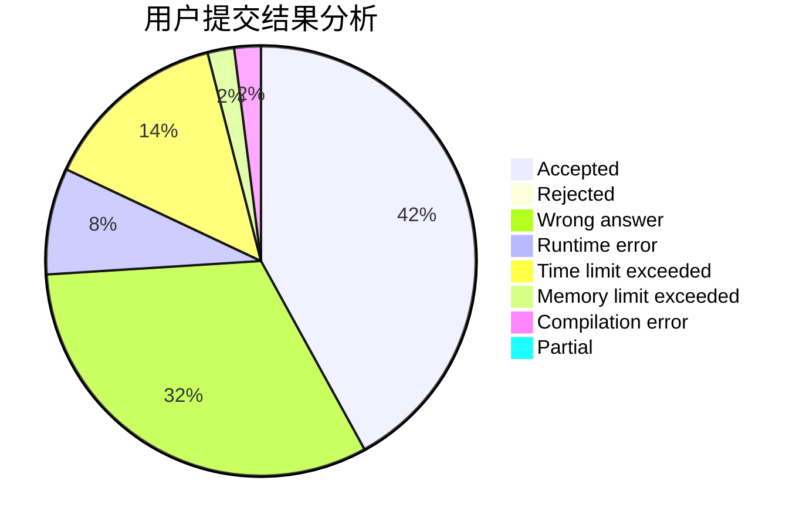
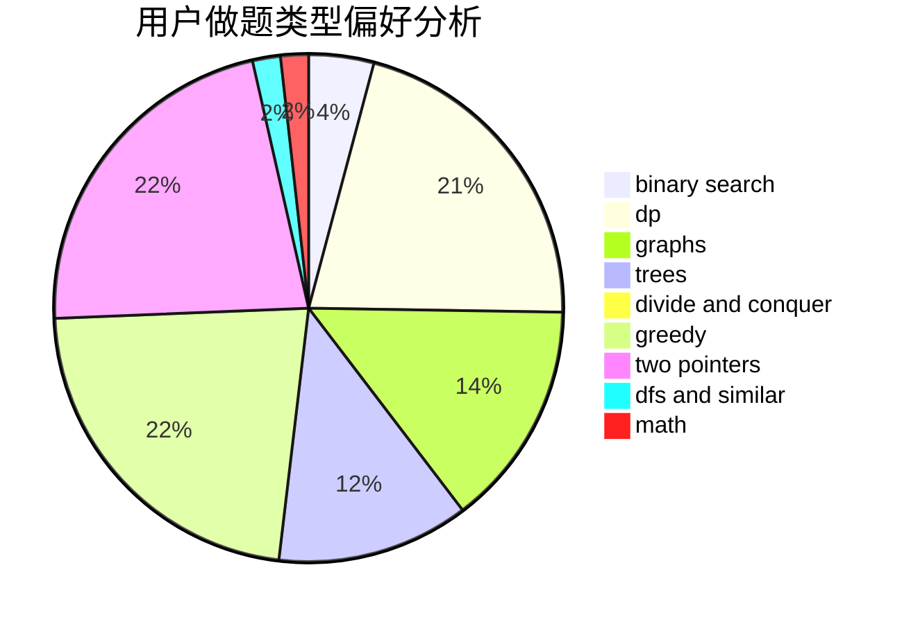

# Obsidian

<!-- tabs:start -->

#### **用户提交结果分析**

#### **用户做题类型偏好分析**

<!-- tabs:end -->
# 推荐题目
[1178B](https://codeforces.com/contest/1178/problem/B)
[962B](https://codeforces.com/contest/962/problem/B)
[990D](https://codeforces.com/contest/990/problem/D)
[180E](https://codeforces.com/contest/180/problem/E)
[1408E](https://codeforces.com/contest/1408/problem/E)
[1278D](https://codeforces.com/contest/1278/problem/D)
[515C](https://codeforces.com/contest/515/problem/C)
[491C](https://codeforces.com/contest/491/problem/C)
[1415E](https://codeforces.com/contest/1415/problem/E)
[311B](https://codeforces.com/contest/311/problem/B)
