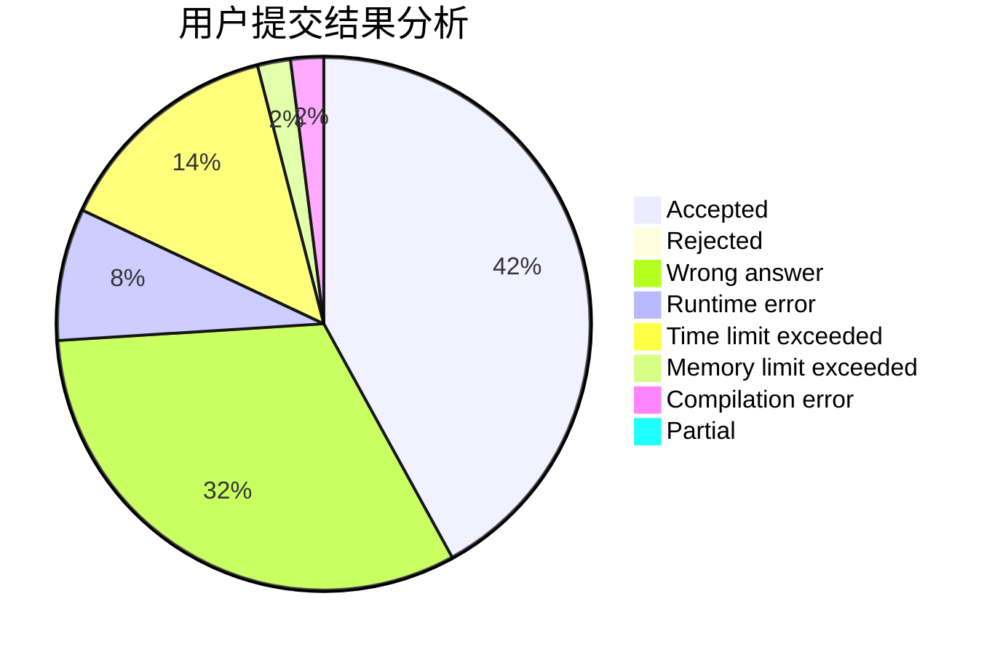
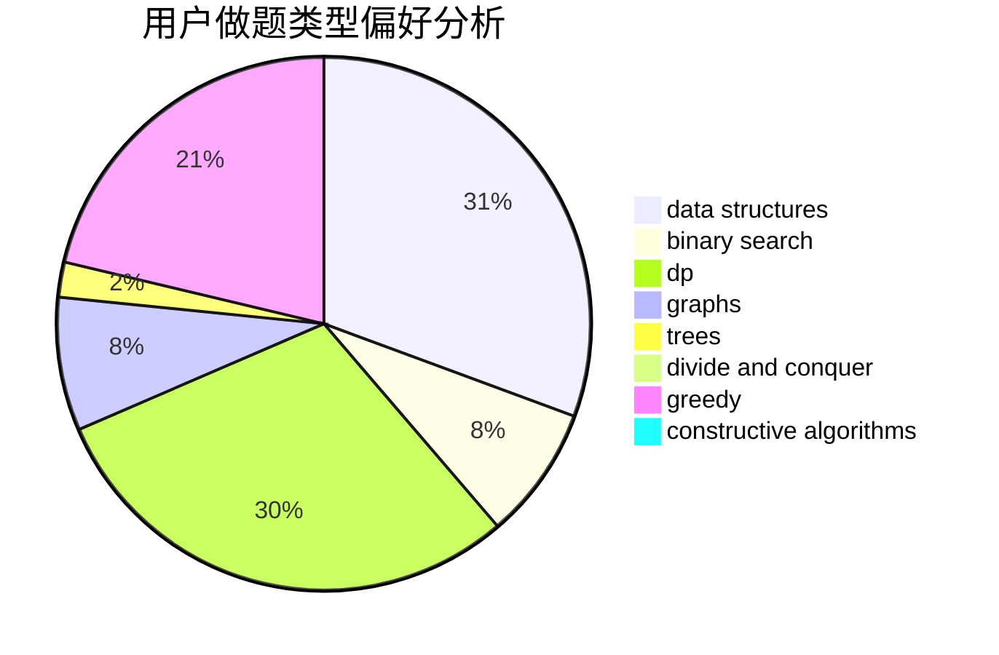
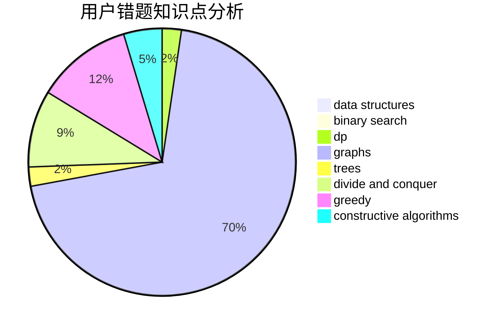

# Obsidian

<!-- tabs:start -->

#### **用户提交结果分析**

#### **用户做题类型偏好分析**

#### **用户错题知识点分析**

<!-- tabs:end -->
# 推荐题目
[1178B](https://codeforces.com/contest/1178/problem/B)		dp,
                        strings		  
[962B](https://codeforces.com/contest/962/problem/B)		constructive algorithms,
                        greedy,
                        implementation		  
[990D](https://codeforces.com/contest/990/problem/D)		constructive algorithms,
                        graphs,
                        implementation		  
[180E](https://codeforces.com/contest/180/problem/E)		binary search,
                        dp,
                        two pointers		  
[1408E](https://codeforces.com/contest/1408/problem/E)		data structures,
                        dsu,
                        graphs,
                        greedy,
                        sortings,
                        trees		  
[1278D](https://codeforces.com/contest/1278/problem/D)		data structures,
                        dsu,
                        graphs,
                        trees		  
[515C](https://codeforces.com/contest/515/problem/C)		greedy,
                        math,
                        sortings		  
[491C](https://codeforces.com/contest/491/problem/C)		flows,
                        graph matchings		  
[1415E](https://codeforces.com/contest/1415/problem/E)		constructive algorithms,
                        greedy,
                        math		  
[311B](https://codeforces.com/contest/311/problem/B)		data structures,
                        dp		  
