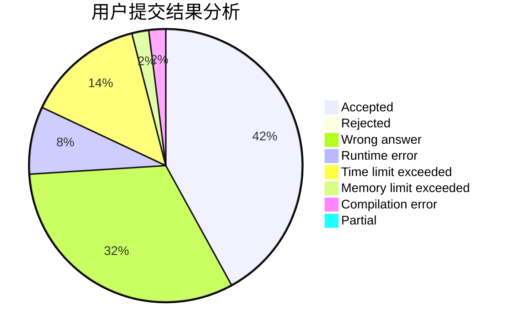
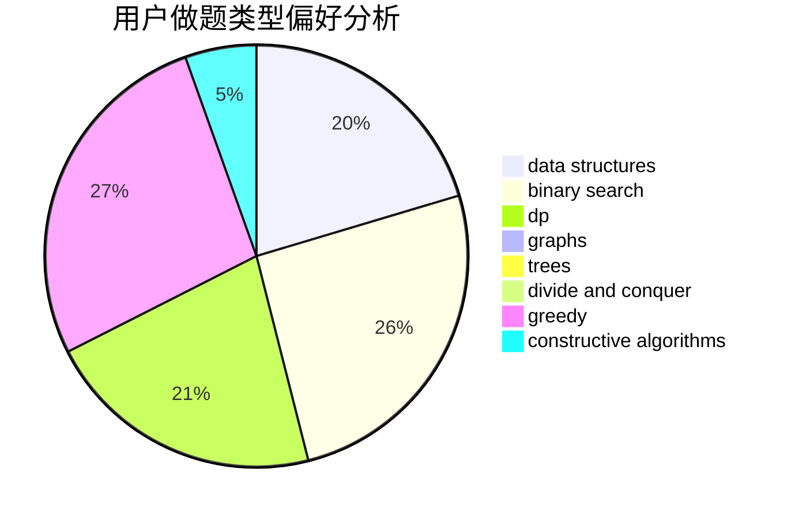
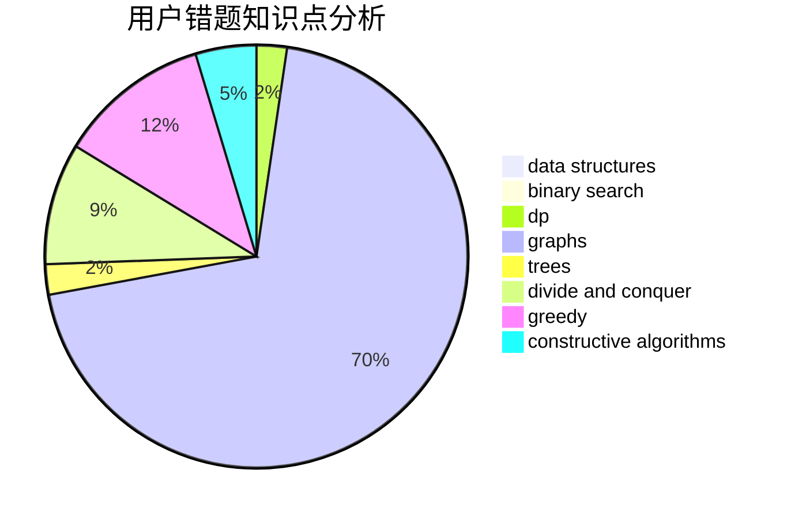

# Obsidian

<!-- tabs:start -->

#### **用户提交结果分析**

#### **用户做题类型偏好分析**

#### **用户错题知识点分析**

<!-- tabs:end -->
# 推荐题目
[1175B](https://codeforces.com/contest/1175/problem/B)		data structures,
                        expression parsing,
                        implementation		  
[940E](https://codeforces.com/contest/940/problem/E)		data structures,
                        dp,
                        greedy,
                        math		  
[976E](https://codeforces.com/contest/976/problem/E)		greedy,
                        sortings		  
[158E](https://codeforces.com/contest/158/problem/E)		*special problem,
                        dp,
                        sortings		  
[1399D](https://codeforces.com/contest/1399/problem/D)		constructive algorithms,
                        data structures,
                        greedy,
                        implementation		  
[1269D](https://codeforces.com/contest/1269/problem/D)		dsu,graphs,sortings,trees		  
[495B](https://codeforces.com/contest/495/problem/B)		math,
                        number theory		  
[472F](https://codeforces.com/contest/472/problem/F)		constructive algorithms,
                        math,
                        matrices		  
[1404C](https://codeforces.com/contest/1404/problem/C)		binary search,
                        constructive algorithms,
                        data structures,
                        greedy,
                        two pointers		  
[294E](https://codeforces.com/contest/294/problem/E)		dp,
                        trees		  
