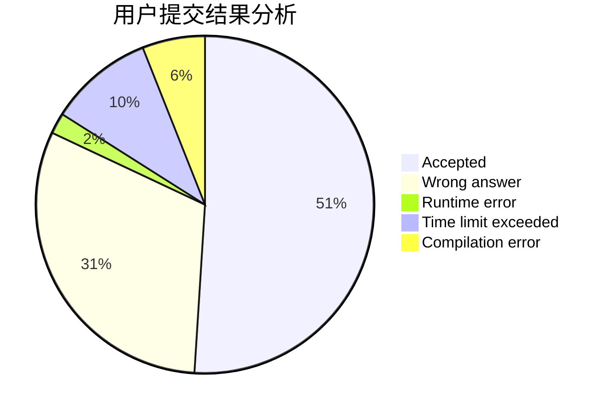
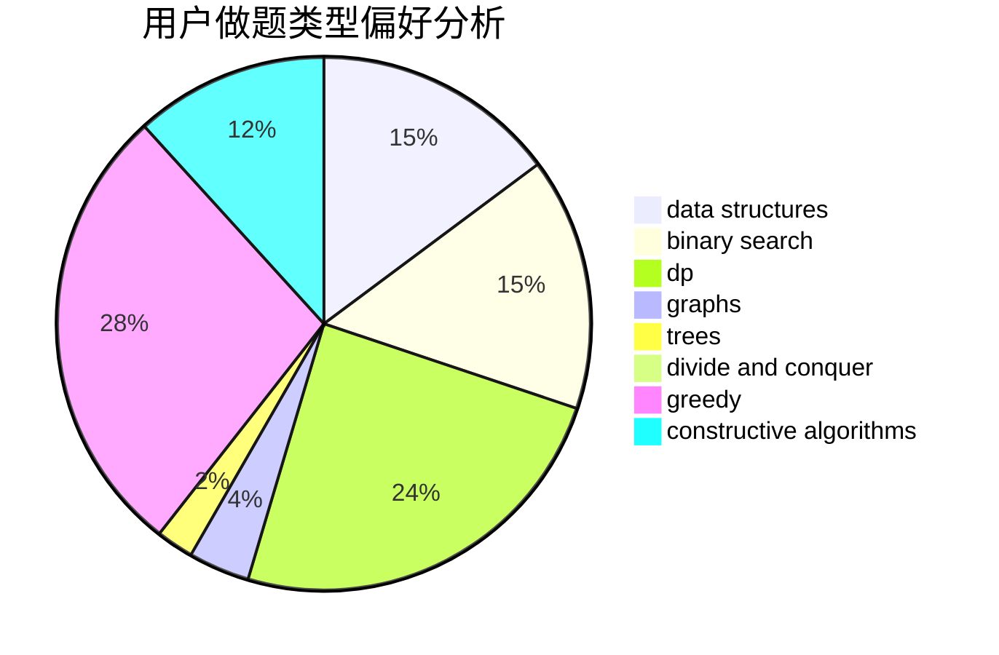
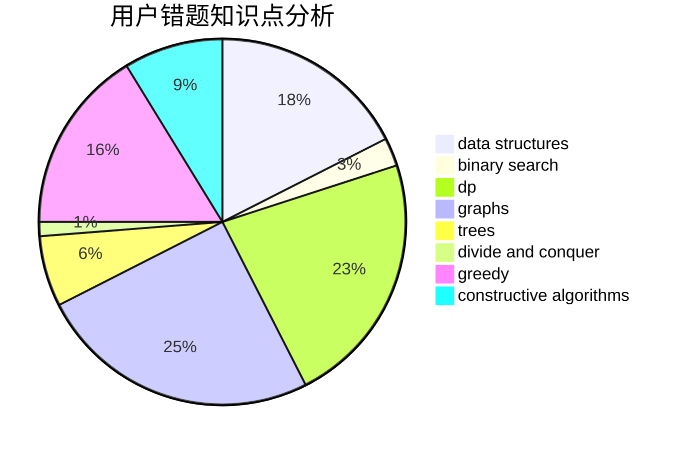

# Oceann
<!-- tabs:start -->
#### **用户提交结果分析**

#### **用户做题类型偏好分析**

#### **用户错题知识点分析**

<!-- tabs:end -->
# 推荐题目
[Yet Another String Game](http://codeforces.com/problemset/problem/1480/A)		games,
                        greedy,
                        strings		  
[Shifting Stacks](http://codeforces.com/problemset/problem/1486/A)		greedy,
                        implementation		  
[Decreasing Heights](http://codeforces.com/problemset/problem/1353/F)		brute force,
                        dp		  
[Deadline](http://codeforces.com/problemset/problem/1288/A)		binary search,
                        brute force,
                        math,
                        ternary search		  
[Radio Station](http://codeforces.com/problemset/problem/918/B)		implementation,
                        strings		  
[Don't fear, DravDe is kind](http://codeforces.com/problemset/problem/28/D)		binary search,
                        data structures,
                        dp,
                        hashing		  
[Crisp String](http://codeforces.com/problemset/problem/1117/F)		bitmasks,
                        dp		  
[Drazil and Park](https://codeforces.com/contest/516/problem/C)		data structures		  
[Measuring Lengths in Baden](http://codeforces.com/problemset/problem/125/A)		math		  
[A + B Strikes Back](http://codeforces.com/problemset/problem/409/H)		*special problem,
                        brute force,
                        constructive algorithms,
                        dsu,
                        implementation		  
<!-- tabs:start -->
#### **data structures**
[Don't fear, DravDe is kind](http://codeforces.com/problemset/problem/28/D)		binary search,
                        data structures,
                        dp,
                        hashing		  
[Drazil and Park](https://codeforces.com/contest/516/problem/C)		data structures		  
[Graph and Queries](https://codeforces.com/contest/1417/problem/F)		data structures,
                        dsu,
                        graphs,
                        implementation,
                        trees		  
[Insertion Sort](http://codeforces.com/problemset/problem/362/C)		data structures,
                        dp,
                        implementation,
                        math		  
[Performance Review](http://codeforces.com/problemset/problem/1252/G)		data structures		  
[Chip Play](https://codeforces.com/contest/90/problem/E)		brute force,
                        data structures,
                        implementation		  
[Subsegments](http://codeforces.com/problemset/problem/69/E)		data structures,
                        implementation		  
[Marvolo Gaunt's Ring](http://codeforces.com/problemset/problem/855/B)		brute force,
                        data structures,
                        dp		  
[Raging Thunder](http://codeforces.com/problemset/problem/1371/F)		data structures,
                        divide and conquer,
                        implementation		  
[Drivers Dissatisfaction](http://codeforces.com/problemset/problem/733/F)		data structures,
                        dsu,
                        graphs,
                        trees		  
#### **binary search**
[Deadline](http://codeforces.com/problemset/problem/1288/A)		binary search,
                        brute force,
                        math,
                        ternary search		  
[Don't fear, DravDe is kind](http://codeforces.com/problemset/problem/28/D)		binary search,
                        data structures,
                        dp,
                        hashing		  
[Ordering Pizza](http://codeforces.com/problemset/problem/865/B)		binary search,
                        sortings,
                        ternary search		  
[A Tale of Two Lands](http://codeforces.com/problemset/problem/1166/C)		binary search,
                        sortings,
                        two pointers		  
[Anton and Fairy Tale](http://codeforces.com/problemset/problem/785/C)		binary search,
                        math		  
[Queue](http://codeforces.com/problemset/problem/91/B)		binary search,
                        data structures		  
[Bulmart](http://codeforces.com/problemset/problem/730/C)		binary search,
                        dfs and similar		  
[Sum of Medians](http://codeforces.com/problemset/problem/85/D)		binary search,
                        brute force,
                        data structures,
                        implementation		  
[Maximum width](http://codeforces.com/problemset/problem/1492/C)		binary search,
                        data structures,
                        dp,
                        greedy,
                        two pointers		  
[Pairs](http://codeforces.com/problemset/problem/1463/D)		binary search,
                        constructive algorithms,
                        greedy,
                        two pointers		  
#### **dp**
[Decreasing Heights](http://codeforces.com/problemset/problem/1353/F)		brute force,
                        dp		  
[Don't fear, DravDe is kind](http://codeforces.com/problemset/problem/28/D)		binary search,
                        data structures,
                        dp,
                        hashing		  
[Crisp String](http://codeforces.com/problemset/problem/1117/F)		bitmasks,
                        dp		  
[Let's Go Rolling!](http://codeforces.com/problemset/problem/38/E)		dp,
                        sortings		  
[Two Merged Sequences](http://codeforces.com/problemset/problem/1144/G)		dp,
                        greedy		  
[Insertion Sort](http://codeforces.com/problemset/problem/362/C)		data structures,
                        dp,
                        implementation,
                        math		  
[Mutation](http://codeforces.com/problemset/problem/76/C)		bitmasks,
                        dp,
                        math		  
[Beautiful Bracket Sequence (easy version)](http://codeforces.com/problemset/problem/1264/D1)		combinatorics,
                        dp,
                        probabilities		  
[Speed Dial](http://codeforces.com/problemset/problem/1082/F)		dp,
                        strings,
                        trees		  
[Coin Troubles](https://codeforces.com/contest/284/problem/E)		dp		  
#### **graph**
[Graph and Queries](https://codeforces.com/contest/1417/problem/F)		data structures,
                        dsu,
                        graphs,
                        implementation,
                        trees		  
[Constructing the Dungeon](http://codeforces.com/problemset/problem/1346/D)		*special problem,
                        graphs,
                        greedy		  
[BerSU Ball](http://codeforces.com/problemset/problem/489/B)		dfs and similar,
                        dp,
                        graph matchings,
                        greedy,
                        sortings,
                        two pointers		  
[Jeremy Bearimy](https://codeforces.com/contest/1281/problem/E)		dfs and similar,
                        graphs,
                        greedy,
                        trees		  
[Drivers Dissatisfaction](http://codeforces.com/problemset/problem/733/F)		data structures,
                        dsu,
                        graphs,
                        trees		  
[Cow Program](http://codeforces.com/problemset/problem/283/B)		dfs and similar,
                        dp,
                        graphs		  
[Lunar New Year and a Wander](http://codeforces.com/problemset/problem/1106/D)		data structures,
                        dfs and similar,
                        graphs,
                        greedy,
                        shortest paths		  
[Tournament](http://codeforces.com/problemset/problem/878/C)		data structures,
                        graphs		  
[Centroids](https://codeforces.com/contest/709/problem/E)		data structures,
                        dfs and similar,
                        dp,
                        graphs,
                        greedy,
                        trees		  
[Team Rocket Rises Again](http://codeforces.com/problemset/problem/757/F)		data structures,
                        graphs,
                        shortest paths		  
#### **trees**
[Graph and Queries](https://codeforces.com/contest/1417/problem/F)		data structures,
                        dsu,
                        graphs,
                        implementation,
                        trees		  
[Speed Dial](http://codeforces.com/problemset/problem/1082/F)		dp,
                        strings,
                        trees		  
[Jeremy Bearimy](https://codeforces.com/contest/1281/problem/E)		dfs and similar,
                        graphs,
                        greedy,
                        trees		  
[Queen](http://codeforces.com/problemset/problem/1143/C)		dfs and similar,
                        trees		  
[Berland Beauty](http://codeforces.com/problemset/problem/1296/F)		constructive algorithms,
                        dfs and similar,
                        greedy,
                        sortings,
                        trees		  
[Drivers Dissatisfaction](http://codeforces.com/problemset/problem/733/F)		data structures,
                        dsu,
                        graphs,
                        trees		  
[Ehab and a component choosing problem](http://codeforces.com/problemset/problem/1088/E)		dp,
                        greedy,
                        math,
                        trees		  
[Centroids](https://codeforces.com/contest/709/problem/E)		data structures,
                        dfs and similar,
                        dp,
                        graphs,
                        greedy,
                        trees		  
[Lynyrd Skynyrd](http://codeforces.com/problemset/problem/1142/B)		data structures,
                        dfs and similar,
                        dp,
                        math,
                        trees		  
[Odd Mineral Resource](http://codeforces.com/problemset/problem/1479/D)		binary search,
                        bitmasks,
                        brute force,
                        data structures,
                        probabilities,
                        trees		  
#### **divide and conquer**
[Raging Thunder](http://codeforces.com/problemset/problem/1371/F)		data structures,
                        divide and conquer,
                        implementation		  
[Finding lines](http://codeforces.com/problemset/problem/788/D)		constructive algorithms,
                        divide and conquer,
                        interactive		  
[Divide and Summarize](http://codeforces.com/problemset/problem/1461/D)		binary search,
                        brute force,
                        data structures,
                        divide and conquer,
                        implementation,
                        sortings		  
[Song of the Sirens](http://codeforces.com/problemset/problem/1466/G)		combinatorics,
                        divide and conquer,
                        hashing,
                        math,
                        string suffix structures,
                        strings		  
[Permutation Transformation](http://codeforces.com/problemset/problem/1490/D)		dfs and similar,
                        divide and conquer,
                        implementation		  
[Skyline Photo](https://codeforces.com/contest/1483/problem/C)		data structures,
                        divide and conquer,
                        dp		  
[Fib-tree](http://codeforces.com/problemset/problem/1491/E)		brute force,
                        dfs and similar,
                        divide and conquer,
                        number theory,
                        trees		  
[Sum of Prefix Sums](http://codeforces.com/problemset/problem/1303/G)		data structures,
                        divide and conquer,
                        geometry,
                        trees		  
[Dogeforces](http://codeforces.com/problemset/problem/1494/D)		constructive algorithms,
                        data structures,
                        dfs and similar,
                        divide and conquer,
                        dsu,
                        greedy,
                        sortings,
                        trees		  
[Logistical Questions](http://codeforces.com/problemset/problem/566/C)		dfs and similar,
                        divide and conquer,
                        trees		  
#### **greedy**
[Yet Another String Game](http://codeforces.com/problemset/problem/1480/A)		games,
                        greedy,
                        strings		  
[Shifting Stacks](http://codeforces.com/problemset/problem/1486/A)		greedy,
                        implementation		  
[Olympic Medal](http://codeforces.com/problemset/problem/215/B)		greedy,
                        math		  
[Two Merged Sequences](http://codeforces.com/problemset/problem/1144/G)		dp,
                        greedy		  
[Constructing the Dungeon](http://codeforces.com/problemset/problem/1346/D)		*special problem,
                        graphs,
                        greedy		  
[BerSU Ball](http://codeforces.com/problemset/problem/489/B)		dfs and similar,
                        dp,
                        graph matchings,
                        greedy,
                        sortings,
                        two pointers		  
[Bear and Different Names](https://codeforces.com/contest/790/problem/A)		constructive algorithms,
                        greedy		  
[Jeremy Bearimy](https://codeforces.com/contest/1281/problem/E)		dfs and similar,
                        graphs,
                        greedy,
                        trees		  
[Hiring Staff](http://codeforces.com/problemset/problem/216/C)		greedy		  
[Math](http://codeforces.com/problemset/problem/1062/B)		greedy,
                        math,
                        number theory		  
#### **constructive algorithms**
[A + B Strikes Back](http://codeforces.com/problemset/problem/409/H)		*special problem,
                        brute force,
                        constructive algorithms,
                        dsu,
                        implementation		  
[Anton and Letters](http://codeforces.com/problemset/problem/443/A)		constructive algorithms,
                        implementation		  
[Karen and Test](http://codeforces.com/problemset/problem/815/B)		brute force,
                        combinatorics,
                        constructive algorithms,
                        math		  
[Bear and Different Names](https://codeforces.com/contest/790/problem/A)		constructive algorithms,
                        greedy		  
[Berland Beauty](http://codeforces.com/problemset/problem/1296/F)		constructive algorithms,
                        dfs and similar,
                        greedy,
                        sortings,
                        trees		  
[Short Program](https://codeforces.com/contest/879/problem/C)		bitmasks,
                        constructive algorithms		  
[Special Permutation](https://codeforces.com/contest/1347/problem/E)		constructive algorithms,
                        probabilities		  
[Equalize Them All](http://codeforces.com/problemset/problem/1144/D)		constructive algorithms,
                        greedy		  
[Candies Game](http://codeforces.com/problemset/problem/341/E)		constructive algorithms,
                        greedy		  
[Optimal Number Permutation](http://codeforces.com/problemset/problem/622/D)		constructive algorithms		  
#### **sortings**
[Let's Go Rolling!](http://codeforces.com/problemset/problem/38/E)		dp,
                        sortings		  
[Ordering Pizza](http://codeforces.com/problemset/problem/865/B)		binary search,
                        sortings,
                        ternary search		  
[BerSU Ball](http://codeforces.com/problemset/problem/489/B)		dfs and similar,
                        dp,
                        graph matchings,
                        greedy,
                        sortings,
                        two pointers		  
[A Tale of Two Lands](http://codeforces.com/problemset/problem/1166/C)		binary search,
                        sortings,
                        two pointers		  
[Berland Beauty](http://codeforces.com/problemset/problem/1296/F)		constructive algorithms,
                        dfs and similar,
                        greedy,
                        sortings,
                        trees		  
[Phone Talks](http://codeforces.com/problemset/problem/158/E)		*special problem,
                        dp,
                        sortings		  
[Winter Is Coming](http://codeforces.com/problemset/problem/747/D)		dp,
                        greedy,
                        sortings		  
[Mastermind](http://codeforces.com/problemset/problem/1381/C)		constructive algorithms,
                        graph matchings,
                        greedy,
                        implementation,
                        sortings,
                        two pointers		  
[Diamond Miner](https://codeforces.com/contest/1496/problem/C)		geometry,
                        greedy,
                        math,
                        sortings		  
[Meximization](http://codeforces.com/problemset/problem/1497/A)		brute force,
                        data structures,
                        greedy,
                        sortings		  
<!-- tabs:end -->
