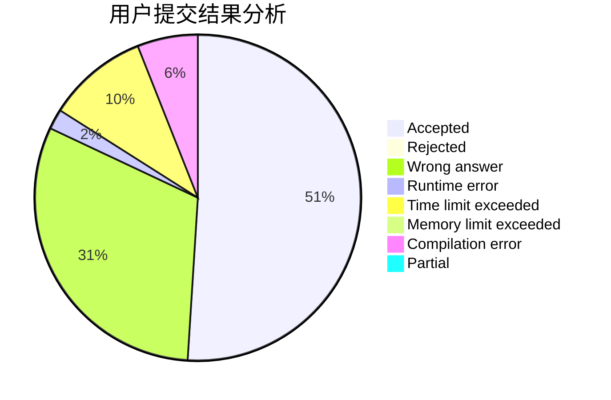
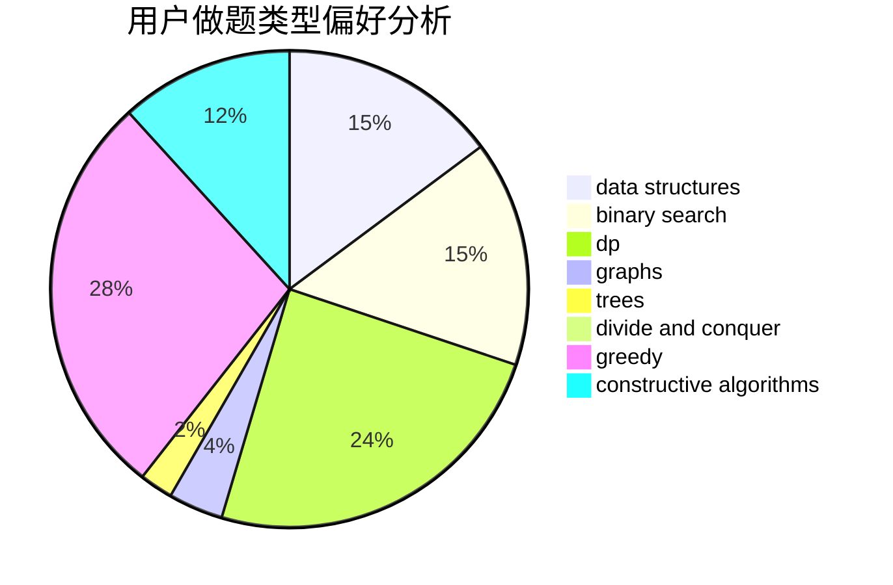
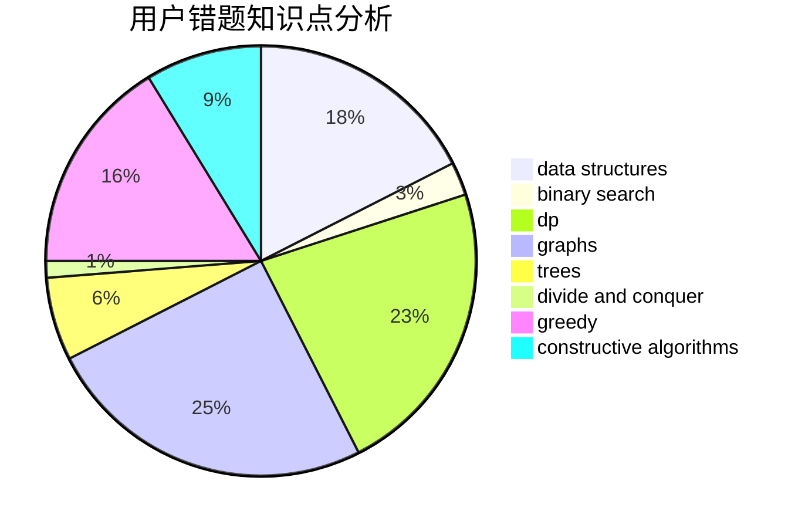

# Oceann

<!-- tabs:start -->

#### **用户提交结果分析**

#### **用户做题类型偏好分析**

#### **用户错题知识点分析**

<!-- tabs:end -->
# 推荐题目
[28D](https://codeforces.com/contest/28/problem/D)		binary search,
                        data structures,
                        dp,
                        hashing		  
[1459B](https://codeforces.com/contest/1459/problem/B)		dp,
                        math		  
[53E](https://codeforces.com/contest/53/problem/E)		bitmasks,
                        dp		  
[125A](https://codeforces.com/contest/125/problem/A)		math		  
[76C](https://codeforces.com/contest/76/problem/C)		bitmasks,
                        dp,
                        math		  
[1166C](https://codeforces.com/contest/1166/problem/C)		binary search,
                        sortings,
                        two pointers		  
[1144G](https://codeforces.com/contest/1144/problem/G)		dp,
                        greedy		  
[215B](https://codeforces.com/contest/215/problem/B)		greedy,
                        math		  
[815B](https://codeforces.com/contest/815/problem/B)		brute force,
                        combinatorics,
                        constructive algorithms,
                        math		  
[598A](https://codeforces.com/contest/598/problem/A)		math		  
