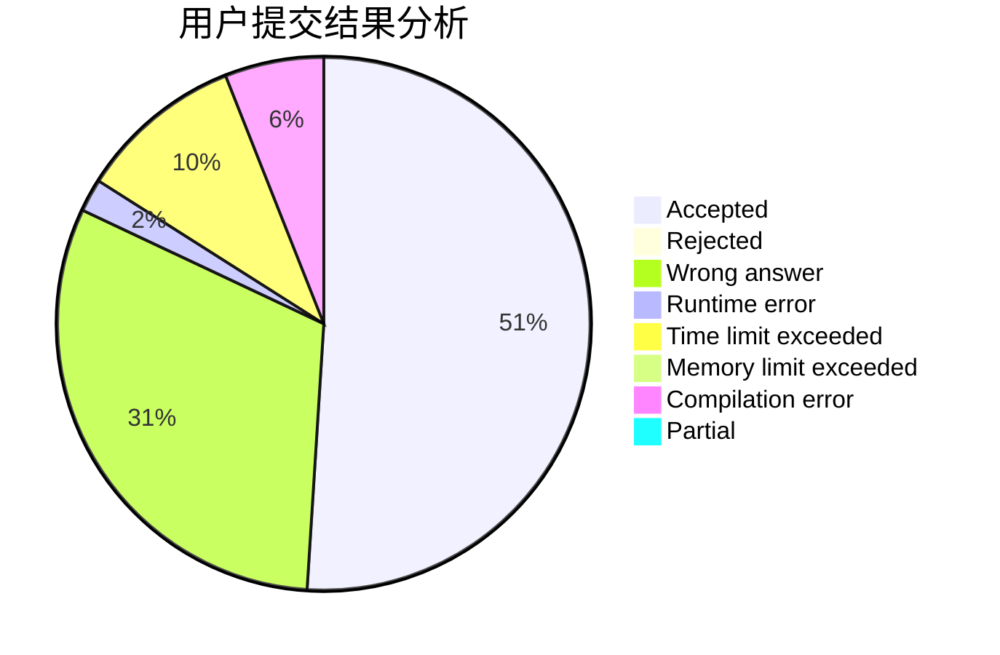
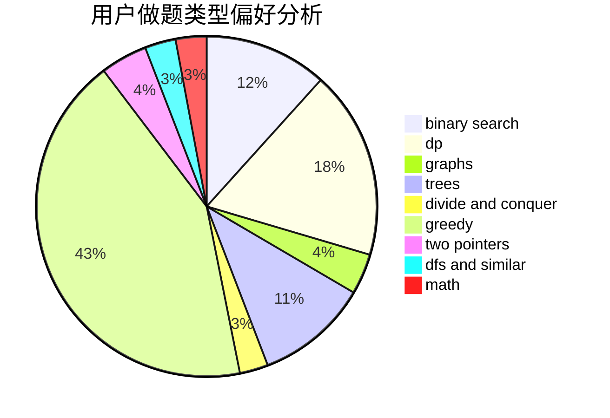

# Oceann

<!-- tabs:start -->

#### **用户提交结果分析**

#### **用户做题类型偏好分析**

<!-- tabs:end -->
# 推荐题目
[304D](https://codeforces.com/contest/304/problem/D)
[1468B](https://codeforces.com/contest/1468/problem/B)
[560E](https://codeforces.com/contest/560/problem/E)
[1265C](https://codeforces.com/contest/1265/problem/C)
[789D](https://codeforces.com/contest/789/problem/D)
[1169B](https://codeforces.com/contest/1169/problem/B)
[1147A](https://codeforces.com/contest/1147/problem/A)
[234A](https://codeforces.com/contest/234/problem/A)
[834B](https://codeforces.com/contest/834/problem/B)
[615D](https://codeforces.com/contest/615/problem/D)
