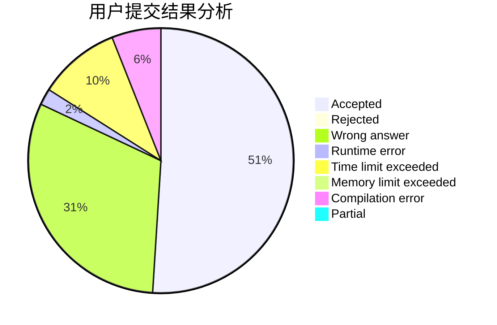
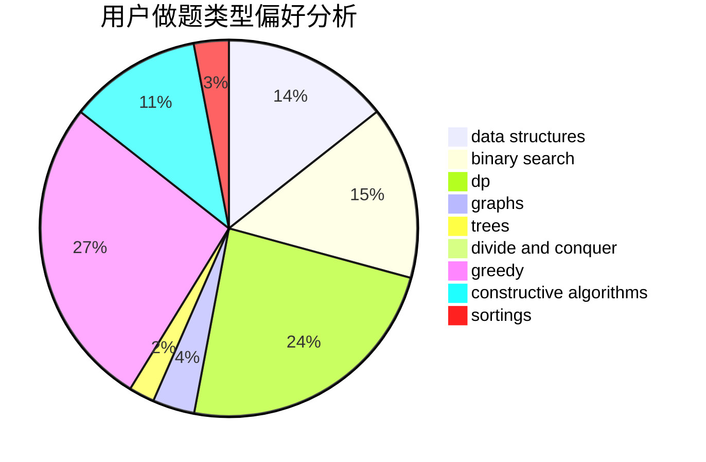
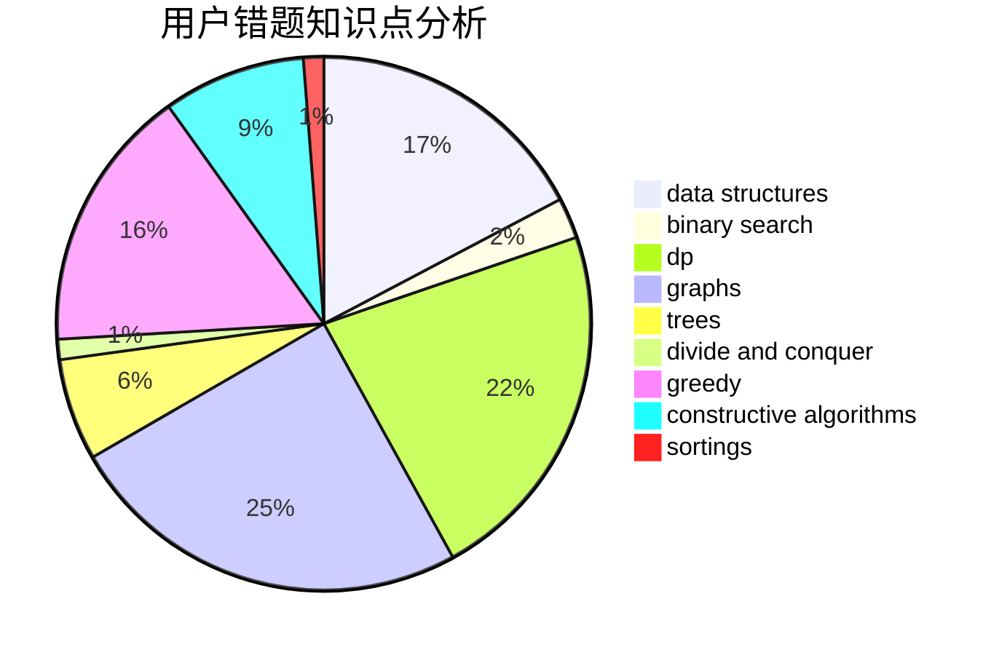

# Oceann
<!-- tabs:start -->
#### **用户提交结果分析**

#### **用户做题类型偏好分析**

#### **用户错题知识点分析**

<!-- tabs:end -->
# 推荐题目
[1480A](http://codeforces.com/problemset/problem/1480/A)		games,
                        greedy,
                        strings		  
[1486A](http://codeforces.com/problemset/problem/1486/A)		greedy,
                        implementation		  
[1353F](http://codeforces.com/problemset/problem/1353/F)		brute force,
                        dp		  
[1288A](http://codeforces.com/problemset/problem/1288/A)		binary search,
                        brute force,
                        math,
                        ternary search		  
[918B](http://codeforces.com/problemset/problem/918/B)		implementation,
                        strings		  
[28D](http://codeforces.com/problemset/problem/28/D)		binary search,
                        data structures,
                        dp,
                        hashing		  
[1117F](http://codeforces.com/problemset/problem/1117/F)		bitmasks,
                        dp		  
[516C](https://codeforces.com/contest/516/problem/C)		data structures		  
[125A](http://codeforces.com/problemset/problem/125/A)		math		  
[409H](http://codeforces.com/problemset/problem/409/H)		*special problem,
                        brute force,
                        constructive algorithms,
                        dsu,
                        implementation		  
<!-- tabs:start -->
#### **data structures**
[28D](http://codeforces.com/problemset/problem/28/D)		binary search,
                        data structures,
                        dp,
                        hashing		  
[516C](https://codeforces.com/contest/516/problem/C)		data structures		  
[1417F](https://codeforces.com/contest/1417/problem/F)		data structures,
                        dsu,
                        graphs,
                        implementation,
                        trees		  
[362C](http://codeforces.com/problemset/problem/362/C)		data structures,
                        dp,
                        implementation,
                        math		  
[1252G](http://codeforces.com/problemset/problem/1252/G)		data structures		  
[90E](https://codeforces.com/contest/90/problem/E)		brute force,
                        data structures,
                        implementation		  
[69E](http://codeforces.com/problemset/problem/69/E)		data structures,
                        implementation		  
[855B](http://codeforces.com/problemset/problem/855/B)		brute force,
                        data structures,
                        dp		  
[1371F](http://codeforces.com/problemset/problem/1371/F)		data structures,
                        divide and conquer,
                        implementation		  
[733F](http://codeforces.com/problemset/problem/733/F)		data structures,
                        dsu,
                        graphs,
                        trees		  
#### **binary search**
[1288A](http://codeforces.com/problemset/problem/1288/A)		binary search,
                        brute force,
                        math,
                        ternary search		  
[28D](http://codeforces.com/problemset/problem/28/D)		binary search,
                        data structures,
                        dp,
                        hashing		  
[865B](http://codeforces.com/problemset/problem/865/B)		binary search,
                        sortings,
                        ternary search		  
[1166C](http://codeforces.com/problemset/problem/1166/C)		binary search,
                        sortings,
                        two pointers		  
[785C](http://codeforces.com/problemset/problem/785/C)		binary search,
                        math		  
[91B](http://codeforces.com/problemset/problem/91/B)		binary search,
                        data structures		  
[730C](http://codeforces.com/problemset/problem/730/C)		binary search,
                        dfs and similar		  
[85D](http://codeforces.com/problemset/problem/85/D)		binary search,
                        brute force,
                        data structures,
                        implementation		  
[1492C](http://codeforces.com/problemset/problem/1492/C)		binary search,
                        data structures,
                        dp,
                        greedy,
                        two pointers		  
[1463D](http://codeforces.com/problemset/problem/1463/D)		binary search,
                        constructive algorithms,
                        greedy,
                        two pointers		  
#### **dp**
[1353F](http://codeforces.com/problemset/problem/1353/F)		brute force,
                        dp		  
[28D](http://codeforces.com/problemset/problem/28/D)		binary search,
                        data structures,
                        dp,
                        hashing		  
[1117F](http://codeforces.com/problemset/problem/1117/F)		bitmasks,
                        dp		  
[38E](http://codeforces.com/problemset/problem/38/E)		dp,
                        sortings		  
[1144G](http://codeforces.com/problemset/problem/1144/G)		dp,
                        greedy		  
[362C](http://codeforces.com/problemset/problem/362/C)		data structures,
                        dp,
                        implementation,
                        math		  
[76C](http://codeforces.com/problemset/problem/76/C)		bitmasks,
                        dp,
                        math		  
[1264D1](http://codeforces.com/problemset/problem/1264/D1)		combinatorics,
                        dp,
                        probabilities		  
[1082F](http://codeforces.com/problemset/problem/1082/F)		dp,
                        strings,
                        trees		  
[284E](https://codeforces.com/contest/284/problem/E)		dp		  
#### **graph**
[1417F](https://codeforces.com/contest/1417/problem/F)		data structures,
                        dsu,
                        graphs,
                        implementation,
                        trees		  
[1346D](http://codeforces.com/problemset/problem/1346/D)		*special problem,
                        graphs,
                        greedy		  
[489B](http://codeforces.com/problemset/problem/489/B)		dfs and similar,
                        dp,
                        graph matchings,
                        greedy,
                        sortings,
                        two pointers		  
[1281E](https://codeforces.com/contest/1281/problem/E)		dfs and similar,
                        graphs,
                        greedy,
                        trees		  
[733F](http://codeforces.com/problemset/problem/733/F)		data structures,
                        dsu,
                        graphs,
                        trees		  
[283B](http://codeforces.com/problemset/problem/283/B)		dfs and similar,
                        dp,
                        graphs		  
[1106D](http://codeforces.com/problemset/problem/1106/D)		data structures,
                        dfs and similar,
                        graphs,
                        greedy,
                        shortest paths		  
[878C](http://codeforces.com/problemset/problem/878/C)		data structures,
                        graphs		  
[709E](https://codeforces.com/contest/709/problem/E)		data structures,
                        dfs and similar,
                        dp,
                        graphs,
                        greedy,
                        trees		  
[757F](http://codeforces.com/problemset/problem/757/F)		data structures,
                        graphs,
                        shortest paths		  
#### **trees**
[1417F](https://codeforces.com/contest/1417/problem/F)		data structures,
                        dsu,
                        graphs,
                        implementation,
                        trees		  
[1082F](http://codeforces.com/problemset/problem/1082/F)		dp,
                        strings,
                        trees		  
[1281E](https://codeforces.com/contest/1281/problem/E)		dfs and similar,
                        graphs,
                        greedy,
                        trees		  
[1143C](http://codeforces.com/problemset/problem/1143/C)		dfs and similar,
                        trees		  
[1296F](http://codeforces.com/problemset/problem/1296/F)		constructive algorithms,
                        dfs and similar,
                        greedy,
                        sortings,
                        trees		  
[733F](http://codeforces.com/problemset/problem/733/F)		data structures,
                        dsu,
                        graphs,
                        trees		  
[1088E](http://codeforces.com/problemset/problem/1088/E)		dp,
                        greedy,
                        math,
                        trees		  
[709E](https://codeforces.com/contest/709/problem/E)		data structures,
                        dfs and similar,
                        dp,
                        graphs,
                        greedy,
                        trees		  
[1142B](http://codeforces.com/problemset/problem/1142/B)		data structures,
                        dfs and similar,
                        dp,
                        math,
                        trees		  
[1479D](http://codeforces.com/problemset/problem/1479/D)		binary search,
                        bitmasks,
                        brute force,
                        data structures,
                        probabilities,
                        trees		  
#### **divide and conquer**
[1371F](http://codeforces.com/problemset/problem/1371/F)		data structures,
                        divide and conquer,
                        implementation		  
[788D](http://codeforces.com/problemset/problem/788/D)		constructive algorithms,
                        divide and conquer,
                        interactive		  
[1461D](http://codeforces.com/problemset/problem/1461/D)		binary search,
                        brute force,
                        data structures,
                        divide and conquer,
                        implementation,
                        sortings		  
[1466G](http://codeforces.com/problemset/problem/1466/G)		combinatorics,
                        divide and conquer,
                        hashing,
                        math,
                        string suffix structures,
                        strings		  
[1490D](http://codeforces.com/problemset/problem/1490/D)		dfs and similar,
                        divide and conquer,
                        implementation		  
[1483C](https://codeforces.com/contest/1483/problem/C)		data structures,
                        divide and conquer,
                        dp		  
[1491E](http://codeforces.com/problemset/problem/1491/E)		brute force,
                        dfs and similar,
                        divide and conquer,
                        number theory,
                        trees		  
[1303G](http://codeforces.com/problemset/problem/1303/G)		data structures,
                        divide and conquer,
                        geometry,
                        trees		  
[1494D](http://codeforces.com/problemset/problem/1494/D)		constructive algorithms,
                        data structures,
                        dfs and similar,
                        divide and conquer,
                        dsu,
                        greedy,
                        sortings,
                        trees		  
[1482E](http://codeforces.com/problemset/problem/1482/E)		data structures,
                        divide and conquer,
                        dp		  
#### **greedy**
[1480A](http://codeforces.com/problemset/problem/1480/A)		games,
                        greedy,
                        strings		  
[1486A](http://codeforces.com/problemset/problem/1486/A)		greedy,
                        implementation		  
[215B](http://codeforces.com/problemset/problem/215/B)		greedy,
                        math		  
[1144G](http://codeforces.com/problemset/problem/1144/G)		dp,
                        greedy		  
[1346D](http://codeforces.com/problemset/problem/1346/D)		*special problem,
                        graphs,
                        greedy		  
[489B](http://codeforces.com/problemset/problem/489/B)		dfs and similar,
                        dp,
                        graph matchings,
                        greedy,
                        sortings,
                        two pointers		  
[790A](https://codeforces.com/contest/790/problem/A)		constructive algorithms,
                        greedy		  
[1281E](https://codeforces.com/contest/1281/problem/E)		dfs and similar,
                        graphs,
                        greedy,
                        trees		  
[216C](http://codeforces.com/problemset/problem/216/C)		greedy		  
[1062B](http://codeforces.com/problemset/problem/1062/B)		greedy,
                        math,
                        number theory		  
#### **constructive algorithms**
[409H](http://codeforces.com/problemset/problem/409/H)		*special problem,
                        brute force,
                        constructive algorithms,
                        dsu,
                        implementation		  
[443A](http://codeforces.com/problemset/problem/443/A)		constructive algorithms,
                        implementation		  
[815B](http://codeforces.com/problemset/problem/815/B)		brute force,
                        combinatorics,
                        constructive algorithms,
                        math		  
[790A](https://codeforces.com/contest/790/problem/A)		constructive algorithms,
                        greedy		  
[1296F](http://codeforces.com/problemset/problem/1296/F)		constructive algorithms,
                        dfs and similar,
                        greedy,
                        sortings,
                        trees		  
[879C](https://codeforces.com/contest/879/problem/C)		bitmasks,
                        constructive algorithms		  
[1347E](https://codeforces.com/contest/1347/problem/E)		constructive algorithms,
                        probabilities		  
[1144D](http://codeforces.com/problemset/problem/1144/D)		constructive algorithms,
                        greedy		  
[341E](http://codeforces.com/problemset/problem/341/E)		constructive algorithms,
                        greedy		  
[622D](http://codeforces.com/problemset/problem/622/D)		constructive algorithms		  
#### **sortings**
[38E](http://codeforces.com/problemset/problem/38/E)		dp,
                        sortings		  
[865B](http://codeforces.com/problemset/problem/865/B)		binary search,
                        sortings,
                        ternary search		  
[489B](http://codeforces.com/problemset/problem/489/B)		dfs and similar,
                        dp,
                        graph matchings,
                        greedy,
                        sortings,
                        two pointers		  
[1166C](http://codeforces.com/problemset/problem/1166/C)		binary search,
                        sortings,
                        two pointers		  
[1296F](http://codeforces.com/problemset/problem/1296/F)		constructive algorithms,
                        dfs and similar,
                        greedy,
                        sortings,
                        trees		  
[158E](http://codeforces.com/problemset/problem/158/E)		*special problem,
                        dp,
                        sortings		  
[747D](http://codeforces.com/problemset/problem/747/D)		dp,
                        greedy,
                        sortings		  
[1381C](http://codeforces.com/problemset/problem/1381/C)		constructive algorithms,
                        graph matchings,
                        greedy,
                        implementation,
                        sortings,
                        two pointers		  
[1496C](https://codeforces.com/contest/1496/problem/C)		geometry,
                        greedy,
                        math,
                        sortings		  
[1495A](http://codeforces.com/problemset/problem/1495/A)		geometry,
                        greedy,
                        math,
                        sortings		  
<!-- tabs:end -->
