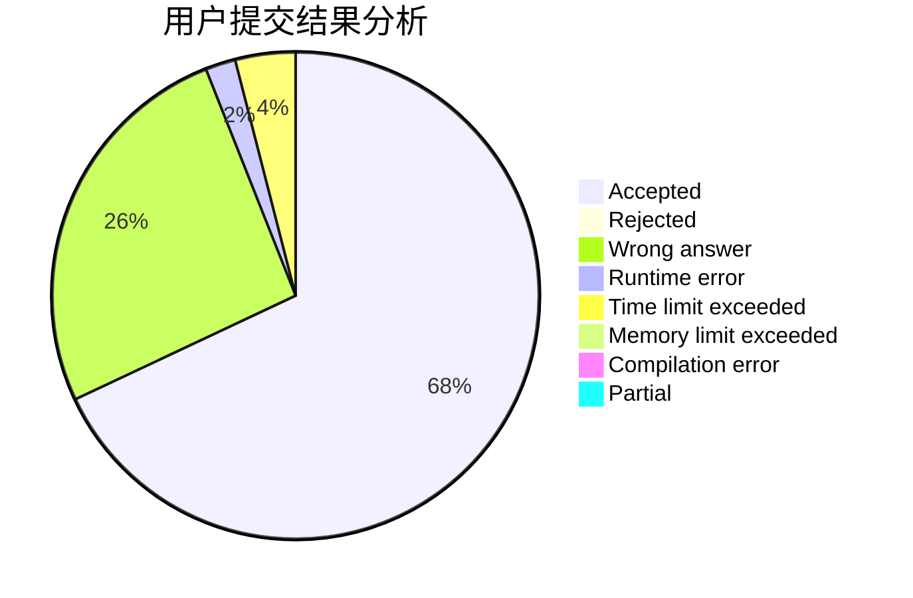
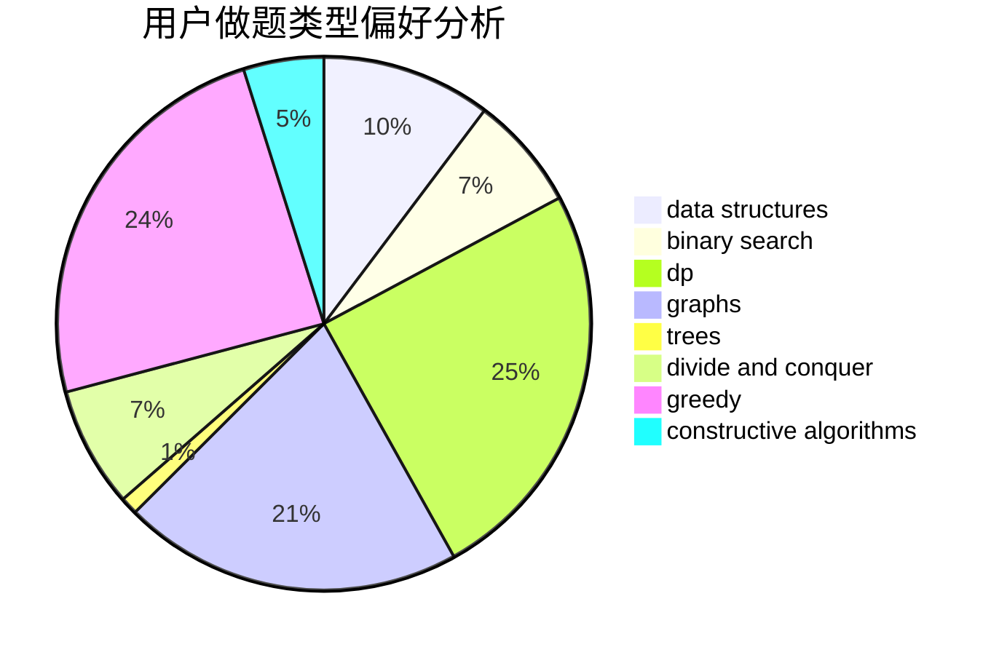
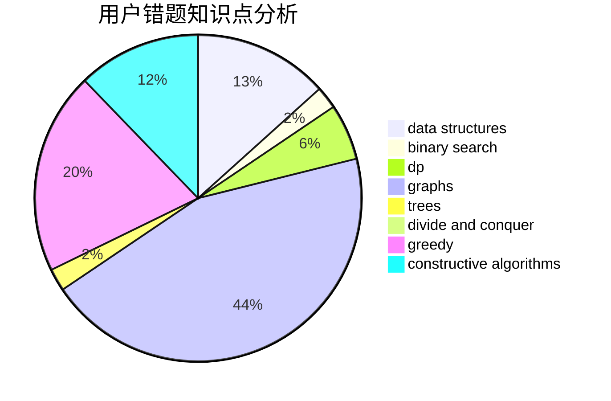

# OldYang

<!-- tabs:start -->

#### **用户提交结果分析**

#### **用户做题类型偏好分析**

#### **用户错题知识点分析**

<!-- tabs:end -->
# 推荐题目
[1301D](https://codeforces.com/contest/1301/problem/D)		constructive algorithms,
                        graphs,
                        implementation		  
[1164M](https://codeforces.com/contest/1164/problem/M)		dsu,graphs,sortings,trees		  
[977A](https://codeforces.com/contest/977/problem/A)		implementation		  
[331C3](https://codeforces.com/contest/331C/problem/3)		dp		  
[949A](https://codeforces.com/contest/949/problem/A)		greedy		  
[645G](https://codeforces.com/contest/645/problem/G)		binary search,
                        geometry		  
[95E](https://codeforces.com/contest/95/problem/E)		dp,
                        dsu,
                        graphs		  
[626F](https://codeforces.com/contest/626/problem/F)		dp		  
[575A](https://codeforces.com/contest/575/problem/A)		data structures,
                        math,
                        matrices		  
[833D](https://codeforces.com/contest/833/problem/D)		data structures,
                        divide and conquer,
                        implementation,
                        trees		  
