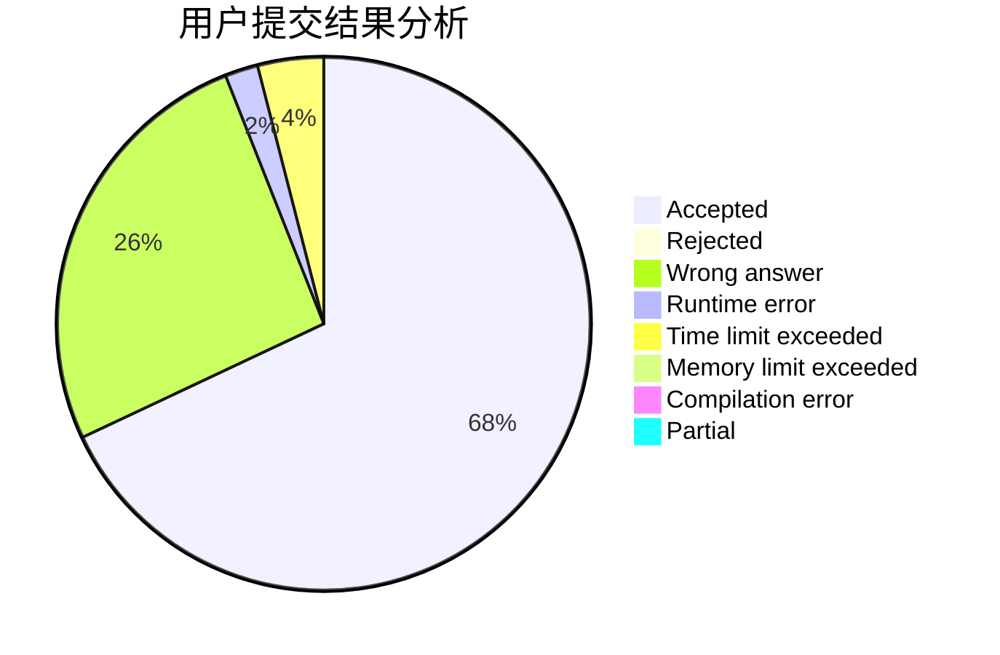
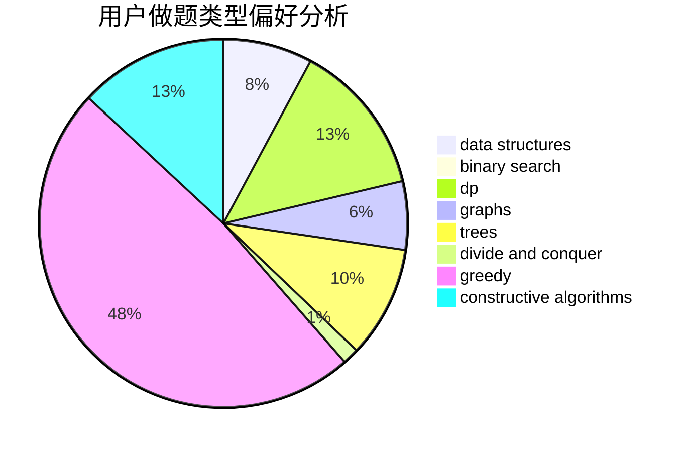
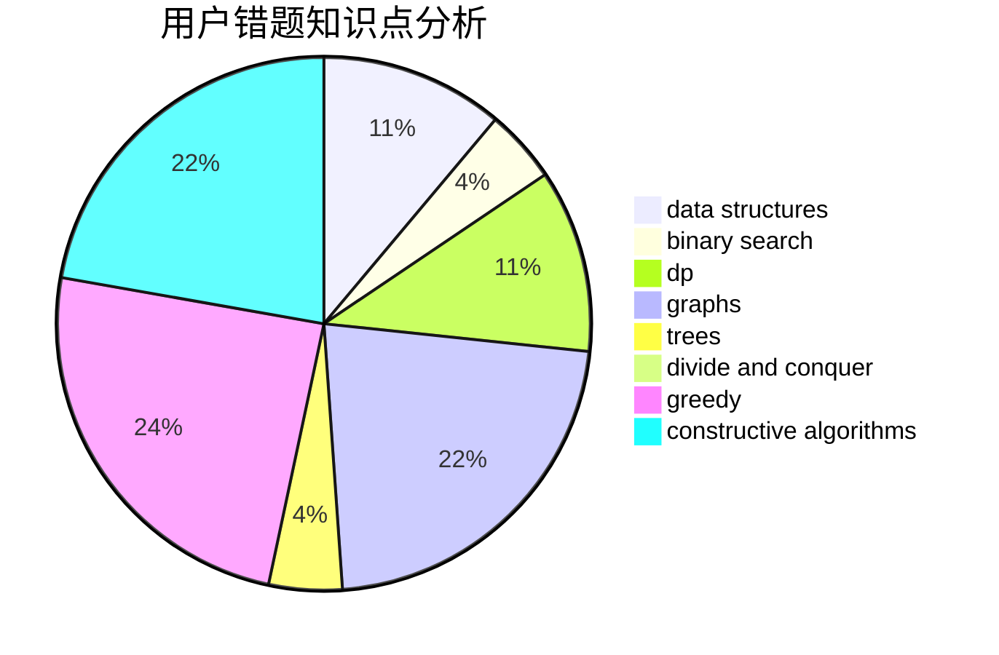

# OldYang

<!-- tabs:start -->

#### **用户提交结果分析**

#### **用户做题类型偏好分析**

#### **用户错题知识点分析**

<!-- tabs:end -->
# 推荐题目
[1311A](https://codeforces.com/contest/1311/problem/A)		greedy,
                        implementation,
                        math		  
[1166D](https://codeforces.com/contest/1166/problem/D)		binary search,
                        brute force,
                        greedy,
                        math		  
[990F](https://codeforces.com/contest/990/problem/F)		dfs and similar,
                        dp,
                        greedy,
                        trees		  
[359C](https://codeforces.com/contest/359/problem/C)		math,
                        number theory		  
[965E](https://codeforces.com/contest/965/problem/E)		data structures,
                        dp,
                        greedy,
                        strings,
                        trees		  
[672C](https://codeforces.com/contest/672/problem/C)		dsu,graphs,sortings,trees		  
[981G](https://codeforces.com/contest/981/problem/G)		data structures		  
[653A](https://codeforces.com/contest/653/problem/A)		brute force,
                        implementation,
                        sortings		  
[596A](https://codeforces.com/contest/596/problem/A)		geometry,
                        implementation		  
[851D](https://codeforces.com/contest/851/problem/D)		dsu,graphs,sortings,trees		  
