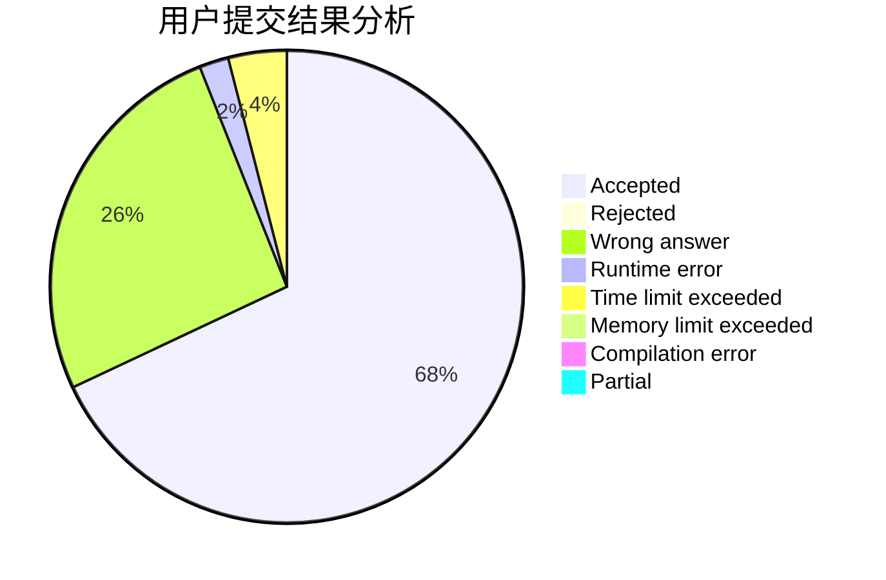
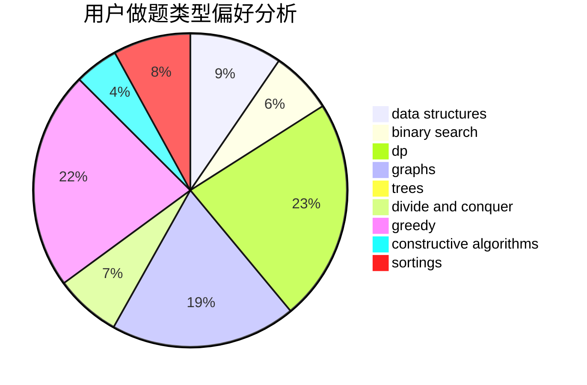
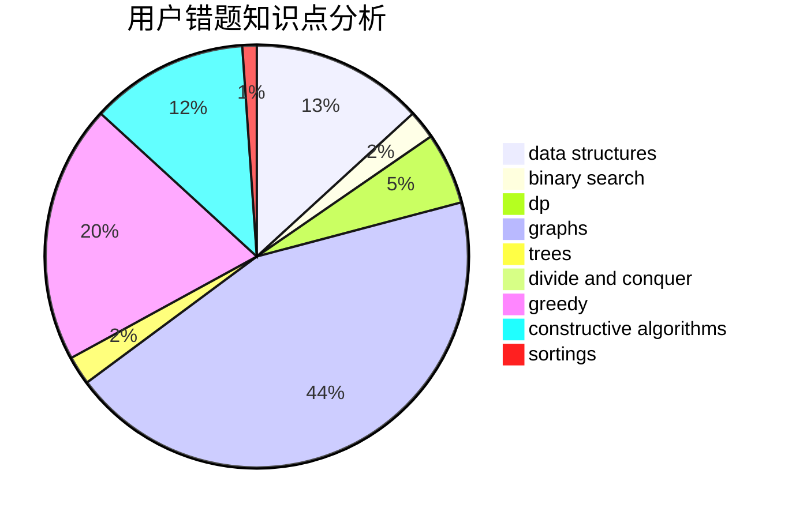

# OldYang
<!-- tabs:start -->
#### **用户提交结果分析**

#### **用户做题类型偏好分析**

#### **用户错题知识点分析**

<!-- tabs:end -->
# 推荐题目
[1301D](http://codeforces.com/problemset/problem/1301/D)		constructive algorithms,
                        graphs,
                        implementation		  
[1164M](https://codeforces.com/contest/1164/problem/M)		nan		  
[331C3](http://codeforces.com/problemset/problem/331/C3)		dp		  
[949A](http://codeforces.com/problemset/problem/949/A)		greedy		  
[1368D](http://codeforces.com/problemset/problem/1368/D)		bitmasks,
                        greedy,
                        math		  
[8B](http://codeforces.com/problemset/problem/8/B)		constructive algorithms,
                        graphs,
                        implementation		  
[977A](http://codeforces.com/problemset/problem/977/A)		implementation		  
[645G](http://codeforces.com/problemset/problem/645/G)		binary search,
                        geometry		  
[575A](http://codeforces.com/problemset/problem/575/A)		data structures,
                        math,
                        matrices		  
[833D](http://codeforces.com/problemset/problem/833/D)		data structures,
                        divide and conquer,
                        implementation,
                        trees		  
<!-- tabs:start -->
#### **data structures**
[575A](http://codeforces.com/problemset/problem/575/A)		data structures,
                        math,
                        matrices		  
[833D](http://codeforces.com/problemset/problem/833/D)		data structures,
                        divide and conquer,
                        implementation,
                        trees		  
[818D](http://codeforces.com/problemset/problem/818/D)		data structures,
                        implementation		  
[1141F2](http://codeforces.com/problemset/problem/1141/F2)		data structures,
                        greedy		  
[1446F](http://codeforces.com/problemset/problem/1446/F)		binary search,
                        data structures,
                        geometry		  
[362C](http://codeforces.com/problemset/problem/362/C)		data structures,
                        dp,
                        implementation,
                        math		  
[675C](http://codeforces.com/problemset/problem/675/C)		constructive algorithms,
                        data structures,
                        greedy,
                        sortings		  
[316E1](http://codeforces.com/problemset/problem/316/E1)		brute force,
                        data structures		  
[576E](http://codeforces.com/problemset/problem/576/E)		binary search,
                        data structures		  
[549F](http://codeforces.com/problemset/problem/549/F)		data structures,
                        divide and conquer		  
#### **binary search**
[645G](http://codeforces.com/problemset/problem/645/G)		binary search,
                        geometry		  
[1446F](http://codeforces.com/problemset/problem/1446/F)		binary search,
                        data structures,
                        geometry		  
[576E](http://codeforces.com/problemset/problem/576/E)		binary search,
                        data structures		  
[527C](http://codeforces.com/problemset/problem/527/C)		binary search,
                        data structures,
                        implementation		  
[1436C](http://codeforces.com/problemset/problem/1436/C)		binary search,
                        combinatorics		  
[862E](http://codeforces.com/problemset/problem/862/E)		binary search,
                        data structures,
                        sortings		  
[1492C](http://codeforces.com/problemset/problem/1492/C)		binary search,
                        data structures,
                        dp,
                        greedy,
                        two pointers		  
[1463D](http://codeforces.com/problemset/problem/1463/D)		binary search,
                        constructive algorithms,
                        greedy,
                        two pointers		  
[1490G](http://codeforces.com/problemset/problem/1490/G)		binary search,
                        data structures,
                        math		  
[1479D](http://codeforces.com/problemset/problem/1479/D)		binary search,
                        bitmasks,
                        brute force,
                        data structures,
                        probabilities,
                        trees		  
#### **dp**
[331C3](http://codeforces.com/problemset/problem/331/C3)		dp		  
[70E](http://codeforces.com/problemset/problem/70/E)		dp,
                        implementation,
                        trees		  
[166E](http://codeforces.com/problemset/problem/166/E)		dp,
                        math,
                        matrices		  
[626F](http://codeforces.com/problemset/problem/626/F)		dp		  
[825F](http://codeforces.com/problemset/problem/825/F)		dp,
                        hashing,
                        string suffix structures,
                        strings		  
[95E](http://codeforces.com/problemset/problem/95/E)		dp,
                        dsu,
                        graphs		  
[362C](http://codeforces.com/problemset/problem/362/C)		data structures,
                        dp,
                        implementation,
                        math		  
[10B](http://codeforces.com/problemset/problem/10/B)		dp,
                        implementation		  
[1444D](http://codeforces.com/problemset/problem/1444/D)		constructive algorithms,
                        dp,
                        geometry		  
[448C](http://codeforces.com/problemset/problem/448/C)		divide and conquer,
                        dp,
                        greedy		  
#### **graph**
[1301D](http://codeforces.com/problemset/problem/1301/D)		constructive algorithms,
                        graphs,
                        implementation		  
[8B](http://codeforces.com/problemset/problem/8/B)		constructive algorithms,
                        graphs,
                        implementation		  
[1340D](http://codeforces.com/problemset/problem/1340/D)		constructive algorithms,
                        dfs and similar,
                        graphs,
                        trees		  
[303C](http://codeforces.com/problemset/problem/303/C)		brute force,
                        graphs,
                        math,
                        number theory		  
[1027D](http://codeforces.com/problemset/problem/1027/D)		dfs and similar,
                        graphs		  
[95E](http://codeforces.com/problemset/problem/95/E)		dp,
                        dsu,
                        graphs		  
[1139C](http://codeforces.com/problemset/problem/1139/C)		dfs and similar,
                        dsu,
                        graphs,
                        math,
                        trees		  
[468B](http://codeforces.com/problemset/problem/468/B)		2-sat,
                        dfs and similar,
                        dsu,
                        graph matchings,
                        greedy		  
[521E](http://codeforces.com/problemset/problem/521/E)		dfs and similar,
                        graphs		  
[1012B](http://codeforces.com/problemset/problem/1012/B)		constructive algorithms,
                        dfs and similar,
                        dsu,
                        graphs,
                        matrices		  
#### **trees**
[833D](http://codeforces.com/problemset/problem/833/D)		data structures,
                        divide and conquer,
                        implementation,
                        trees		  
[70E](http://codeforces.com/problemset/problem/70/E)		dp,
                        implementation,
                        trees		  
[1340D](http://codeforces.com/problemset/problem/1340/D)		constructive algorithms,
                        dfs and similar,
                        graphs,
                        trees		  
[959C](http://codeforces.com/problemset/problem/959/C)		constructive algorithms,
                        trees		  
[1139C](http://codeforces.com/problemset/problem/1139/C)		dfs and similar,
                        dsu,
                        graphs,
                        math,
                        trees		  
[1408E](http://codeforces.com/problemset/problem/1408/E)		data structures,
                        dsu,
                        graphs,
                        greedy,
                        sortings,
                        trees		  
[1479D](http://codeforces.com/problemset/problem/1479/D)		binary search,
                        bitmasks,
                        brute force,
                        data structures,
                        probabilities,
                        trees		  
[1511C](http://codeforces.com/problemset/problem/1511/C)		brute force,
                        data structures,
                        implementation,
                        trees		  
[1499F](http://codeforces.com/problemset/problem/1499/F)		combinatorics,
                        dfs and similar,
                        dp,
                        trees		  
[1491E](http://codeforces.com/problemset/problem/1491/E)		brute force,
                        dfs and similar,
                        divide and conquer,
                        number theory,
                        trees		  
#### **divide and conquer**
[833D](http://codeforces.com/problemset/problem/833/D)		data structures,
                        divide and conquer,
                        implementation,
                        trees		  
[549F](http://codeforces.com/problemset/problem/549/F)		data structures,
                        divide and conquer		  
[448C](http://codeforces.com/problemset/problem/448/C)		divide and conquer,
                        dp,
                        greedy		  
[1461D](http://codeforces.com/problemset/problem/1461/D)		binary search,
                        brute force,
                        data structures,
                        divide and conquer,
                        implementation,
                        sortings		  
[1466G](http://codeforces.com/problemset/problem/1466/G)		combinatorics,
                        divide and conquer,
                        hashing,
                        math,
                        string suffix structures,
                        strings		  
[1490D](http://codeforces.com/problemset/problem/1490/D)		dfs and similar,
                        divide and conquer,
                        implementation		  
[1483C](https://codeforces.com/contest/1483/problem/C)		data structures,
                        divide and conquer,
                        dp		  
[1491E](http://codeforces.com/problemset/problem/1491/E)		brute force,
                        dfs and similar,
                        divide and conquer,
                        number theory,
                        trees		  
[1303G](http://codeforces.com/problemset/problem/1303/G)		data structures,
                        divide and conquer,
                        geometry,
                        trees		  
[1494D](http://codeforces.com/problemset/problem/1494/D)		constructive algorithms,
                        data structures,
                        dfs and similar,
                        divide and conquer,
                        dsu,
                        greedy,
                        sortings,
                        trees		  
#### **greedy**
[949A](http://codeforces.com/problemset/problem/949/A)		greedy		  
[1368D](http://codeforces.com/problemset/problem/1368/D)		bitmasks,
                        greedy,
                        math		  
[436A](http://codeforces.com/problemset/problem/436/A)		greedy		  
[1141F2](http://codeforces.com/problemset/problem/1141/F2)		data structures,
                        greedy		  
[298D](https://codeforces.com/contest/298/problem/D)		constructive algorithms,
                        greedy		  
[675C](http://codeforces.com/problemset/problem/675/C)		constructive algorithms,
                        data structures,
                        greedy,
                        sortings		  
[381A](http://codeforces.com/problemset/problem/381/A)		greedy,
                        implementation,
                        two pointers		  
[1178A](http://codeforces.com/problemset/problem/1178/A)		greedy		  
[468B](http://codeforces.com/problemset/problem/468/B)		2-sat,
                        dfs and similar,
                        dsu,
                        graph matchings,
                        greedy		  
[960C](http://codeforces.com/problemset/problem/960/C)		bitmasks,
                        constructive algorithms,
                        greedy,
                        implementation		  
#### **constructive algorithms**
[1301D](http://codeforces.com/problemset/problem/1301/D)		constructive algorithms,
                        graphs,
                        implementation		  
[8B](http://codeforces.com/problemset/problem/8/B)		constructive algorithms,
                        graphs,
                        implementation		  
[1340D](http://codeforces.com/problemset/problem/1340/D)		constructive algorithms,
                        dfs and similar,
                        graphs,
                        trees		  
[732A](http://codeforces.com/problemset/problem/732/A)		brute force,
                        constructive algorithms,
                        implementation,
                        math		  
[912B](http://codeforces.com/problemset/problem/912/B)		bitmasks,
                        constructive algorithms,
                        number theory		  
[1196A](http://codeforces.com/problemset/problem/1196/A)		brute force,
                        constructive algorithms,
                        math		  
[675B](http://codeforces.com/problemset/problem/675/B)		brute force,
                        constructive algorithms,
                        math		  
[730B](http://codeforces.com/problemset/problem/730/B)		constructive algorithms,
                        interactive		  
[298D](https://codeforces.com/contest/298/problem/D)		constructive algorithms,
                        greedy		  
[675C](http://codeforces.com/problemset/problem/675/C)		constructive algorithms,
                        data structures,
                        greedy,
                        sortings		  
#### **sortings**
[675C](http://codeforces.com/problemset/problem/675/C)		constructive algorithms,
                        data structures,
                        greedy,
                        sortings		  
[714B](http://codeforces.com/problemset/problem/714/B)		implementation,
                        sortings		  
[1478C](http://codeforces.com/problemset/problem/1478/C)		implementation,
                        math,
                        sortings		  
[862E](http://codeforces.com/problemset/problem/862/E)		binary search,
                        data structures,
                        sortings		  
[1408E](http://codeforces.com/problemset/problem/1408/E)		data structures,
                        dsu,
                        graphs,
                        greedy,
                        sortings,
                        trees		  
[1496C](https://codeforces.com/contest/1496/problem/C)		geometry,
                        greedy,
                        math,
                        sortings		  
[1495A](http://codeforces.com/problemset/problem/1495/A)		geometry,
                        greedy,
                        math,
                        sortings		  
[1497A](http://codeforces.com/problemset/problem/1497/A)		brute force,
                        data structures,
                        greedy,
                        sortings		  
[1427A](http://codeforces.com/problemset/problem/1427/A)		math,
                        sortings		  
[1461D](http://codeforces.com/problemset/problem/1461/D)		binary search,
                        brute force,
                        data structures,
                        divide and conquer,
                        implementation,
                        sortings		  
<!-- tabs:end -->
