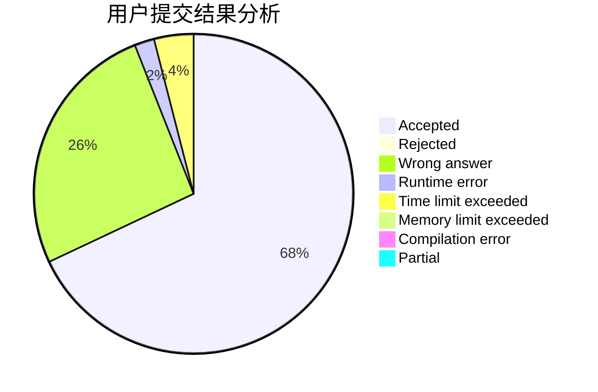
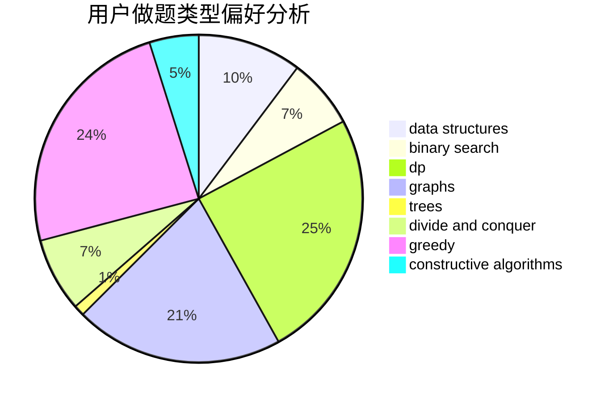
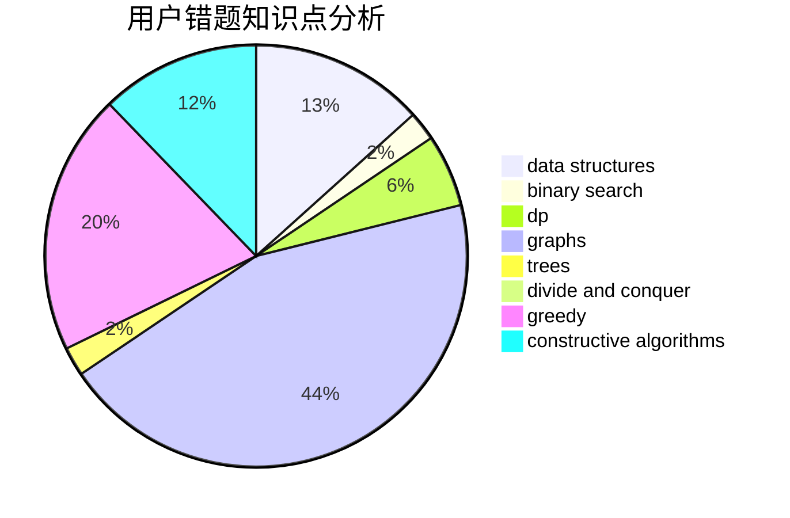

# OldYang
<!-- tabs:start -->
#### **用户提交结果分析**

#### **用户做题类型偏好分析**

#### **用户错题知识点分析**

<!-- tabs:end -->
# 推荐题目
[Time to Run](http://codeforces.com/problemset/problem/1301/D)		constructive algorithms,
                        graphs,
                        implementation		  
[Seven Digit Number (2 points)](https://codeforces.com/contest/1164/problem/M)		nan		  
[The Great Julya Calendar](http://codeforces.com/problemset/problem/331/C3)		dp		  
[Zebras](http://codeforces.com/problemset/problem/949/A)		greedy		  
[AND, OR and square sum](http://codeforces.com/problemset/problem/1368/D)		bitmasks,
                        greedy,
                        math		  
[Obsession with Robots](http://codeforces.com/problemset/problem/8/B)		constructive algorithms,
                        graphs,
                        implementation		  
[Wrong Subtraction](http://codeforces.com/problemset/problem/977/A)		implementation		  
[Armistice Area Apportionment](http://codeforces.com/problemset/problem/645/G)		binary search,
                        geometry		  
[Fibonotci](http://codeforces.com/problemset/problem/575/A)		data structures,
                        math,
                        matrices		  
[Red-Black Cobweb](http://codeforces.com/problemset/problem/833/D)		data structures,
                        divide and conquer,
                        implementation,
                        trees		  
<!-- tabs:start -->
#### **data structures**
[Time to Run](http://codeforces.com/problemset/problem/575/A)		data structures,
                        math,
                        matrices		  
[Seven Digit Number (2 points)](http://codeforces.com/problemset/problem/833/D)		data structures,
                        divide and conquer,
                        implementation,
                        trees		  
[The Great Julya Calendar](http://codeforces.com/problemset/problem/818/D)		data structures,
                        implementation		  
[Zebras](http://codeforces.com/problemset/problem/1141/F2)		data structures,
                        greedy		  
[AND, OR and square sum](http://codeforces.com/problemset/problem/1446/F)		binary search,
                        data structures,
                        geometry		  
[Obsession with Robots](http://codeforces.com/problemset/problem/362/C)		data structures,
                        dp,
                        implementation,
                        math		  
[Wrong Subtraction](http://codeforces.com/problemset/problem/675/C)		constructive algorithms,
                        data structures,
                        greedy,
                        sortings		  
[Armistice Area Apportionment](http://codeforces.com/problemset/problem/316/E1)		brute force,
                        data structures		  
[Fibonotci](http://codeforces.com/problemset/problem/576/E)		binary search,
                        data structures		  
[Red-Black Cobweb](http://codeforces.com/problemset/problem/549/F)		data structures,
                        divide and conquer		  
#### **binary search**
[Time to Run](http://codeforces.com/problemset/problem/645/G)		binary search,
                        geometry		  
[Seven Digit Number (2 points)](http://codeforces.com/problemset/problem/1446/F)		binary search,
                        data structures,
                        geometry		  
[The Great Julya Calendar](http://codeforces.com/problemset/problem/576/E)		binary search,
                        data structures		  
[Zebras](http://codeforces.com/problemset/problem/527/C)		binary search,
                        data structures,
                        implementation		  
[AND, OR and square sum](http://codeforces.com/problemset/problem/1436/C)		binary search,
                        combinatorics		  
[Obsession with Robots](http://codeforces.com/problemset/problem/862/E)		binary search,
                        data structures,
                        sortings		  
[Wrong Subtraction](http://codeforces.com/problemset/problem/1492/C)		binary search,
                        data structures,
                        dp,
                        greedy,
                        two pointers		  
[Armistice Area Apportionment](http://codeforces.com/problemset/problem/1463/D)		binary search,
                        constructive algorithms,
                        greedy,
                        two pointers		  
[Fibonotci](http://codeforces.com/problemset/problem/1490/G)		binary search,
                        data structures,
                        math		  
[Red-Black Cobweb](http://codeforces.com/problemset/problem/1479/D)		binary search,
                        bitmasks,
                        brute force,
                        data structures,
                        probabilities,
                        trees		  
#### **dp**
[Time to Run](http://codeforces.com/problemset/problem/331/C3)		dp		  
[Seven Digit Number (2 points)](http://codeforces.com/problemset/problem/70/E)		dp,
                        implementation,
                        trees		  
[The Great Julya Calendar](http://codeforces.com/problemset/problem/166/E)		dp,
                        math,
                        matrices		  
[Zebras](http://codeforces.com/problemset/problem/626/F)		dp		  
[AND, OR and square sum](http://codeforces.com/problemset/problem/825/F)		dp,
                        hashing,
                        string suffix structures,
                        strings		  
[Obsession with Robots](http://codeforces.com/problemset/problem/95/E)		dp,
                        dsu,
                        graphs		  
[Wrong Subtraction](http://codeforces.com/problemset/problem/362/C)		data structures,
                        dp,
                        implementation,
                        math		  
[Armistice Area Apportionment](http://codeforces.com/problemset/problem/10/B)		dp,
                        implementation		  
[Fibonotci](http://codeforces.com/problemset/problem/1444/D)		constructive algorithms,
                        dp,
                        geometry		  
[Red-Black Cobweb](http://codeforces.com/problemset/problem/448/C)		divide and conquer,
                        dp,
                        greedy		  
#### **graph**
[Time to Run](http://codeforces.com/problemset/problem/1301/D)		constructive algorithms,
                        graphs,
                        implementation		  
[Seven Digit Number (2 points)](http://codeforces.com/problemset/problem/8/B)		constructive algorithms,
                        graphs,
                        implementation		  
[The Great Julya Calendar](http://codeforces.com/problemset/problem/1340/D)		constructive algorithms,
                        dfs and similar,
                        graphs,
                        trees		  
[Zebras](http://codeforces.com/problemset/problem/303/C)		brute force,
                        graphs,
                        math,
                        number theory		  
[AND, OR and square sum](http://codeforces.com/problemset/problem/1027/D)		dfs and similar,
                        graphs		  
[Obsession with Robots](http://codeforces.com/problemset/problem/95/E)		dp,
                        dsu,
                        graphs		  
[Wrong Subtraction](http://codeforces.com/problemset/problem/1139/C)		dfs and similar,
                        dsu,
                        graphs,
                        math,
                        trees		  
[Armistice Area Apportionment](http://codeforces.com/problemset/problem/468/B)		2-sat,
                        dfs and similar,
                        dsu,
                        graph matchings,
                        greedy		  
[Fibonotci](http://codeforces.com/problemset/problem/521/E)		dfs and similar,
                        graphs		  
[Red-Black Cobweb](http://codeforces.com/problemset/problem/1012/B)		constructive algorithms,
                        dfs and similar,
                        dsu,
                        graphs,
                        matrices		  
#### **trees**
[Time to Run](http://codeforces.com/problemset/problem/833/D)		data structures,
                        divide and conquer,
                        implementation,
                        trees		  
[Seven Digit Number (2 points)](http://codeforces.com/problemset/problem/70/E)		dp,
                        implementation,
                        trees		  
[The Great Julya Calendar](http://codeforces.com/problemset/problem/1340/D)		constructive algorithms,
                        dfs and similar,
                        graphs,
                        trees		  
[Zebras](http://codeforces.com/problemset/problem/959/C)		constructive algorithms,
                        trees		  
[AND, OR and square sum](http://codeforces.com/problemset/problem/1139/C)		dfs and similar,
                        dsu,
                        graphs,
                        math,
                        trees		  
[Obsession with Robots](http://codeforces.com/problemset/problem/1408/E)		data structures,
                        dsu,
                        graphs,
                        greedy,
                        sortings,
                        trees		  
[Wrong Subtraction](http://codeforces.com/problemset/problem/1479/D)		binary search,
                        bitmasks,
                        brute force,
                        data structures,
                        probabilities,
                        trees		  
[Armistice Area Apportionment](http://codeforces.com/problemset/problem/1511/C)		brute force,
                        data structures,
                        implementation,
                        trees		  
[Fibonotci](http://codeforces.com/problemset/problem/1499/F)		combinatorics,
                        dfs and similar,
                        dp,
                        trees		  
[Red-Black Cobweb](http://codeforces.com/problemset/problem/1491/E)		brute force,
                        dfs and similar,
                        divide and conquer,
                        number theory,
                        trees		  
#### **divide and conquer**
[Time to Run](http://codeforces.com/problemset/problem/833/D)		data structures,
                        divide and conquer,
                        implementation,
                        trees		  
[Seven Digit Number (2 points)](http://codeforces.com/problemset/problem/549/F)		data structures,
                        divide and conquer		  
[The Great Julya Calendar](http://codeforces.com/problemset/problem/448/C)		divide and conquer,
                        dp,
                        greedy		  
[Zebras](http://codeforces.com/problemset/problem/1461/D)		binary search,
                        brute force,
                        data structures,
                        divide and conquer,
                        implementation,
                        sortings		  
[AND, OR and square sum](http://codeforces.com/problemset/problem/1466/G)		combinatorics,
                        divide and conquer,
                        hashing,
                        math,
                        string suffix structures,
                        strings		  
[Obsession with Robots](http://codeforces.com/problemset/problem/1490/D)		dfs and similar,
                        divide and conquer,
                        implementation		  
[Wrong Subtraction](https://codeforces.com/contest/1483/problem/C)		data structures,
                        divide and conquer,
                        dp		  
[Armistice Area Apportionment](http://codeforces.com/problemset/problem/1491/E)		brute force,
                        dfs and similar,
                        divide and conquer,
                        number theory,
                        trees		  
[Fibonotci](http://codeforces.com/problemset/problem/1303/G)		data structures,
                        divide and conquer,
                        geometry,
                        trees		  
[Red-Black Cobweb](http://codeforces.com/problemset/problem/1494/D)		constructive algorithms,
                        data structures,
                        dfs and similar,
                        divide and conquer,
                        dsu,
                        greedy,
                        sortings,
                        trees		  
#### **greedy**
[Time to Run](http://codeforces.com/problemset/problem/949/A)		greedy		  
[Seven Digit Number (2 points)](http://codeforces.com/problemset/problem/1368/D)		bitmasks,
                        greedy,
                        math		  
[The Great Julya Calendar](http://codeforces.com/problemset/problem/436/A)		greedy		  
[Zebras](http://codeforces.com/problemset/problem/1141/F2)		data structures,
                        greedy		  
[AND, OR and square sum](https://codeforces.com/contest/298/problem/D)		constructive algorithms,
                        greedy		  
[Obsession with Robots](http://codeforces.com/problemset/problem/675/C)		constructive algorithms,
                        data structures,
                        greedy,
                        sortings		  
[Wrong Subtraction](http://codeforces.com/problemset/problem/381/A)		greedy,
                        implementation,
                        two pointers		  
[Armistice Area Apportionment](http://codeforces.com/problemset/problem/1178/A)		greedy		  
[Fibonotci](http://codeforces.com/problemset/problem/468/B)		2-sat,
                        dfs and similar,
                        dsu,
                        graph matchings,
                        greedy		  
[Red-Black Cobweb](http://codeforces.com/problemset/problem/960/C)		bitmasks,
                        constructive algorithms,
                        greedy,
                        implementation		  
#### **constructive algorithms**
[Time to Run](http://codeforces.com/problemset/problem/1301/D)		constructive algorithms,
                        graphs,
                        implementation		  
[Seven Digit Number (2 points)](http://codeforces.com/problemset/problem/8/B)		constructive algorithms,
                        graphs,
                        implementation		  
[The Great Julya Calendar](http://codeforces.com/problemset/problem/1340/D)		constructive algorithms,
                        dfs and similar,
                        graphs,
                        trees		  
[Zebras](http://codeforces.com/problemset/problem/732/A)		brute force,
                        constructive algorithms,
                        implementation,
                        math		  
[AND, OR and square sum](http://codeforces.com/problemset/problem/912/B)		bitmasks,
                        constructive algorithms,
                        number theory		  
[Obsession with Robots](http://codeforces.com/problemset/problem/1196/A)		brute force,
                        constructive algorithms,
                        math		  
[Wrong Subtraction](http://codeforces.com/problemset/problem/675/B)		brute force,
                        constructive algorithms,
                        math		  
[Armistice Area Apportionment](http://codeforces.com/problemset/problem/730/B)		constructive algorithms,
                        interactive		  
[Fibonotci](https://codeforces.com/contest/298/problem/D)		constructive algorithms,
                        greedy		  
[Red-Black Cobweb](http://codeforces.com/problemset/problem/675/C)		constructive algorithms,
                        data structures,
                        greedy,
                        sortings		  
#### **sortings**
[Time to Run](http://codeforces.com/problemset/problem/675/C)		constructive algorithms,
                        data structures,
                        greedy,
                        sortings		  
[Seven Digit Number (2 points)](http://codeforces.com/problemset/problem/714/B)		implementation,
                        sortings		  
[The Great Julya Calendar](http://codeforces.com/problemset/problem/1478/C)		implementation,
                        math,
                        sortings		  
[Zebras](http://codeforces.com/problemset/problem/862/E)		binary search,
                        data structures,
                        sortings		  
[AND, OR and square sum](http://codeforces.com/problemset/problem/1408/E)		data structures,
                        dsu,
                        graphs,
                        greedy,
                        sortings,
                        trees		  
[Obsession with Robots](https://codeforces.com/contest/1496/problem/C)		geometry,
                        greedy,
                        math,
                        sortings		  
[Wrong Subtraction](http://codeforces.com/problemset/problem/1495/A)		geometry,
                        greedy,
                        math,
                        sortings		  
[Armistice Area Apportionment](http://codeforces.com/problemset/problem/1497/A)		brute force,
                        data structures,
                        greedy,
                        sortings		  
[Fibonotci](http://codeforces.com/problemset/problem/1427/A)		math,
                        sortings		  
[Red-Black Cobweb](http://codeforces.com/problemset/problem/1461/D)		binary search,
                        brute force,
                        data structures,
                        divide and conquer,
                        implementation,
                        sortings		  
<!-- tabs:end -->
