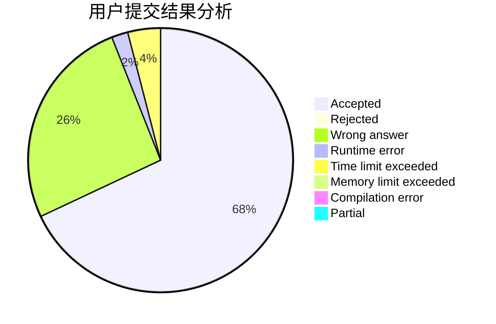
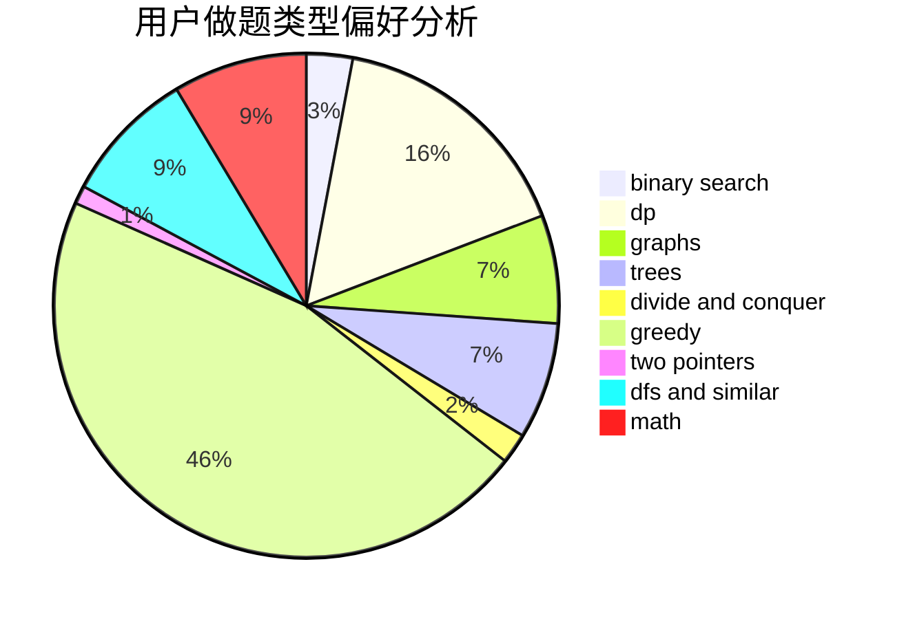

# OldYang

<!-- tabs:start -->

#### **用户提交结果分析**

#### **用户做题类型偏好分析**

<!-- tabs:end -->
# 推荐题目
[1311A](https://codeforces.com/contest/1311/problem/A)
[1166D](https://codeforces.com/contest/1166/problem/D)
[990F](https://codeforces.com/contest/990/problem/F)
[359C](https://codeforces.com/contest/359/problem/C)
[965E](https://codeforces.com/contest/965/problem/E)
[672C](https://codeforces.com/contest/672/problem/C)
[981G](https://codeforces.com/contest/981/problem/G)
[653A](https://codeforces.com/contest/653/problem/A)
[596A](https://codeforces.com/contest/596/problem/A)
[851D](https://codeforces.com/contest/851/problem/D)
