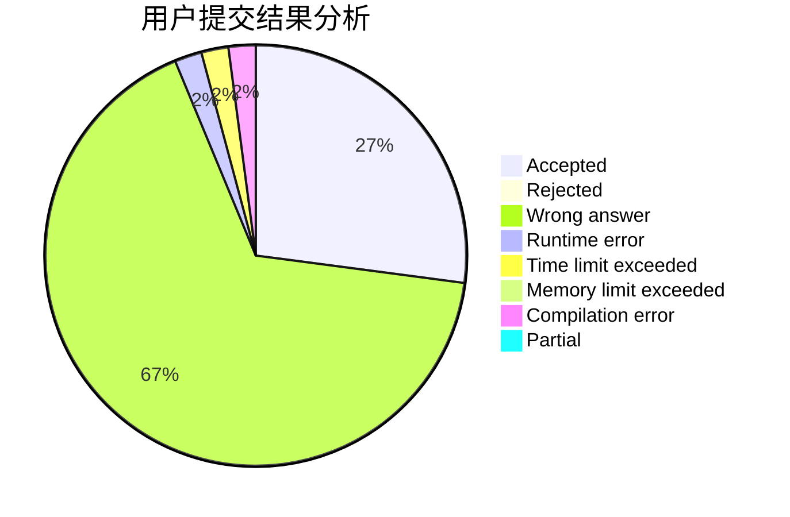
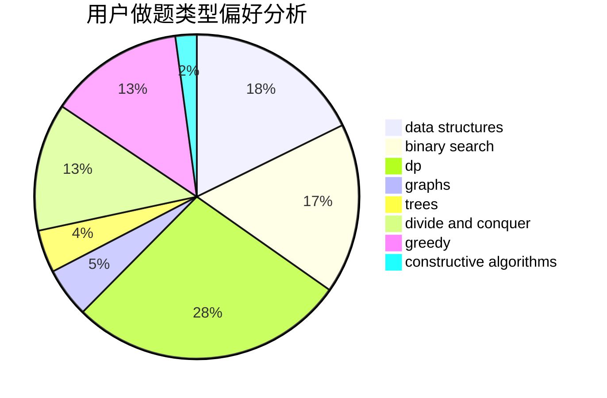
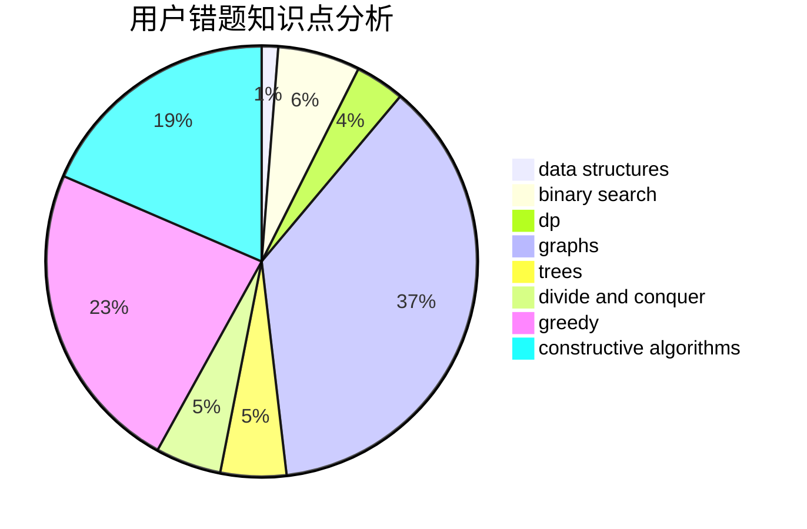

# Onionmind

<!-- tabs:start -->

#### **用户提交结果分析**

#### **用户做题类型偏好分析**

#### **用户错题知识点分析**

<!-- tabs:end -->
# 推荐题目
[699B](https://codeforces.com/contest/699/problem/B)		implementation		  
[15C](https://codeforces.com/contest/15/problem/C)		games		  
[183D](https://codeforces.com/contest/183/problem/D)		dp,
                        greedy,
                        probabilities		  
[1082F](https://codeforces.com/contest/1082/problem/F)		dp,
                        strings,
                        trees		  
[1143B](https://codeforces.com/contest/1143/problem/B)		brute force,
                        math,
                        number theory		  
[722C](https://codeforces.com/contest/722/problem/C)		data structures,
                        dsu		  
[784D](https://codeforces.com/contest/784/problem/D)		*special problem,
                        implementation		  
[1254B1](https://codeforces.com/contest/1254B/problem/1)		constructive algorithms,
                        greedy,
                        math,
                        number theory,
                        ternary search,
                        two pointers		  
[754E](https://codeforces.com/contest/754/problem/E)		bitmasks,
                        brute force,
                        fft,
                        strings,
                        trees		  
[902C](https://codeforces.com/contest/902/problem/C)		dsu,graphs,sortings,trees		  
