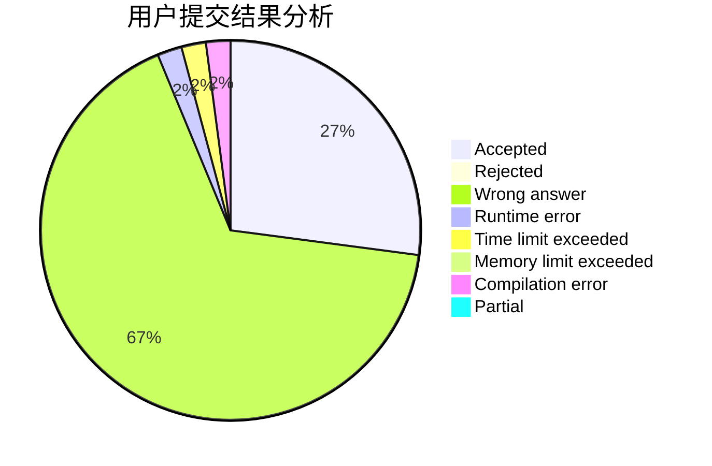
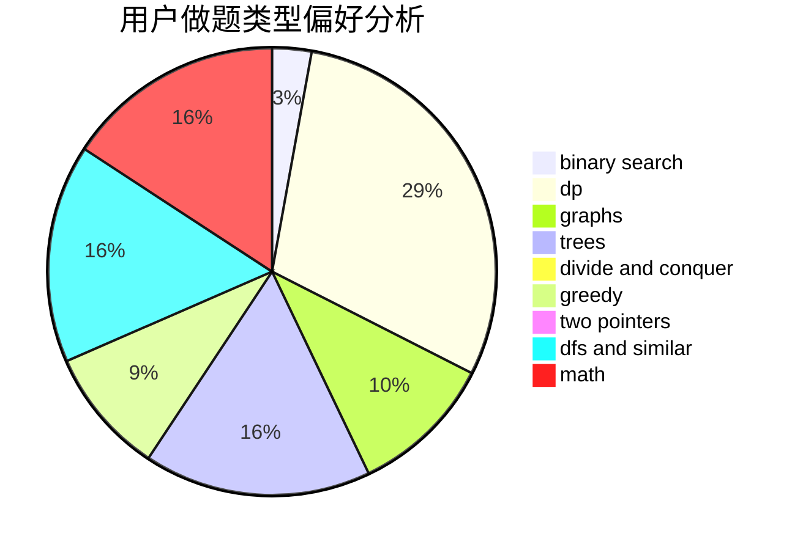

# Onionmind

<!-- tabs:start -->

#### **用户提交结果分析**

#### **用户做题类型偏好分析**

<!-- tabs:end -->
# 推荐题目
[716A](https://codeforces.com/contest/716/problem/A)
[182D](https://codeforces.com/contest/182/problem/D)
[20A](https://codeforces.com/contest/20/problem/A)
[1083B](https://codeforces.com/contest/1083/problem/B)
[1145B](https://codeforces.com/contest/1145/problem/B)
[739D](https://codeforces.com/contest/739/problem/D)
[801D](https://codeforces.com/contest/801/problem/D)
[1261C](https://codeforces.com/contest/1261/problem/C)
[773D](https://codeforces.com/contest/773/problem/D)
[918E](https://codeforces.com/contest/918/problem/E)
