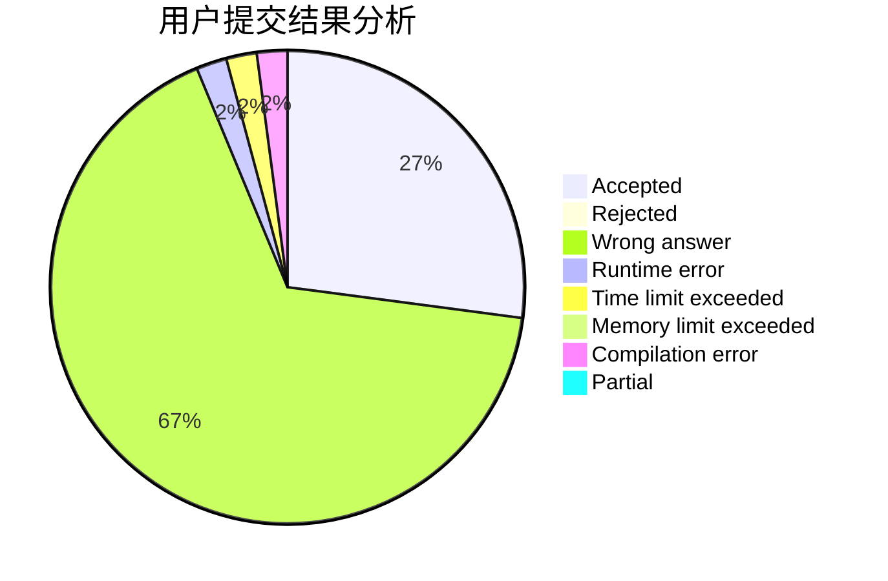
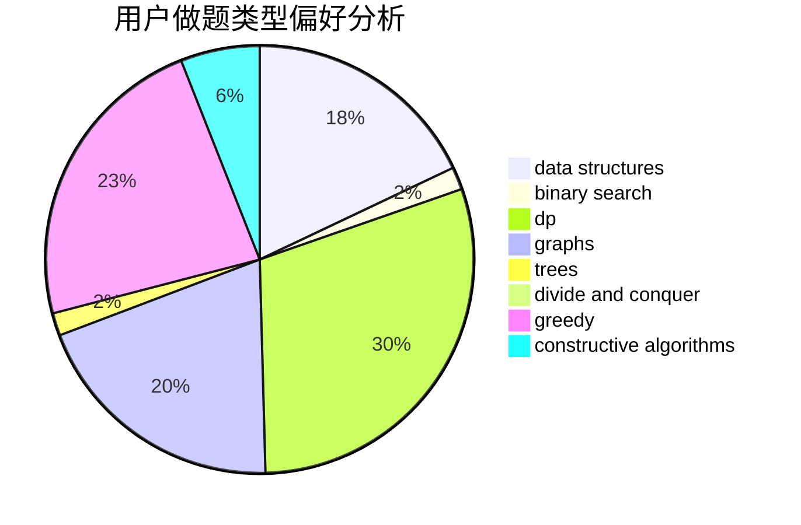
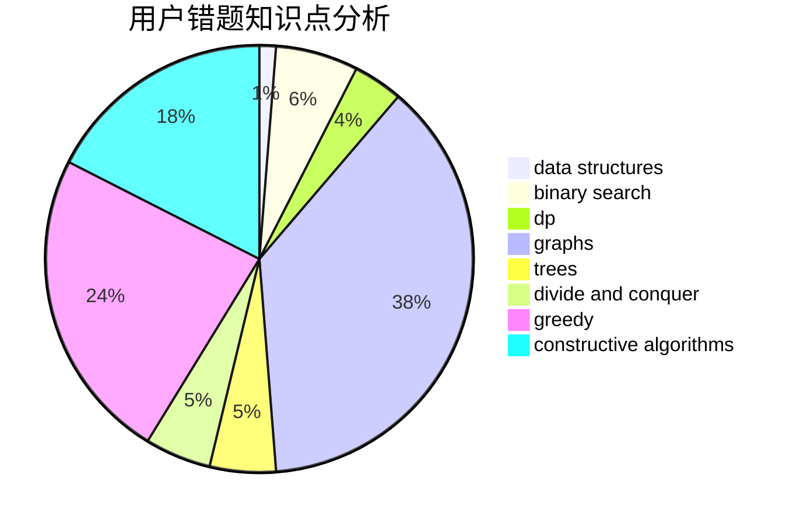

# Onionmind

<!-- tabs:start -->

#### **用户提交结果分析**

#### **用户做题类型偏好分析**

#### **用户错题知识点分析**

<!-- tabs:end -->
# 推荐题目
[716A](https://codeforces.com/contest/716/problem/A)		implementation		  
[182D](https://codeforces.com/contest/182/problem/D)		brute force,
                        hashing,
                        implementation,
                        math,
                        strings		  
[20A](https://codeforces.com/contest/20/problem/A)		implementation		  
[1083B](https://codeforces.com/contest/1083/problem/B)		greedy,
                        strings		  
[1145B](https://codeforces.com/contest/1145/problem/B)		brute force		  
[739D](https://codeforces.com/contest/739/problem/D)		graph matchings		  
[801D](https://codeforces.com/contest/801/problem/D)		dsu,graphs,sortings,trees		  
[1261C](https://codeforces.com/contest/1261/problem/C)		dsu,graphs,sortings,trees		  
[773D](https://codeforces.com/contest/773/problem/D)		dp,
                        graphs,
                        shortest paths		  
[918E](https://codeforces.com/contest/918/problem/E)		dsu,graphs,sortings,trees		  
