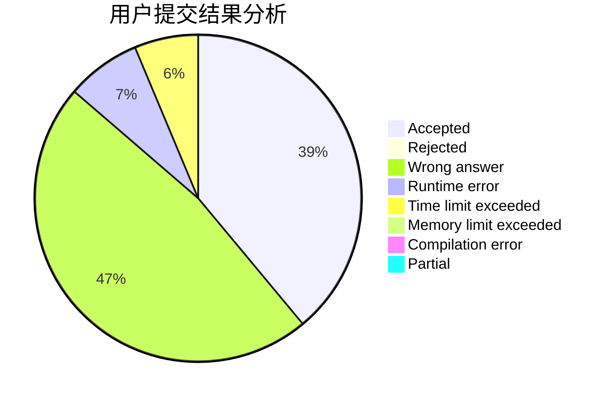
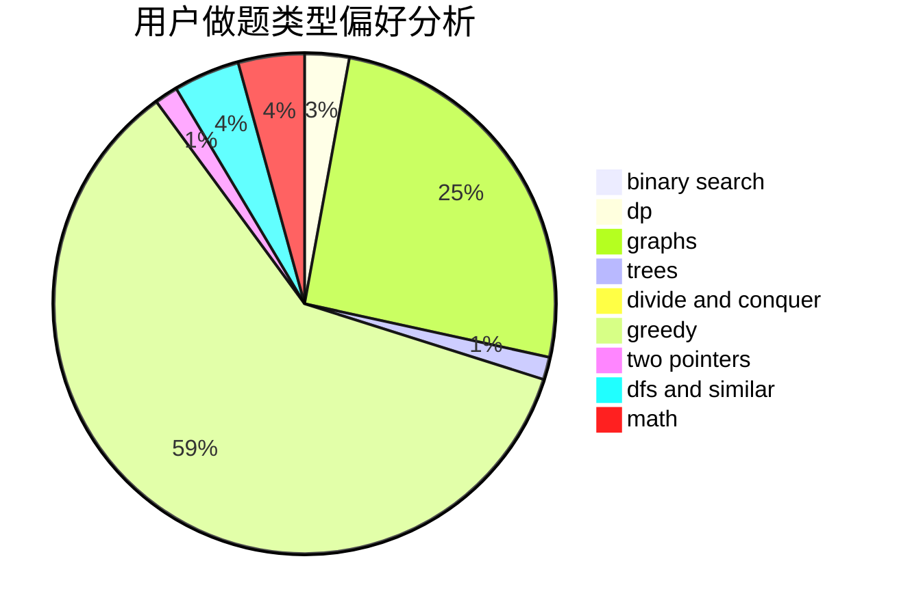

# Online_Judge_SMOJ

<!-- tabs:start -->

#### **用户提交结果分析**

#### **用户做题类型偏好分析**

<!-- tabs:end -->
# 推荐题目
[1511D](https://codeforces.com/contest/1511/problem/D)
[846A](https://codeforces.com/contest/846/problem/A)
[1310C](https://codeforces.com/contest/1310/problem/C)
[679E](https://codeforces.com/contest/679/problem/E)
[1145B](https://codeforces.com/contest/1145/problem/B)
[1250N](https://codeforces.com/contest/1250/problem/N)
[519B](https://codeforces.com/contest/519/problem/B)
[421A](https://codeforces.com/contest/421/problem/A)
[1436F](https://codeforces.com/contest/1436/problem/F)
[144B](https://codeforces.com/contest/144/problem/B)
