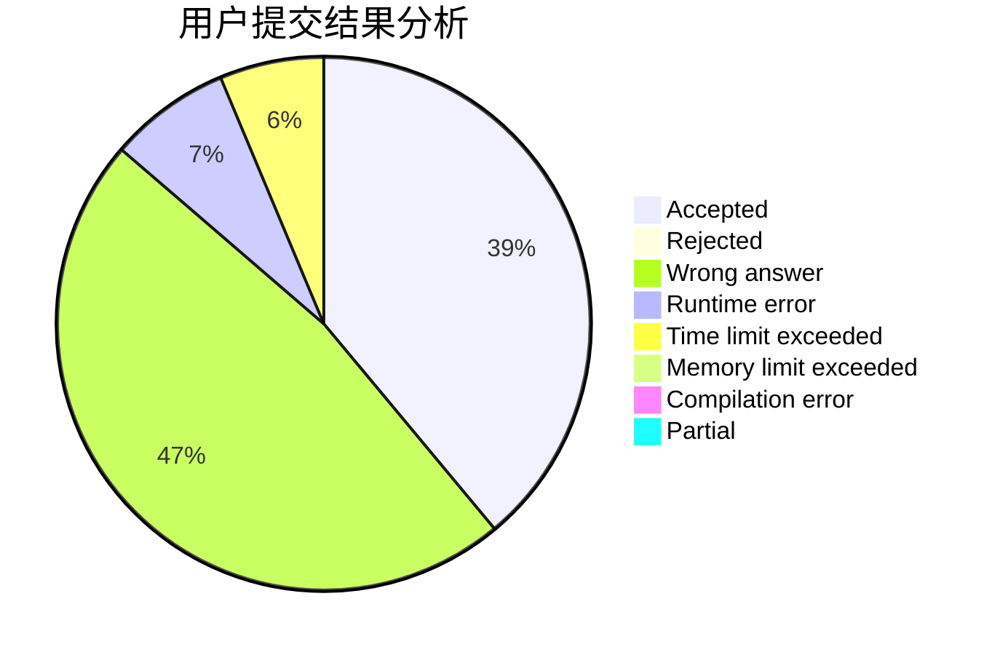
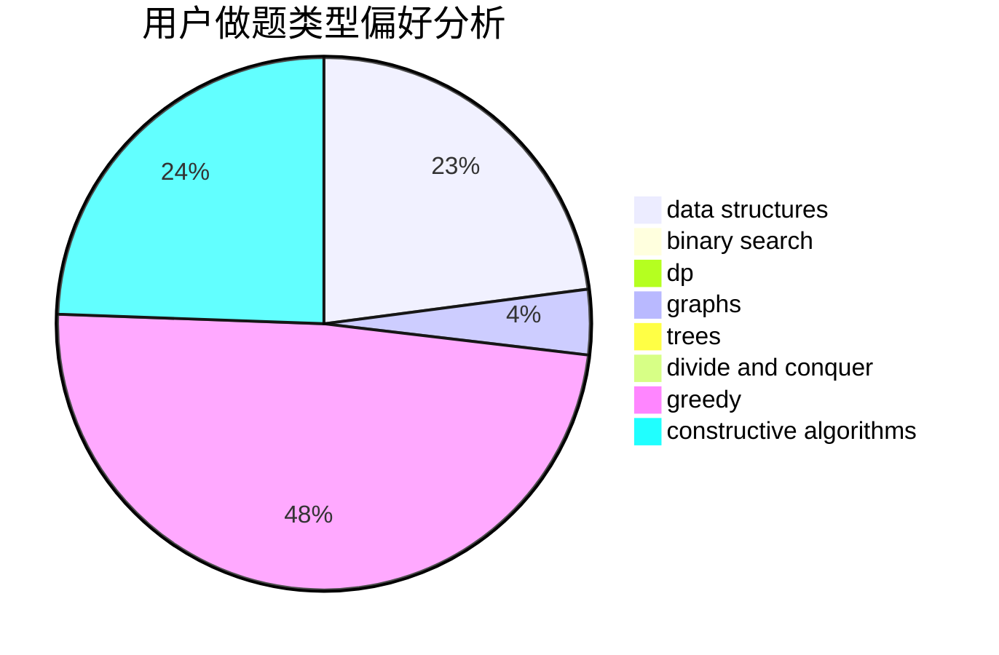
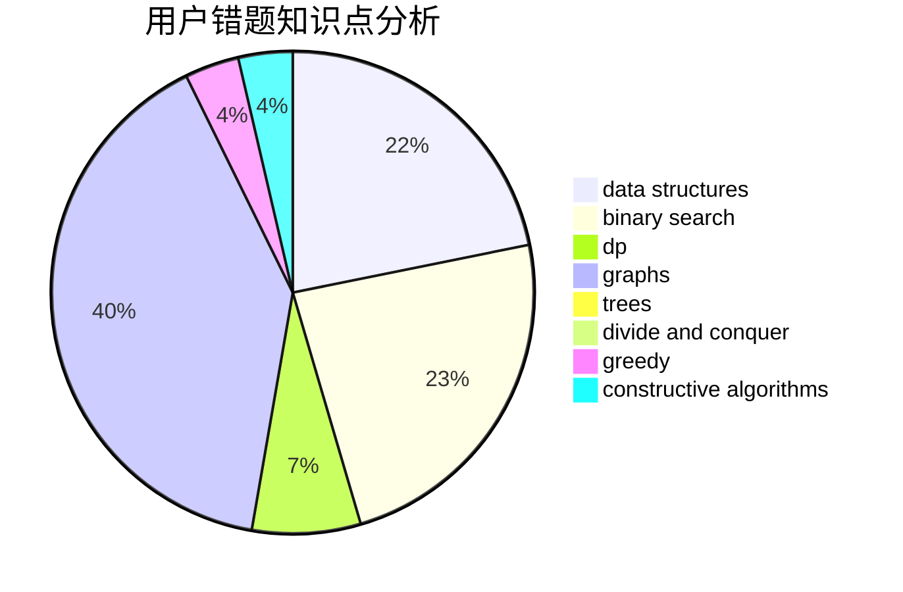

# Online_Judge_SMOJ

<!-- tabs:start -->

#### **用户提交结果分析**

#### **用户做题类型偏好分析**

#### **用户错题知识点分析**

<!-- tabs:end -->
# 推荐题目
[1511D](https://codeforces.com/contest/1511/problem/D)		brute force,
                        constructive algorithms,
                        graphs,
                        greedy,
                        strings		  
[846A](https://codeforces.com/contest/846/problem/A)		brute force,
                        implementation		  
[1310C](https://codeforces.com/contest/1310/problem/C)		binary search,
                        dp,
                        strings		  
[679E](https://codeforces.com/contest/679/problem/E)		data structures		  
[1145B](https://codeforces.com/contest/1145/problem/B)		brute force		  
[1250N](https://codeforces.com/contest/1250/problem/N)		dfs and similar,
                        graphs,
                        greedy		  
[519B](https://codeforces.com/contest/519/problem/B)		data structures,
                        implementation,
                        sortings		  
[421A](https://codeforces.com/contest/421/problem/A)		constructive algorithms,
                        implementation		  
[1436F](https://codeforces.com/contest/1436/problem/F)		combinatorics,
                        math,
                        number theory		  
[144B](https://codeforces.com/contest/144/problem/B)		implementation		  
