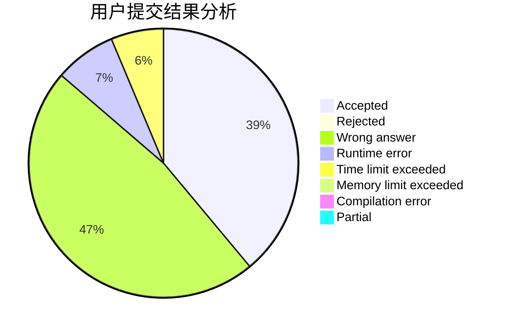
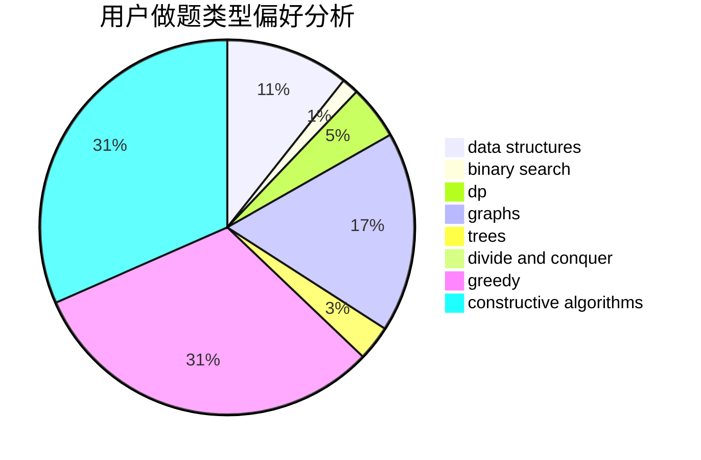
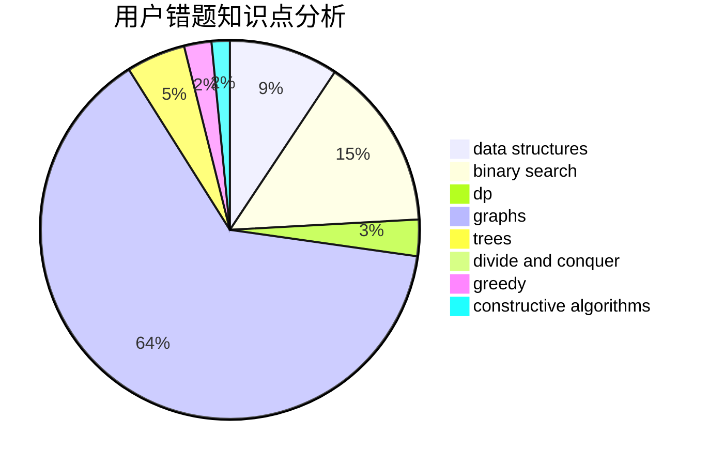

# Online_Judge_SMOJ

<!-- tabs:start -->

#### **用户提交结果分析**

#### **用户做题类型偏好分析**

#### **用户错题知识点分析**

<!-- tabs:end -->
# 推荐题目
[1501C](https://codeforces.com/contest/1501/problem/C)		dsu,graphs,sortings,trees		  
[827E](https://codeforces.com/contest/827/problem/E)		fft,
                        math,
                        strings		  
[1300E](https://codeforces.com/contest/1300/problem/E)		dsu,graphs,sortings,trees		  
[659E](https://codeforces.com/contest/659/problem/E)		data structures,
                        dfs and similar,
                        dsu,
                        graphs,
                        greedy		  
[1143B](https://codeforces.com/contest/1143/problem/B)		brute force,
                        math,
                        number theory		  
[1246F](https://codeforces.com/contest/1246/problem/F)		nan		  
[498C](https://codeforces.com/contest/498/problem/C)		flows,
                        graph matchings,
                        number theory		  
[392B](https://codeforces.com/contest/392/problem/B)		dp		  
[1427H](https://codeforces.com/contest/1427/problem/H)		binary search,
                        games,
                        geometry,
                        ternary search		  
[1438B](https://codeforces.com/contest/1438/problem/B)		constructive algorithms,
                        data structures,
                        greedy,
                        sortings		  
