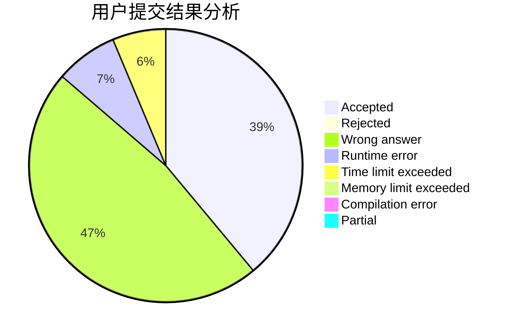
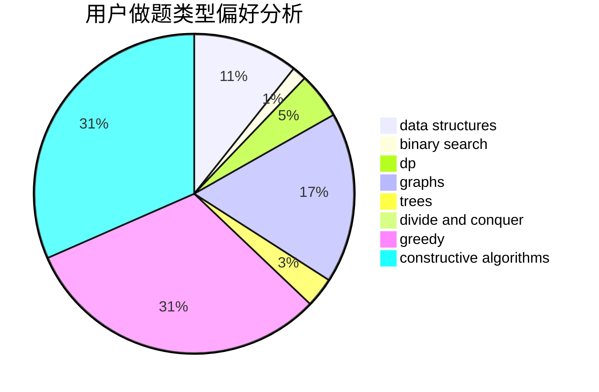
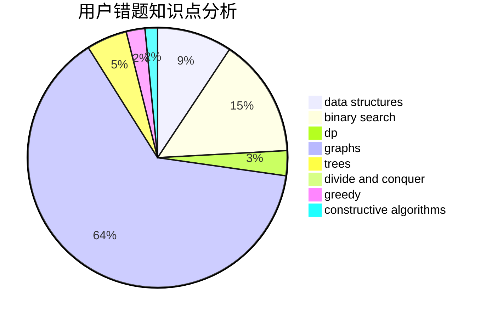

# Online_Judge_SMOJ
<!-- tabs:start -->
#### **用户提交结果分析**

#### **用户做题类型偏好分析**

#### **用户错题知识点分析**

<!-- tabs:end -->
# 推荐题目
[Water Balance](https://codeforces.com/contest/1300/problem/E)		data structures,
                        geometry,
                        greedy		  
[K-th Beautiful String](http://codeforces.com/problemset/problem/1328/B)		binary search,
                        brute force,
                        combinatorics,
                        implementation,
                        math		  
[Cursor Distance](http://codeforces.com/problemset/problem/1246/F)		nan		  
[Valerii Against Everyone](http://codeforces.com/problemset/problem/1438/B)		constructive algorithms,
                        data structures,
                        greedy,
                        sortings		  
[Toy Train (Simplified)](http://codeforces.com/problemset/problem/1129/A1)		brute force,
                        greedy		  
[New Reform](http://codeforces.com/problemset/problem/659/E)		data structures,
                        dfs and similar,
                        dsu,
                        graphs,
                        greedy		  
[Nirvana](http://codeforces.com/problemset/problem/1143/B)		brute force,
                        math,
                        number theory		  
[Rusty String](http://codeforces.com/problemset/problem/827/E)		fft,
                        math,
                        strings		  
[Tower of Hanoi](http://codeforces.com/problemset/problem/392/B)		dp		  
[Quantum Classification - Dataset 4](http://codeforces.com/problemset/problem/1357/D2)		nan		  
<!-- tabs:start -->
#### **data structures**
[Water Balance](https://codeforces.com/contest/1300/problem/E)		data structures,
                        geometry,
                        greedy		  
[K-th Beautiful String](http://codeforces.com/problemset/problem/1438/B)		constructive algorithms,
                        data structures,
                        greedy,
                        sortings		  
[Cursor Distance](http://codeforces.com/problemset/problem/659/E)		data structures,
                        dfs and similar,
                        dsu,
                        graphs,
                        greedy		  
[Valerii Against Everyone](http://codeforces.com/problemset/problem/1146/E)		bitmasks,
                        data structures,
                        divide and conquer,
                        implementation		  
[Toy Train (Simplified)](http://codeforces.com/problemset/problem/1252/C)		data structures,
                        implementation		  
[New Reform](http://codeforces.com/problemset/problem/809/D)		data structures,
                        dp		  
[Nirvana](http://codeforces.com/problemset/problem/1392/F)		binary search,
                        constructive algorithms,
                        data structures,
                        greedy,
                        math		  
[Rusty String](http://codeforces.com/problemset/problem/1492/C)		binary search,
                        data structures,
                        dp,
                        greedy,
                        two pointers		  
[Tower of Hanoi](http://codeforces.com/problemset/problem/1490/G)		binary search,
                        data structures,
                        math		  
[Quantum Classification - Dataset 4](http://codeforces.com/problemset/problem/1479/D)		binary search,
                        bitmasks,
                        brute force,
                        data structures,
                        probabilities,
                        trees		  
#### **binary search**
[Water Balance](http://codeforces.com/problemset/problem/1328/B)		binary search,
                        brute force,
                        combinatorics,
                        implementation,
                        math		  
[K-th Beautiful String](http://codeforces.com/problemset/problem/1427/H)		binary search,
                        games,
                        geometry,
                        ternary search		  
[Cursor Distance](http://codeforces.com/problemset/problem/842/E)		binary search,
                        dfs and similar,
                        divide and conquer,
                        graphs,
                        trees		  
[Valerii Against Everyone](http://codeforces.com/problemset/problem/1488/D)		*special problem,
                        binary search,
                        greedy		  
[Toy Train (Simplified)](http://codeforces.com/problemset/problem/1392/F)		binary search,
                        constructive algorithms,
                        data structures,
                        greedy,
                        math		  
[New Reform](http://codeforces.com/problemset/problem/1492/C)		binary search,
                        data structures,
                        dp,
                        greedy,
                        two pointers		  
[Nirvana](http://codeforces.com/problemset/problem/1463/D)		binary search,
                        constructive algorithms,
                        greedy,
                        two pointers		  
[Rusty String](http://codeforces.com/problemset/problem/1490/G)		binary search,
                        data structures,
                        math		  
[Tower of Hanoi](http://codeforces.com/problemset/problem/1479/D)		binary search,
                        bitmasks,
                        brute force,
                        data structures,
                        probabilities,
                        trees		  
[Quantum Classification - Dataset 4](http://codeforces.com/problemset/problem/1436/E)		binary search,
                        data structures,
                        two pointers		  
#### **dp**
[Water Balance](http://codeforces.com/problemset/problem/392/B)		dp		  
[K-th Beautiful String](http://codeforces.com/problemset/problem/234/C)		dp,
                        implementation		  
[Cursor Distance](http://codeforces.com/problemset/problem/1034/C)		combinatorics,
                        dp,
                        number theory,
                        trees		  
[Valerii Against Everyone](http://codeforces.com/problemset/problem/809/D)		data structures,
                        dp		  
[Toy Train (Simplified)](http://codeforces.com/problemset/problem/1015/E1)		brute force,
                        dp,
                        greedy		  
[New Reform](http://codeforces.com/problemset/problem/1492/C)		binary search,
                        data structures,
                        dp,
                        greedy,
                        two pointers		  
[Nirvana](https://codeforces.com/contest/1457/problem/C)		brute force,
                        dp,
                        implementation		  
[Rusty String](http://codeforces.com/problemset/problem/1491/C)		brute force,
                        data structures,
                        dp,
                        greedy,
                        implementation		  
[Tower of Hanoi](http://codeforces.com/problemset/problem/1437/C)		dp,
                        flows,
                        graph matchings,
                        greedy,
                        math,
                        sortings		  
[Quantum Classification - Dataset 4](http://codeforces.com/problemset/problem/1499/B)		brute force,
                        dp,
                        greedy,
                        implementation		  
#### **graph**
[Water Balance](http://codeforces.com/problemset/problem/659/E)		data structures,
                        dfs and similar,
                        dsu,
                        graphs,
                        greedy		  
[K-th Beautiful String](http://codeforces.com/problemset/problem/498/C)		flows,
                        graph matchings,
                        number theory		  
[Cursor Distance](http://codeforces.com/problemset/problem/761/E)		constructive algorithms,
                        dfs and similar,
                        graphs,
                        greedy,
                        trees		  
[Valerii Against Everyone](http://codeforces.com/problemset/problem/1000/E)		dfs and similar,
                        graphs,
                        trees		  
[Toy Train (Simplified)](http://codeforces.com/problemset/problem/350/B)		graphs		  
[New Reform](http://codeforces.com/problemset/problem/842/E)		binary search,
                        dfs and similar,
                        divide and conquer,
                        graphs,
                        trees		  
[Nirvana](http://codeforces.com/problemset/problem/1487/C)		brute force,
                        constructive algorithms,
                        dfs and similar,
                        graphs,
                        greedy,
                        implementation,
                        math		  
[Rusty String](http://codeforces.com/problemset/problem/1437/C)		dp,
                        flows,
                        graph matchings,
                        greedy,
                        math,
                        sortings		  
[Tower of Hanoi](http://codeforces.com/problemset/problem/1470/D)		constructive algorithms,
                        dfs and similar,
                        graph matchings,
                        graphs,
                        greedy		  
[Quantum Classification - Dataset 4](http://codeforces.com/problemset/problem/1476/C)		dp,
                        graphs,
                        greedy		  
#### **trees**
[Water Balance](http://codeforces.com/problemset/problem/761/E)		constructive algorithms,
                        dfs and similar,
                        graphs,
                        greedy,
                        trees		  
[K-th Beautiful String](http://codeforces.com/problemset/problem/1000/E)		dfs and similar,
                        graphs,
                        trees		  
[Cursor Distance](http://codeforces.com/problemset/problem/842/E)		binary search,
                        dfs and similar,
                        divide and conquer,
                        graphs,
                        trees		  
[Valerii Against Everyone](http://codeforces.com/problemset/problem/1034/C)		combinatorics,
                        dp,
                        number theory,
                        trees		  
[Toy Train (Simplified)](http://codeforces.com/problemset/problem/1479/D)		binary search,
                        bitmasks,
                        brute force,
                        data structures,
                        probabilities,
                        trees		  
[New Reform](http://codeforces.com/problemset/problem/1511/C)		brute force,
                        data structures,
                        implementation,
                        trees		  
[Nirvana](http://codeforces.com/problemset/problem/1499/F)		combinatorics,
                        dfs and similar,
                        dp,
                        trees		  
[Rusty String](http://codeforces.com/problemset/problem/1491/E)		brute force,
                        dfs and similar,
                        divide and conquer,
                        number theory,
                        trees		  
[Tower of Hanoi](http://codeforces.com/problemset/problem/1466/D)		data structures,
                        greedy,
                        sortings,
                        trees		  
[Quantum Classification - Dataset 4](http://codeforces.com/problemset/problem/1495/D)		combinatorics,
                        dfs and similar,
                        graphs,
                        math,
                        shortest paths,
                        trees		  
#### **divide and conquer**
[Water Balance](http://codeforces.com/problemset/problem/1146/E)		bitmasks,
                        data structures,
                        divide and conquer,
                        implementation		  
[K-th Beautiful String](http://codeforces.com/problemset/problem/842/E)		binary search,
                        dfs and similar,
                        divide and conquer,
                        graphs,
                        trees		  
[Cursor Distance](http://codeforces.com/problemset/problem/1461/D)		binary search,
                        brute force,
                        data structures,
                        divide and conquer,
                        implementation,
                        sortings		  
[Valerii Against Everyone](http://codeforces.com/problemset/problem/1466/G)		combinatorics,
                        divide and conquer,
                        hashing,
                        math,
                        string suffix structures,
                        strings		  
[Toy Train (Simplified)](http://codeforces.com/problemset/problem/1490/D)		dfs and similar,
                        divide and conquer,
                        implementation		  
[New Reform](https://codeforces.com/contest/1483/problem/C)		data structures,
                        divide and conquer,
                        dp		  
[Nirvana](http://codeforces.com/problemset/problem/1491/E)		brute force,
                        dfs and similar,
                        divide and conquer,
                        number theory,
                        trees		  
[Rusty String](http://codeforces.com/problemset/problem/1303/G)		data structures,
                        divide and conquer,
                        geometry,
                        trees		  
[Tower of Hanoi](http://codeforces.com/problemset/problem/1494/D)		constructive algorithms,
                        data structures,
                        dfs and similar,
                        divide and conquer,
                        dsu,
                        greedy,
                        sortings,
                        trees		  
[Quantum Classification - Dataset 4](http://codeforces.com/problemset/problem/1482/E)		data structures,
                        divide and conquer,
                        dp		  
#### **greedy**
[Water Balance](https://codeforces.com/contest/1300/problem/E)		data structures,
                        geometry,
                        greedy		  
[K-th Beautiful String](http://codeforces.com/problemset/problem/1438/B)		constructive algorithms,
                        data structures,
                        greedy,
                        sortings		  
[Cursor Distance](http://codeforces.com/problemset/problem/1129/A1)		brute force,
                        greedy		  
[Valerii Against Everyone](http://codeforces.com/problemset/problem/659/E)		data structures,
                        dfs and similar,
                        dsu,
                        graphs,
                        greedy		  
[Toy Train (Simplified)](http://codeforces.com/problemset/problem/231/B)		constructive algorithms,
                        greedy		  
[New Reform](http://codeforces.com/problemset/problem/761/E)		constructive algorithms,
                        dfs and similar,
                        graphs,
                        greedy,
                        trees		  
[Nirvana](http://codeforces.com/problemset/problem/1371/D)		constructive algorithms,
                        greedy,
                        implementation		  
[Rusty String](http://codeforces.com/problemset/problem/1433/B)		greedy,
                        implementation		  
[Tower of Hanoi](http://codeforces.com/problemset/problem/1488/D)		*special problem,
                        binary search,
                        greedy		  
[Quantum Classification - Dataset 4](http://codeforces.com/problemset/problem/1393/A)		greedy,
                        math		  
#### **constructive algorithms**
[Water Balance](http://codeforces.com/problemset/problem/1438/B)		constructive algorithms,
                        data structures,
                        greedy,
                        sortings		  
[K-th Beautiful String](http://codeforces.com/problemset/problem/231/B)		constructive algorithms,
                        greedy		  
[Cursor Distance](http://codeforces.com/problemset/problem/761/E)		constructive algorithms,
                        dfs and similar,
                        graphs,
                        greedy,
                        trees		  
[Valerii Against Everyone](http://codeforces.com/problemset/problem/949/B)		constructive algorithms,
                        math		  
[Toy Train (Simplified)](http://codeforces.com/problemset/problem/1371/D)		constructive algorithms,
                        greedy,
                        implementation		  
[New Reform](http://codeforces.com/problemset/problem/1392/F)		binary search,
                        constructive algorithms,
                        data structures,
                        greedy,
                        math		  
[Nirvana](http://codeforces.com/problemset/problem/1493/A)		constructive algorithms,
                        greedy		  
[Rusty String](http://codeforces.com/problemset/problem/1463/D)		binary search,
                        constructive algorithms,
                        greedy,
                        two pointers		  
[Tower of Hanoi](https://codeforces.com/contest/1456/problem/B)		bitmasks,
                        brute force,
                        constructive algorithms		  
[Quantum Classification - Dataset 4](http://codeforces.com/problemset/problem/1492/D)		bitmasks,
                        constructive algorithms,
                        greedy,
                        math		  
#### **sortings**
[Water Balance](http://codeforces.com/problemset/problem/1438/B)		constructive algorithms,
                        data structures,
                        greedy,
                        sortings		  
[K-th Beautiful String](http://codeforces.com/problemset/problem/977/C)		sortings		  
[Cursor Distance](https://codeforces.com/contest/1496/problem/C)		geometry,
                        greedy,
                        math,
                        sortings		  
[Valerii Against Everyone](http://codeforces.com/problemset/problem/1495/A)		geometry,
                        greedy,
                        math,
                        sortings		  
[Toy Train (Simplified)](http://codeforces.com/problemset/problem/1497/A)		brute force,
                        data structures,
                        greedy,
                        sortings		  
[New Reform](http://codeforces.com/problemset/problem/1427/A)		math,
                        sortings		  
[Nirvana](http://codeforces.com/problemset/problem/1461/D)		binary search,
                        brute force,
                        data structures,
                        divide and conquer,
                        implementation,
                        sortings		  
[Rusty String](http://codeforces.com/problemset/problem/1437/C)		dp,
                        flows,
                        graph matchings,
                        greedy,
                        math,
                        sortings		  
[Tower of Hanoi](http://codeforces.com/problemset/problem/1473/A)		greedy,
                        implementation,
                        math,
                        sortings		  
[Quantum Classification - Dataset 4](http://codeforces.com/problemset/problem/1486/B)		binary search,
                        geometry,
                        shortest paths,
                        sortings		  
<!-- tabs:end -->
